{width=50px}

Grupo:

* Daniel Mello Duarte Morais
* David da Guia Carvalho
* Elaine Maria Lopes Loureiro
* Guilherme Vieira Dantas
* Mallena Ferreira de Morais Costa

# Índice {.tabset .tabset-pills}

## Resumo

No presente projeto, iremos, a partir de base de dados disponibilizada em aula, gerar um modelo linear para a previsão de CO2 em KT. Os resultados obtidos foram positivos e seguiram todos os requisitos necessários para a validade da regressão:

* Um p-valor acima de $5\%$ para os testes de Anderson-Darling e Shapiro, o que indica normalidade em nossos resíduos, conforme o esperado.
* Um p-valor também elevado no teste de Breusch-Pagan, o que nos permite aceitar a hipótese de Homocedasticidade ainda que a reta do gráfico Scale-Location não seja propriamente horizontal.
* Um p-valor elevado para o teste de Durblin-Watson.
* Tudo isso a um $R^2$ na ordem de $99\%$

<center>

{width=150px}

</center>

O modelo foi desenvolvido, no âmbito de nosso grupo, para os dados relativos à França. Nas próximas seções, iremos descrever cada um dos passos realizados, desde a análise exploratória de dados até os resultados finais, em formato de storytelling.

## 1. Primeiro Passo - Verificação de Dados

Iremos iniciar o trabalho verificando os dados que temos para a realização da análise. Para isso, seguiremos a seguinte sequência de passos:

* Verificar o arquivo de entrada
* Conferir quais atributos possuem informações para todos os instantes de tempo da análise
* Conferir quais atributos possuem informações parciais (missing data)
* Conferir e eliminar atributos que não possuem informações ou possuem uma quantidade muito reduzida de dados, de forma a inviabilizar a análise


```r
setwd('~/Área de Trabalho/stu/MBA - FGV/Estatística Avançada/Trabalhos/Trabalho-Final')
df_in <- read_excel('./FRA_Country_en_excel_v2.xls')
```

```
## New names:
## * `` -> ...3
## * `` -> ...4
## * `` -> ...5
## * `` -> ...6
## * `` -> ...7
## * … and 53 more problems
```

```r
df_in[, 1:3] %>% head
```

<div data-pagedtable="false">
  <script data-pagedtable-source type="application/json">
{"columns":[{"label":["Data Source"],"name":[1],"type":["chr"],"align":["left"]},{"label":["World Development Indicators"],"name":[2],"type":["chr"],"align":["left"]},{"label":["...3"],"name":[3],"type":["chr"],"align":["left"]}],"data":[{"1":"Last Updated Date","2":"42320","3":"NA"},{"1":"NA","2":"NA","3":"NA"},{"1":"Country Name","2":"Country Code","3":"Indicator Name"},{"1":"France","2":"FRA","3":"Agricultural machinery, tractors"},{"1":"France","2":"FRA","3":"Fertilizer consumption (% of fertilizer production)"},{"1":"France","2":"FRA","3":"Fertilizer consumption (kilograms per hectare of arable land)"}],"options":{"columns":{"min":{},"max":[10]},"rows":{"min":[10],"max":[10]},"pages":{}}}
  </script>
</div>
Os dados parecem extremamente desorganizados. Precisamos, primeiramente, eliminar as duas primeiras linhas e tornar a terceira linha o header do Data Frame:


```r
colnames(df_in) <- df_in[3,] %>% unlist
df_in <- df_in[-c(1, 2, 3),]
df_in[, 1:3] %>% head
```

<div data-pagedtable="false">
  <script data-pagedtable-source type="application/json">
{"columns":[{"label":["Country Name"],"name":[1],"type":["chr"],"align":["left"]},{"label":["Country Code"],"name":[2],"type":["chr"],"align":["left"]},{"label":["Indicator Name"],"name":[3],"type":["chr"],"align":["left"]}],"data":[{"1":"France","2":"FRA","3":"Agricultural machinery, tractors"},{"1":"France","2":"FRA","3":"Fertilizer consumption (% of fertilizer production)"},{"1":"France","2":"FRA","3":"Fertilizer consumption (kilograms per hectare of arable land)"},{"1":"France","2":"FRA","3":"Agricultural land (sq. km)"},{"1":"France","2":"FRA","3":"Agricultural land (% of land area)"},{"1":"France","2":"FRA","3":"Arable land (hectares)"}],"options":{"columns":{"min":{},"max":[10]},"rows":{"min":[10],"max":[10]},"pages":{}}}
  </script>
</div>

Sabemos que o país é a França, então podemos eliminar o nome e o código do país. O nome do indicador será utilizado para se referir à variável e o nome do indicador será eliminado da tabela. Um segundo Data Frame relacionando os códigos dos indicadores aos nomes será criado e funcionará como uma tabela de metadados:


```r
df_in_meta <- df_in %>% select(`Indicator Name`, `Indicator Code`)
df_in_meta %>% head
```

<div data-pagedtable="false">
  <script data-pagedtable-source type="application/json">
{"columns":[{"label":["Indicator Name"],"name":[1],"type":["chr"],"align":["left"]},{"label":["Indicator Code"],"name":[2],"type":["chr"],"align":["left"]}],"data":[{"1":"Agricultural machinery, tractors","2":"AG.AGR.TRAC.NO"},{"1":"Fertilizer consumption (% of fertilizer production)","2":"AG.CON.FERT.PT.ZS"},{"1":"Fertilizer consumption (kilograms per hectare of arable land)","2":"AG.CON.FERT.ZS"},{"1":"Agricultural land (sq. km)","2":"AG.LND.AGRI.K2"},{"1":"Agricultural land (% of land area)","2":"AG.LND.AGRI.ZS"},{"1":"Arable land (hectares)","2":"AG.LND.ARBL.HA"}],"options":{"columns":{"min":{},"max":[10]},"rows":{"min":[10],"max":[10]},"pages":{}}}
  </script>
</div>

Eliminando os metadados e as informações redundantes de país da tabela de dados:


```r
df_in <- df_in %>% select(-`Country Name`, -`Country Code`, -`Indicator Name`)
df_in[, 1:3] %>% head
```

<div data-pagedtable="false">
  <script data-pagedtable-source type="application/json">
{"columns":[{"label":["Indicator Code"],"name":[1],"type":["chr"],"align":["left"]},{"label":["1960"],"name":[2],"type":["chr"],"align":["left"]},{"label":["1961"],"name":[3],"type":["chr"],"align":["left"]}],"data":[{"1":"AG.AGR.TRAC.NO","2":"NA","3":"743400"},{"1":"AG.CON.FERT.PT.ZS","2":"NA","3":"NA"},{"1":"AG.CON.FERT.ZS","2":"NA","3":"NA"},{"1":"AG.LND.AGRI.K2","2":"NA","3":"345390"},{"1":"AG.LND.AGRI.ZS","2":"NA","3":"63.077327664610294"},{"1":"AG.LND.ARBL.HA","2":"NA","3":"19606000"}],"options":{"columns":{"min":{},"max":[10]},"rows":{"min":[10],"max":[10]},"pages":{}}}
  </script>
</div>

Podemos notar que existem muitos indicadores com um altíssimo número de dados perdidos. Iremos então verificar em uma tabela a quantidade de dados perdidos por indicador, para descobrir quais indicadores não serão levados em consideração na análise:


```r
df_in$`N. Missing` <- apply(df_in, 1, function(x) (is.na(x) %>% sum))
df_in$`Perc. Missing` <- df_in$`N. Missing` / (ncol(df_in) - 2)

df_in_missing <- df_in %>% 
  select(`Indicator Code`, `N. Missing`, `Perc. Missing`) %>% 
  arrange(desc(`N. Missing`))
```

Escrevendo a a saída em uma tabela Shiny formatada e em um gráfico de barra com o percentual de dados perdidos:


```r
ggplot(data=df_in_missing, aes(x=`N. Missing`)) + 
geom_histogram(color='darkgreen', fill='white') + theme_minimal() +
  labs(x='Quantidade de dados perdidos',
       y='Freq. Absoluta',
       title='Missing Data',
       subtitle='Analisando quantidade de dados perdidos por tipo de variável')
```

```
## `stat_bin()` using `bins = 30`. Pick better value with `binwidth`.
```

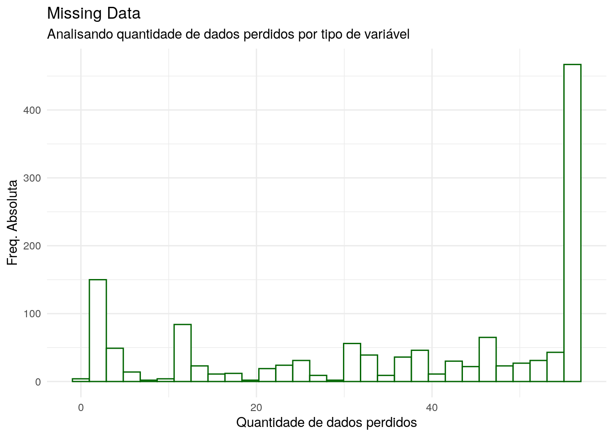

```r
df_in_missing
```

<div data-pagedtable="false">
  <script data-pagedtable-source type="application/json">
{"columns":[{"label":["Indicator Code"],"name":[1],"type":["chr"],"align":["left"]},{"label":["N. Missing"],"name":[2],"type":["int"],"align":["right"]},{"label":["Perc. Missing"],"name":[3],"type":["dbl"],"align":["right"]}],"data":[{"1":"BX.GRT.EXTA.CD.WD","2":"56","3":"1.00000000"},{"1":"BX.GRT.TECH.CD.WD","2":"56","3":"1.00000000"},{"1":"BX.KLT.DREM.CD.DT","2":"56","3":"1.00000000"},{"1":"DC.DAC.AUSL.CD","2":"56","3":"1.00000000"},{"1":"DC.DAC.AUTL.CD","2":"56","3":"1.00000000"},{"1":"DC.DAC.BELL.CD","2":"56","3":"1.00000000"},{"1":"DC.DAC.CANL.CD","2":"56","3":"1.00000000"},{"1":"DC.DAC.CECL.CD","2":"56","3":"1.00000000"},{"1":"DC.DAC.CHEL.CD","2":"56","3":"1.00000000"},{"1":"DC.DAC.CZEL.CD","2":"56","3":"1.00000000"},{"1":"DC.DAC.DEUL.CD","2":"56","3":"1.00000000"},{"1":"DC.DAC.DNKL.CD","2":"56","3":"1.00000000"},{"1":"DC.DAC.ESPL.CD","2":"56","3":"1.00000000"},{"1":"DC.DAC.FINL.CD","2":"56","3":"1.00000000"},{"1":"DC.DAC.FRAL.CD","2":"56","3":"1.00000000"},{"1":"DC.DAC.GBRL.CD","2":"56","3":"1.00000000"},{"1":"DC.DAC.GRCL.CD","2":"56","3":"1.00000000"},{"1":"DC.DAC.IRLL.CD","2":"56","3":"1.00000000"},{"1":"DC.DAC.ISLL.CD","2":"56","3":"1.00000000"},{"1":"DC.DAC.ITAL.CD","2":"56","3":"1.00000000"},{"1":"DC.DAC.JPNL.CD","2":"56","3":"1.00000000"},{"1":"DC.DAC.KORL.CD","2":"56","3":"1.00000000"},{"1":"DC.DAC.LUXL.CD","2":"56","3":"1.00000000"},{"1":"DC.DAC.NLDL.CD","2":"56","3":"1.00000000"},{"1":"DC.DAC.NORL.CD","2":"56","3":"1.00000000"},{"1":"DC.DAC.NZLL.CD","2":"56","3":"1.00000000"},{"1":"DC.DAC.POLL.CD","2":"56","3":"1.00000000"},{"1":"DC.DAC.PRTL.CD","2":"56","3":"1.00000000"},{"1":"DC.DAC.SVKL.CD","2":"56","3":"1.00000000"},{"1":"DC.DAC.SVNL.CD","2":"56","3":"1.00000000"},{"1":"DC.DAC.SWEL.CD","2":"56","3":"1.00000000"},{"1":"DC.DAC.TOTL.CD","2":"56","3":"1.00000000"},{"1":"DC.DAC.USAL.CD","2":"56","3":"1.00000000"},{"1":"DT.AMT.BLAT.CD","2":"56","3":"1.00000000"},{"1":"DT.AMT.BLTC.CD","2":"56","3":"1.00000000"},{"1":"DT.AMT.DIMF.CD","2":"56","3":"1.00000000"},{"1":"DT.AMT.DLTF.CD","2":"56","3":"1.00000000"},{"1":"DT.AMT.DLXF.CD","2":"56","3":"1.00000000"},{"1":"DT.AMT.DPNG.CD","2":"56","3":"1.00000000"},{"1":"DT.AMT.DPPG.CD","2":"56","3":"1.00000000"},{"1":"DT.AMT.MIBR.CD","2":"56","3":"1.00000000"},{"1":"DT.AMT.MIDA.CD","2":"56","3":"1.00000000"},{"1":"DT.AMT.MLAT.CD","2":"56","3":"1.00000000"},{"1":"DT.AMT.MLTC.CD","2":"56","3":"1.00000000"},{"1":"DT.AMT.OFFT.CD","2":"56","3":"1.00000000"},{"1":"DT.AMT.PBND.CD","2":"56","3":"1.00000000"},{"1":"DT.AMT.PCBK.CD","2":"56","3":"1.00000000"},{"1":"DT.AMT.PNGB.CD","2":"56","3":"1.00000000"},{"1":"DT.AMT.PNGC.CD","2":"56","3":"1.00000000"},{"1":"DT.AMT.PROP.CD","2":"56","3":"1.00000000"},{"1":"DT.AMT.PRVT.CD","2":"56","3":"1.00000000"},{"1":"DT.AXA.DPPG.CD","2":"56","3":"1.00000000"},{"1":"DT.AXA.OFFT.CD","2":"56","3":"1.00000000"},{"1":"DT.AXA.PRVT.CD","2":"56","3":"1.00000000"},{"1":"DT.AXF.DPPG.CD","2":"56","3":"1.00000000"},{"1":"DT.AXR.DPPG.CD","2":"56","3":"1.00000000"},{"1":"DT.AXR.OFFT.CD","2":"56","3":"1.00000000"},{"1":"DT.AXR.PRVT.CD","2":"56","3":"1.00000000"},{"1":"DT.COM.DPPG.CD","2":"56","3":"1.00000000"},{"1":"DT.COM.MIBR.CD","2":"56","3":"1.00000000"},{"1":"DT.COM.MIDA.CD","2":"56","3":"1.00000000"},{"1":"DT.COM.OFFT.CD","2":"56","3":"1.00000000"},{"1":"DT.COM.PRVT.CD","2":"56","3":"1.00000000"},{"1":"DT.CUR.DMAK.ZS","2":"56","3":"1.00000000"},{"1":"DT.CUR.EURO.ZS","2":"56","3":"1.00000000"},{"1":"DT.CUR.FFRC.ZS","2":"56","3":"1.00000000"},{"1":"DT.CUR.JYEN.ZS","2":"56","3":"1.00000000"},{"1":"DT.CUR.MULC.ZS","2":"56","3":"1.00000000"},{"1":"DT.CUR.OTHC.ZS","2":"56","3":"1.00000000"},{"1":"DT.CUR.SDRW.ZS","2":"56","3":"1.00000000"},{"1":"DT.CUR.SWFR.ZS","2":"56","3":"1.00000000"},{"1":"DT.CUR.UKPS.ZS","2":"56","3":"1.00000000"},{"1":"DT.CUR.USDL.ZS","2":"56","3":"1.00000000"},{"1":"DT.DFR.DPPG.CD","2":"56","3":"1.00000000"},{"1":"DT.DIS.BLAT.CD","2":"56","3":"1.00000000"},{"1":"DT.DIS.BLTC.CD","2":"56","3":"1.00000000"},{"1":"DT.DIS.DIMF.CD","2":"56","3":"1.00000000"},{"1":"DT.DIS.DLTF.CD","2":"56","3":"1.00000000"},{"1":"DT.DIS.DLXF.CD","2":"56","3":"1.00000000"},{"1":"DT.DIS.DPNG.CD","2":"56","3":"1.00000000"},{"1":"DT.DIS.DPPG.CD","2":"56","3":"1.00000000"},{"1":"DT.DIS.IDAG.CD","2":"56","3":"1.00000000"},{"1":"DT.DIS.MIBR.CD","2":"56","3":"1.00000000"},{"1":"DT.DIS.MIDA.CD","2":"56","3":"1.00000000"},{"1":"DT.DIS.MLAT.CD","2":"56","3":"1.00000000"},{"1":"DT.DIS.MLTC.CD","2":"56","3":"1.00000000"},{"1":"DT.DIS.OFFT.CD","2":"56","3":"1.00000000"},{"1":"DT.DIS.PBND.CD","2":"56","3":"1.00000000"},{"1":"DT.DIS.PCBK.CD","2":"56","3":"1.00000000"},{"1":"DT.DIS.PNGB.CD","2":"56","3":"1.00000000"},{"1":"DT.DIS.PNGC.CD","2":"56","3":"1.00000000"},{"1":"DT.DIS.PROP.CD","2":"56","3":"1.00000000"},{"1":"DT.DIS.PRVT.CD","2":"56","3":"1.00000000"},{"1":"DT.DOD.ALLC.CD","2":"56","3":"1.00000000"},{"1":"DT.DOD.ALLC.ZS","2":"56","3":"1.00000000"},{"1":"DT.DOD.BLAT.CD","2":"56","3":"1.00000000"},{"1":"DT.DOD.BLTC.CD","2":"56","3":"1.00000000"},{"1":"DT.DOD.DECT.CD","2":"56","3":"1.00000000"},{"1":"DT.DOD.DECT.CD.CG","2":"56","3":"1.00000000"},{"1":"DT.DOD.DECT.EX.ZS","2":"56","3":"1.00000000"},{"1":"DT.DOD.DECT.GN.ZS","2":"56","3":"1.00000000"},{"1":"DT.DOD.DIMF.CD","2":"56","3":"1.00000000"},{"1":"DT.DOD.DLXF.CD","2":"56","3":"1.00000000"},{"1":"DT.DOD.DPNG.CD","2":"56","3":"1.00000000"},{"1":"DT.DOD.DPPG.CD","2":"56","3":"1.00000000"},{"1":"DT.DOD.DSTC.CD","2":"56","3":"1.00000000"},{"1":"DT.DOD.DSTC.IR.ZS","2":"56","3":"1.00000000"},{"1":"DT.DOD.DSTC.XP.ZS","2":"56","3":"1.00000000"},{"1":"DT.DOD.DSTC.ZS","2":"56","3":"1.00000000"},{"1":"DT.DOD.MDRI.CD","2":"56","3":"1.00000000"},{"1":"DT.DOD.MIBR.CD","2":"56","3":"1.00000000"},{"1":"DT.DOD.MIDA.CD","2":"56","3":"1.00000000"},{"1":"DT.DOD.MLAT.CD","2":"56","3":"1.00000000"},{"1":"DT.DOD.MLAT.ZS","2":"56","3":"1.00000000"},{"1":"DT.DOD.MLTC.CD","2":"56","3":"1.00000000"},{"1":"DT.DOD.MWBG.CD","2":"56","3":"1.00000000"},{"1":"DT.DOD.OFFT.CD","2":"56","3":"1.00000000"},{"1":"DT.DOD.PBND.CD","2":"56","3":"1.00000000"},{"1":"DT.DOD.PCBK.CD","2":"56","3":"1.00000000"},{"1":"DT.DOD.PNGB.CD","2":"56","3":"1.00000000"},{"1":"DT.DOD.PNGC.CD","2":"56","3":"1.00000000"},{"1":"DT.DOD.PROP.CD","2":"56","3":"1.00000000"},{"1":"DT.DOD.PRVS.CD","2":"56","3":"1.00000000"},{"1":"DT.DOD.PRVT.CD","2":"56","3":"1.00000000"},{"1":"DT.DOD.PUBS.CD","2":"56","3":"1.00000000"},{"1":"DT.DOD.PVLX.CD","2":"56","3":"1.00000000"},{"1":"DT.DOD.PVLX.EX.ZS","2":"56","3":"1.00000000"},{"1":"DT.DOD.PVLX.GN.ZS","2":"56","3":"1.00000000"},{"1":"DT.DOD.RSDL.CD","2":"56","3":"1.00000000"},{"1":"DT.DOD.VTOT.CD","2":"56","3":"1.00000000"},{"1":"DT.DSB.DPPG.CD","2":"56","3":"1.00000000"},{"1":"DT.DSF.DPPG.CD","2":"56","3":"1.00000000"},{"1":"DT.DXR.DPPG.CD","2":"56","3":"1.00000000"},{"1":"DT.GPA.DPPG","2":"56","3":"1.00000000"},{"1":"DT.GPA.OFFT","2":"56","3":"1.00000000"},{"1":"DT.GPA.PRVT","2":"56","3":"1.00000000"},{"1":"DT.GRE.DPPG","2":"56","3":"1.00000000"},{"1":"DT.GRE.OFFT","2":"56","3":"1.00000000"},{"1":"DT.GRE.PRVT","2":"56","3":"1.00000000"},{"1":"DT.INR.DPPG","2":"56","3":"1.00000000"},{"1":"DT.INR.OFFT","2":"56","3":"1.00000000"},{"1":"DT.INR.PRVT","2":"56","3":"1.00000000"},{"1":"DT.INT.BLAT.CD","2":"56","3":"1.00000000"},{"1":"DT.INT.BLTC.CD","2":"56","3":"1.00000000"},{"1":"DT.INT.DECT.CD","2":"56","3":"1.00000000"},{"1":"DT.INT.DECT.EX.ZS","2":"56","3":"1.00000000"},{"1":"DT.INT.DECT.GN.ZS","2":"56","3":"1.00000000"},{"1":"DT.INT.DIMF.CD","2":"56","3":"1.00000000"},{"1":"DT.INT.DLXF.CD","2":"56","3":"1.00000000"},{"1":"DT.INT.DPNG.CD","2":"56","3":"1.00000000"},{"1":"DT.INT.DPPG.CD","2":"56","3":"1.00000000"},{"1":"DT.INT.DSTC.CD","2":"56","3":"1.00000000"},{"1":"DT.INT.MIBR.CD","2":"56","3":"1.00000000"},{"1":"DT.INT.MIDA.CD","2":"56","3":"1.00000000"},{"1":"DT.INT.MLAT.CD","2":"56","3":"1.00000000"},{"1":"DT.INT.MLTC.CD","2":"56","3":"1.00000000"},{"1":"DT.INT.OFFT.CD","2":"56","3":"1.00000000"},{"1":"DT.INT.PBND.CD","2":"56","3":"1.00000000"},{"1":"DT.INT.PCBK.CD","2":"56","3":"1.00000000"},{"1":"DT.INT.PNGB.CD","2":"56","3":"1.00000000"},{"1":"DT.INT.PNGC.CD","2":"56","3":"1.00000000"},{"1":"DT.INT.PROP.CD","2":"56","3":"1.00000000"},{"1":"DT.INT.PRVT.CD","2":"56","3":"1.00000000"},{"1":"DT.IXA.DPPG.CD","2":"56","3":"1.00000000"},{"1":"DT.IXA.DPPG.CD.CG","2":"56","3":"1.00000000"},{"1":"DT.IXA.OFFT.CD","2":"56","3":"1.00000000"},{"1":"DT.IXA.PRVT.CD","2":"56","3":"1.00000000"},{"1":"DT.IXF.DPPG.CD","2":"56","3":"1.00000000"},{"1":"DT.IXR.DPPG.CD","2":"56","3":"1.00000000"},{"1":"DT.IXR.OFFT.CD","2":"56","3":"1.00000000"},{"1":"DT.IXR.PRVT.CD","2":"56","3":"1.00000000"},{"1":"DT.MAT.DPPG","2":"56","3":"1.00000000"},{"1":"DT.MAT.OFFT","2":"56","3":"1.00000000"},{"1":"DT.MAT.PRVT","2":"56","3":"1.00000000"},{"1":"DT.NFL.BLAT.CD","2":"56","3":"1.00000000"},{"1":"DT.NFL.BLTC.CD","2":"56","3":"1.00000000"},{"1":"DT.NFL.BOND.CD","2":"56","3":"1.00000000"},{"1":"DT.NFL.DECT.CD","2":"56","3":"1.00000000"},{"1":"DT.NFL.DLXF.CD","2":"56","3":"1.00000000"},{"1":"DT.NFL.DPNG.CD","2":"56","3":"1.00000000"},{"1":"DT.NFL.DPPG.CD","2":"56","3":"1.00000000"},{"1":"DT.NFL.DSTC.CD","2":"56","3":"1.00000000"},{"1":"DT.NFL.IAEA.CD","2":"56","3":"1.00000000"},{"1":"DT.NFL.IFAD.CD","2":"56","3":"1.00000000"},{"1":"DT.NFL.IMFC.CD","2":"56","3":"1.00000000"},{"1":"DT.NFL.IMFN.CD","2":"56","3":"1.00000000"},{"1":"DT.NFL.MIBR.CD","2":"56","3":"1.00000000"},{"1":"DT.NFL.MIDA.CD","2":"56","3":"1.00000000"},{"1":"DT.NFL.MLAT.CD","2":"56","3":"1.00000000"},{"1":"DT.NFL.MLTC.CD","2":"56","3":"1.00000000"},{"1":"DT.NFL.MOTH.CD","2":"56","3":"1.00000000"},{"1":"DT.NFL.NEBR.CD","2":"56","3":"1.00000000"},{"1":"DT.NFL.NIFC.CD","2":"56","3":"1.00000000"},{"1":"DT.NFL.OFFT.CD","2":"56","3":"1.00000000"},{"1":"DT.NFL.PBND.CD","2":"56","3":"1.00000000"},{"1":"DT.NFL.PCBK.CD","2":"56","3":"1.00000000"},{"1":"DT.NFL.PCBO.CD","2":"56","3":"1.00000000"},{"1":"DT.NFL.PNGB.CD","2":"56","3":"1.00000000"},{"1":"DT.NFL.PNGC.CD","2":"56","3":"1.00000000"},{"1":"DT.NFL.PROP.CD","2":"56","3":"1.00000000"},{"1":"DT.NFL.PRVT.CD","2":"56","3":"1.00000000"},{"1":"DT.NFL.RDBC.CD","2":"56","3":"1.00000000"},{"1":"DT.NFL.RDBN.CD","2":"56","3":"1.00000000"},{"1":"DT.NFL.UNAI.CD","2":"56","3":"1.00000000"},{"1":"DT.NFL.UNCF.CD","2":"56","3":"1.00000000"},{"1":"DT.NFL.UNCR.CD","2":"56","3":"1.00000000"},{"1":"DT.NFL.UNDP.CD","2":"56","3":"1.00000000"},{"1":"DT.NFL.UNEC.CD","2":"56","3":"1.00000000"},{"1":"DT.NFL.UNFP.CD","2":"56","3":"1.00000000"},{"1":"DT.NFL.UNPB.CD","2":"56","3":"1.00000000"},{"1":"DT.NFL.UNRW.CD","2":"56","3":"1.00000000"},{"1":"DT.NFL.UNTA.CD","2":"56","3":"1.00000000"},{"1":"DT.NFL.WFPG.CD","2":"56","3":"1.00000000"},{"1":"DT.NFL.WHOL.CD","2":"56","3":"1.00000000"},{"1":"DT.NTR.BLAT.CD","2":"56","3":"1.00000000"},{"1":"DT.NTR.BLTC.CD","2":"56","3":"1.00000000"},{"1":"DT.NTR.DECT.CD","2":"56","3":"1.00000000"},{"1":"DT.NTR.DLXF.CD","2":"56","3":"1.00000000"},{"1":"DT.NTR.DPNG.CD","2":"56","3":"1.00000000"},{"1":"DT.NTR.DPPG.CD","2":"56","3":"1.00000000"},{"1":"DT.NTR.MIBR.CD","2":"56","3":"1.00000000"},{"1":"DT.NTR.MIDA.CD","2":"56","3":"1.00000000"},{"1":"DT.NTR.MLAT.CD","2":"56","3":"1.00000000"},{"1":"DT.NTR.MLTC.CD","2":"56","3":"1.00000000"},{"1":"DT.NTR.OFFT.CD","2":"56","3":"1.00000000"},{"1":"DT.NTR.PBND.CD","2":"56","3":"1.00000000"},{"1":"DT.NTR.PCBK.CD","2":"56","3":"1.00000000"},{"1":"DT.NTR.PNGB.CD","2":"56","3":"1.00000000"},{"1":"DT.NTR.PNGC.CD","2":"56","3":"1.00000000"},{"1":"DT.NTR.PROP.CD","2":"56","3":"1.00000000"},{"1":"DT.NTR.PRVT.CD","2":"56","3":"1.00000000"},{"1":"DT.ODA.ALLD.CD","2":"56","3":"1.00000000"},{"1":"DT.ODA.ALLD.KD","2":"56","3":"1.00000000"},{"1":"DT.ODA.OATL.CD","2":"56","3":"1.00000000"},{"1":"DT.ODA.OATL.KD","2":"56","3":"1.00000000"},{"1":"DT.ODA.ODAT.CD","2":"56","3":"1.00000000"},{"1":"DT.ODA.ODAT.GI.ZS","2":"56","3":"1.00000000"},{"1":"DT.ODA.ODAT.GN.ZS","2":"56","3":"1.00000000"},{"1":"DT.ODA.ODAT.KD","2":"56","3":"1.00000000"},{"1":"DT.ODA.ODAT.MP.ZS","2":"56","3":"1.00000000"},{"1":"DT.ODA.ODAT.PC.ZS","2":"56","3":"1.00000000"},{"1":"DT.ODA.ODAT.XP.ZS","2":"56","3":"1.00000000"},{"1":"DT.TDS.BLAT.CD","2":"56","3":"1.00000000"},{"1":"DT.TDS.BLTC.CD","2":"56","3":"1.00000000"},{"1":"DT.TDS.DECT.CD","2":"56","3":"1.00000000"},{"1":"DT.TDS.DECT.EX.ZS","2":"56","3":"1.00000000"},{"1":"DT.TDS.DECT.GN.ZS","2":"56","3":"1.00000000"},{"1":"DT.TDS.DIMF.CD","2":"56","3":"1.00000000"},{"1":"DT.TDS.DLXF.CD","2":"56","3":"1.00000000"},{"1":"DT.TDS.DPNG.CD","2":"56","3":"1.00000000"},{"1":"DT.TDS.DPPF.XP.ZS","2":"56","3":"1.00000000"},{"1":"DT.TDS.DPPG.CD","2":"56","3":"1.00000000"},{"1":"DT.TDS.DPPG.GN.ZS","2":"56","3":"1.00000000"},{"1":"DT.TDS.DPPG.XP.ZS","2":"56","3":"1.00000000"},{"1":"DT.TDS.MIBR.CD","2":"56","3":"1.00000000"},{"1":"DT.TDS.MIDA.CD","2":"56","3":"1.00000000"},{"1":"DT.TDS.MLAT.CD","2":"56","3":"1.00000000"},{"1":"DT.TDS.MLAT.PG.ZS","2":"56","3":"1.00000000"},{"1":"DT.TDS.MLTC.CD","2":"56","3":"1.00000000"},{"1":"DT.TDS.OFFT.CD","2":"56","3":"1.00000000"},{"1":"DT.TDS.PBND.CD","2":"56","3":"1.00000000"},{"1":"DT.TDS.PCBK.CD","2":"56","3":"1.00000000"},{"1":"DT.TDS.PNGB.CD","2":"56","3":"1.00000000"},{"1":"DT.TDS.PNGC.CD","2":"56","3":"1.00000000"},{"1":"DT.TDS.PROP.CD","2":"56","3":"1.00000000"},{"1":"DT.TDS.PRVT.CD","2":"56","3":"1.00000000"},{"1":"DT.TXR.DPPG.CD","2":"56","3":"1.00000000"},{"1":"DT.UND.DPPG.CD","2":"56","3":"1.00000000"},{"1":"DT.UND.OFFT.CD","2":"56","3":"1.00000000"},{"1":"DT.UND.PRVT.CD","2":"56","3":"1.00000000"},{"1":"EN.CLC.DRSK.XQ","2":"56","3":"1.00000000"},{"1":"FB.CBK.BRWR.P3","2":"56","3":"1.00000000"},{"1":"FB.CBK.DPTR.P3","2":"56","3":"1.00000000"},{"1":"FI.RES.TOTL.DT.ZS","2":"56","3":"1.00000000"},{"1":"FM.AST.CGOV.ZG.M3","2":"56","3":"1.00000000"},{"1":"FM.AST.DOMO.ZG.M3","2":"56","3":"1.00000000"},{"1":"FM.AST.PRVT.ZG.M3","2":"56","3":"1.00000000"},{"1":"FM.LBL.BMNY.CN","2":"56","3":"1.00000000"},{"1":"FM.LBL.BMNY.GD.ZS","2":"56","3":"1.00000000"},{"1":"FM.LBL.BMNY.IR.ZS","2":"56","3":"1.00000000"},{"1":"FM.LBL.BMNY.ZG","2":"56","3":"1.00000000"},{"1":"FS.LBL.QLIQ.GD.ZS","2":"56","3":"1.00000000"},{"1":"GC.FIN.DOMS.CN","2":"56","3":"1.00000000"},{"1":"GC.FIN.DOMS.GD.ZS","2":"56","3":"1.00000000"},{"1":"GC.FIN.FRGN.CN","2":"56","3":"1.00000000"},{"1":"GC.FIN.FRGN.GD.ZS","2":"56","3":"1.00000000"},{"1":"GC.REV.GOTR.CN","2":"56","3":"1.00000000"},{"1":"GC.REV.GOTR.ZS","2":"56","3":"1.00000000"},{"1":"GC.TAX.EXPT.CN","2":"56","3":"1.00000000"},{"1":"GC.TAX.EXPT.ZS","2":"56","3":"1.00000000"},{"1":"IC.CUS.DURS.EX","2":"56","3":"1.00000000"},{"1":"IC.ELC.DURS","2":"56","3":"1.00000000"},{"1":"IC.ELC.OUTG","2":"56","3":"1.00000000"},{"1":"IC.FRM.BKWC.ZS","2":"56","3":"1.00000000"},{"1":"IC.FRM.BNKS.ZS","2":"56","3":"1.00000000"},{"1":"IC.FRM.BRIB.ZS","2":"56","3":"1.00000000"},{"1":"IC.FRM.CMPU.ZS","2":"56","3":"1.00000000"},{"1":"IC.FRM.CORR.ZS","2":"56","3":"1.00000000"},{"1":"IC.FRM.CRIM.ZS","2":"56","3":"1.00000000"},{"1":"IC.FRM.DURS","2":"56","3":"1.00000000"},{"1":"IC.FRM.FEMM.ZS","2":"56","3":"1.00000000"},{"1":"IC.FRM.FEMO.ZS","2":"56","3":"1.00000000"},{"1":"IC.FRM.FREG.ZS","2":"56","3":"1.00000000"},{"1":"IC.FRM.INFM.ZS","2":"56","3":"1.00000000"},{"1":"IC.FRM.ISOC.ZS","2":"56","3":"1.00000000"},{"1":"IC.FRM.OUTG.ZS","2":"56","3":"1.00000000"},{"1":"IC.FRM.TRNG.ZS","2":"56","3":"1.00000000"},{"1":"IC.GOV.DURS.ZS","2":"56","3":"1.00000000"},{"1":"IC.LGL.PROC","2":"56","3":"1.00000000"},{"1":"IC.TAX.GIFT.ZS","2":"56","3":"1.00000000"},{"1":"IC.TAX.METG","2":"56","3":"1.00000000"},{"1":"IE.PPI.ENGY.CD","2":"56","3":"1.00000000"},{"1":"IE.PPI.TELE.CD","2":"56","3":"1.00000000"},{"1":"IE.PPI.TRAN.CD","2":"56","3":"1.00000000"},{"1":"IE.PPI.WATR.CD","2":"56","3":"1.00000000"},{"1":"IQ.CPA.BREG.XQ","2":"56","3":"1.00000000"},{"1":"IQ.CPA.DEBT.XQ","2":"56","3":"1.00000000"},{"1":"IQ.CPA.ECON.XQ","2":"56","3":"1.00000000"},{"1":"IQ.CPA.ENVR.XQ","2":"56","3":"1.00000000"},{"1":"IQ.CPA.FINQ.XQ","2":"56","3":"1.00000000"},{"1":"IQ.CPA.FINS.XQ","2":"56","3":"1.00000000"},{"1":"IQ.CPA.FISP.XQ","2":"56","3":"1.00000000"},{"1":"IQ.CPA.GNDR.XQ","2":"56","3":"1.00000000"},{"1":"IQ.CPA.HRES.XQ","2":"56","3":"1.00000000"},{"1":"IQ.CPA.IRAI.XQ","2":"56","3":"1.00000000"},{"1":"IQ.CPA.MACR.XQ","2":"56","3":"1.00000000"},{"1":"IQ.CPA.PADM.XQ","2":"56","3":"1.00000000"},{"1":"IQ.CPA.PRES.XQ","2":"56","3":"1.00000000"},{"1":"IQ.CPA.PROP.XQ","2":"56","3":"1.00000000"},{"1":"IQ.CPA.PROT.XQ","2":"56","3":"1.00000000"},{"1":"IQ.CPA.PUBS.XQ","2":"56","3":"1.00000000"},{"1":"IQ.CPA.REVN.XQ","2":"56","3":"1.00000000"},{"1":"IQ.CPA.SOCI.XQ","2":"56","3":"1.00000000"},{"1":"IQ.CPA.STRC.XQ","2":"56","3":"1.00000000"},{"1":"IQ.CPA.TRAD.XQ","2":"56","3":"1.00000000"},{"1":"IQ.CPA.TRAN.XQ","2":"56","3":"1.00000000"},{"1":"IQ.SCI.MTHD","2":"56","3":"1.00000000"},{"1":"IQ.SCI.OVRL","2":"56","3":"1.00000000"},{"1":"IQ.SCI.PRDC","2":"56","3":"1.00000000"},{"1":"IQ.SCI.SRCE","2":"56","3":"1.00000000"},{"1":"NE.GDI.FPRV.CN","2":"56","3":"1.00000000"},{"1":"NE.GDI.FPRV.ZS","2":"56","3":"1.00000000"},{"1":"NE.GDI.STKB.KN","2":"56","3":"1.00000000"},{"1":"per_allsp.adq_pop_tot","2":"56","3":"1.00000000"},{"1":"per_allsp.ben_q1_tot","2":"56","3":"1.00000000"},{"1":"per_allsp.cov_pop_tot","2":"56","3":"1.00000000"},{"1":"per_lm_alllm.adq_pop_tot","2":"56","3":"1.00000000"},{"1":"per_lm_alllm.ben_q1_tot","2":"56","3":"1.00000000"},{"1":"per_lm_alllm.cov_pop_tot","2":"56","3":"1.00000000"},{"1":"per_sa_allsa.adq_pop_tot","2":"56","3":"1.00000000"},{"1":"per_sa_allsa.ben_q1_tot","2":"56","3":"1.00000000"},{"1":"per_sa_allsa.cov_pop_tot","2":"56","3":"1.00000000"},{"1":"per_si_allsi.adq_pop_tot","2":"56","3":"1.00000000"},{"1":"per_si_allsi.ben_q1_tot","2":"56","3":"1.00000000"},{"1":"per_si_allsi.cov_pop_tot","2":"56","3":"1.00000000"},{"1":"SE.ADT.1524.LT.FE.ZS","2":"56","3":"1.00000000"},{"1":"SE.ADT.1524.LT.FM.ZS","2":"56","3":"1.00000000"},{"1":"SE.ADT.1524.LT.MA.ZS","2":"56","3":"1.00000000"},{"1":"SE.ADT.1524.LT.ZS","2":"56","3":"1.00000000"},{"1":"SE.ADT.LITR.FE.ZS","2":"56","3":"1.00000000"},{"1":"SE.ADT.LITR.MA.ZS","2":"56","3":"1.00000000"},{"1":"SE.ADT.LITR.ZS","2":"56","3":"1.00000000"},{"1":"SE.PRM.NINT.FE.ZS","2":"56","3":"1.00000000"},{"1":"SE.PRM.NINT.MA.ZS","2":"56","3":"1.00000000"},{"1":"SE.PRM.NINT.ZS","2":"56","3":"1.00000000"},{"1":"SE.PRM.TCAQ.FE.ZS","2":"56","3":"1.00000000"},{"1":"SE.PRM.TCAQ.MA.ZS","2":"56","3":"1.00000000"},{"1":"SE.PRM.TCAQ.ZS","2":"56","3":"1.00000000"},{"1":"SE.SEC.PROG.FE.ZS","2":"56","3":"1.00000000"},{"1":"SE.SEC.PROG.MA.ZS","2":"56","3":"1.00000000"},{"1":"SG.VAW.ARGU.ZS","2":"56","3":"1.00000000"},{"1":"SG.VAW.BURN.ZS","2":"56","3":"1.00000000"},{"1":"SG.VAW.GOES.ZS","2":"56","3":"1.00000000"},{"1":"SG.VAW.NEGL.ZS","2":"56","3":"1.00000000"},{"1":"SG.VAW.REAS.ZS","2":"56","3":"1.00000000"},{"1":"SG.VAW.REFU.ZS","2":"56","3":"1.00000000"},{"1":"SH.CON.1524.FE.ZS","2":"56","3":"1.00000000"},{"1":"SH.CON.1524.MA.ZS","2":"56","3":"1.00000000"},{"1":"SH.DYN.AIDS.FE.ZS","2":"56","3":"1.00000000"},{"1":"SH.DYN.AIDS.ZS","2":"56","3":"1.00000000"},{"1":"SH.HIV.0014","2":"56","3":"1.00000000"},{"1":"SH.HIV.1524.FE.ZS","2":"56","3":"1.00000000"},{"1":"SH.HIV.1524.MA.ZS","2":"56","3":"1.00000000"},{"1":"SH.HIV.ARTC.ZS","2":"56","3":"1.00000000"},{"1":"SH.MED.CMHW.P3","2":"56","3":"1.00000000"},{"1":"SH.MLR.NETS.ZS","2":"56","3":"1.00000000"},{"1":"SH.MLR.TRET.ZS","2":"56","3":"1.00000000"},{"1":"SH.STA.ARIC.ZS","2":"56","3":"1.00000000"},{"1":"SH.STA.BFED.ZS","2":"56","3":"1.00000000"},{"1":"SH.STA.MALN.FE.ZS","2":"56","3":"1.00000000"},{"1":"SH.STA.MALN.MA.ZS","2":"56","3":"1.00000000"},{"1":"SH.STA.MALN.ZS","2":"56","3":"1.00000000"},{"1":"SH.STA.ORCF.ZS","2":"56","3":"1.00000000"},{"1":"SH.STA.ORTH","2":"56","3":"1.00000000"},{"1":"SH.STA.OWGH.FE.ZS","2":"56","3":"1.00000000"},{"1":"SH.STA.OWGH.MA.ZS","2":"56","3":"1.00000000"},{"1":"SH.STA.OWGH.ZS","2":"56","3":"1.00000000"},{"1":"SH.STA.STNT.FE.ZS","2":"56","3":"1.00000000"},{"1":"SH.STA.STNT.MA.ZS","2":"56","3":"1.00000000"},{"1":"SH.STA.STNT.ZS","2":"56","3":"1.00000000"},{"1":"SH.STA.WAST.FE.ZS","2":"56","3":"1.00000000"},{"1":"SH.STA.WAST.MA.ZS","2":"56","3":"1.00000000"},{"1":"SH.STA.WAST.ZS","2":"56","3":"1.00000000"},{"1":"SH.SVR.WAST.FE.ZS","2":"56","3":"1.00000000"},{"1":"SH.SVR.WAST.MA.ZS","2":"56","3":"1.00000000"},{"1":"SH.SVR.WAST.ZS","2":"56","3":"1.00000000"},{"1":"SH.TBS.CURE.ZS","2":"56","3":"1.00000000"},{"1":"SH.VAC.TTNS.ZS","2":"56","3":"1.00000000"},{"1":"SI.POV.2DAY","2":"56","3":"1.00000000"},{"1":"SI.POV.DDAY","2":"56","3":"1.00000000"},{"1":"SI.POV.GAP2","2":"56","3":"1.00000000"},{"1":"SI.POV.GAPS","2":"56","3":"1.00000000"},{"1":"SI.POV.NAGP","2":"56","3":"1.00000000"},{"1":"SI.POV.NAHC","2":"56","3":"1.00000000"},{"1":"SI.POV.RUGP","2":"56","3":"1.00000000"},{"1":"SI.POV.RUHC","2":"56","3":"1.00000000"},{"1":"SI.POV.URGP","2":"56","3":"1.00000000"},{"1":"SI.POV.URHC","2":"56","3":"1.00000000"},{"1":"SI.SPR.PC40.05","2":"56","3":"1.00000000"},{"1":"SI.SPR.PCAP.05","2":"56","3":"1.00000000"},{"1":"SL.AGR.0714.FE.ZS","2":"56","3":"1.00000000"},{"1":"SL.AGR.0714.MA.ZS","2":"56","3":"1.00000000"},{"1":"SL.AGR.0714.ZS","2":"56","3":"1.00000000"},{"1":"SL.FAM.0714.FE.ZS","2":"56","3":"1.00000000"},{"1":"SL.FAM.0714.MA.ZS","2":"56","3":"1.00000000"},{"1":"SL.FAM.0714.ZS","2":"56","3":"1.00000000"},{"1":"SL.MNF.0714.FE.ZS","2":"56","3":"1.00000000"},{"1":"SL.MNF.0714.MA.ZS","2":"56","3":"1.00000000"},{"1":"SL.MNF.0714.ZS","2":"56","3":"1.00000000"},{"1":"SL.SLF.0714.FE.ZS","2":"56","3":"1.00000000"},{"1":"SL.SLF.0714.MA.ZS","2":"56","3":"1.00000000"},{"1":"SL.SLF.0714.ZS","2":"56","3":"1.00000000"},{"1":"SL.SRV.0714.FE.ZS","2":"56","3":"1.00000000"},{"1":"SL.SRV.0714.MA.ZS","2":"56","3":"1.00000000"},{"1":"SL.SRV.0714.ZS","2":"56","3":"1.00000000"},{"1":"SL.TLF.0714.FE.ZS","2":"56","3":"1.00000000"},{"1":"SL.TLF.0714.MA.ZS","2":"56","3":"1.00000000"},{"1":"SL.TLF.0714.SW.FE.TM","2":"56","3":"1.00000000"},{"1":"SL.TLF.0714.SW.FE.ZS","2":"56","3":"1.00000000"},{"1":"SL.TLF.0714.SW.MA.TM","2":"56","3":"1.00000000"},{"1":"SL.TLF.0714.SW.MA.ZS","2":"56","3":"1.00000000"},{"1":"SL.TLF.0714.SW.TM","2":"56","3":"1.00000000"},{"1":"SL.TLF.0714.SW.ZS","2":"56","3":"1.00000000"},{"1":"SL.TLF.0714.WK.FE.TM","2":"56","3":"1.00000000"},{"1":"SL.TLF.0714.WK.FE.ZS","2":"56","3":"1.00000000"},{"1":"SL.TLF.0714.WK.MA.TM","2":"56","3":"1.00000000"},{"1":"SL.TLF.0714.WK.MA.ZS","2":"56","3":"1.00000000"},{"1":"SL.TLF.0714.WK.TM","2":"56","3":"1.00000000"},{"1":"SL.TLF.0714.WK.ZS","2":"56","3":"1.00000000"},{"1":"SL.TLF.0714.ZS","2":"56","3":"1.00000000"},{"1":"SL.WAG.0714.FE.ZS","2":"56","3":"1.00000000"},{"1":"SL.WAG.0714.MA.ZS","2":"56","3":"1.00000000"},{"1":"SL.WAG.0714.ZS","2":"56","3":"1.00000000"},{"1":"SN.ITK.DEFC.ZS","2":"56","3":"1.00000000"},{"1":"SN.ITK.DFCT","2":"56","3":"1.00000000"},{"1":"SN.ITK.SALT.ZS","2":"56","3":"1.00000000"},{"1":"SN.ITK.VITA.ZS","2":"56","3":"1.00000000"},{"1":"SP.DYN.WFRT","2":"56","3":"1.00000000"},{"1":"SP.HOU.FEMA.ZS","2":"56","3":"1.00000000"},{"1":"SP.MTR.1519.ZS","2":"56","3":"1.00000000"},{"1":"SP.REG.BRTH.RU.ZS","2":"56","3":"1.00000000"},{"1":"SP.REG.BRTH.UR.ZS","2":"56","3":"1.00000000"},{"1":"TM.VAL.MRCH.WR.ZS","2":"56","3":"1.00000000"},{"1":"TX.VAL.MRCH.WR.ZS","2":"56","3":"1.00000000"},{"1":"VC.IDP.TOTL.HE","2":"56","3":"1.00000000"},{"1":"VC.IDP.TOTL.LE","2":"56","3":"1.00000000"},{"1":"VC.PKP.TOTL.UN","2":"56","3":"1.00000000"},{"1":"EN.BIR.THRD.NO","2":"55","3":"0.98214286"},{"1":"EN.CLC.MDAT.ZS","2":"55","3":"0.98214286"},{"1":"EN.FSH.THRD.NO","2":"55","3":"0.98214286"},{"1":"EN.HPT.THRD.NO","2":"55","3":"0.98214286"},{"1":"EN.MAM.THRD.NO","2":"55","3":"0.98214286"},{"1":"FB.POS.TOTL.P5","2":"55","3":"0.98214286"},{"1":"PA.NUS.PPP.05","2":"55","3":"0.98214286"},{"1":"PA.NUS.PRVT.PP.05","2":"55","3":"0.98214286"},{"1":"SH.STA.BRTC.ZS","2":"55","3":"0.98214286"},{"1":"SH.STA.DIAB.ZS","2":"55","3":"0.98214286"},{"1":"SH.STA.MMRT.NE","2":"55","3":"0.98214286"},{"1":"SI.SPR.PC40.ZG","2":"55","3":"0.98214286"},{"1":"SI.SPR.PCAP.ZG","2":"55","3":"0.98214286"},{"1":"SP.REG.BRTH.ZS","2":"55","3":"0.98214286"},{"1":"AG.LND.EL5M.ZS","2":"54","3":"0.96428571"},{"1":"AG.LND.IRIG.AG.ZS","2":"54","3":"0.96428571"},{"1":"EG.NSF.ACCS.RU.ZS","2":"54","3":"0.96428571"},{"1":"EG.NSF.ACCS.UR.ZS","2":"54","3":"0.96428571"},{"1":"EN.POP.EL5M.ZS","2":"54","3":"0.96428571"},{"1":"ER.BDV.TOTL.XQ","2":"54","3":"0.96428571"},{"1":"IC.BUS.EASE.XQ","2":"54","3":"0.96428571"},{"1":"IC.ISV.DURS","2":"54","3":"0.96428571"},{"1":"IC.TAX.OTHR.CP.ZS","2":"54","3":"0.96428571"},{"1":"SE.PRM.CMPT.FE.ZS","2":"54","3":"0.96428571"},{"1":"SE.PRM.CMPT.MA.ZS","2":"54","3":"0.96428571"},{"1":"SE.PRM.GINT.FE.ZS","2":"54","3":"0.96428571"},{"1":"SE.PRM.GINT.MA.ZS","2":"54","3":"0.96428571"},{"1":"SE.PRM.PRS5.FE.ZS","2":"54","3":"0.96428571"},{"1":"SE.PRM.PRS5.MA.ZS","2":"54","3":"0.96428571"},{"1":"SE.PRM.PRSL.FE.ZS","2":"54","3":"0.96428571"},{"1":"SE.PRM.PRSL.MA.ZS","2":"54","3":"0.96428571"},{"1":"SE.PRM.REPT.FE.ZS","2":"54","3":"0.96428571"},{"1":"SE.PRM.REPT.MA.ZS","2":"54","3":"0.96428571"},{"1":"SH.DTH.COMM.ZS","2":"54","3":"0.96428571"},{"1":"SH.DTH.INJR.ZS","2":"54","3":"0.96428571"},{"1":"SH.DTH.NCOM.ZS","2":"54","3":"0.96428571"},{"1":"SH.STA.ANVC.ZS","2":"54","3":"0.96428571"},{"1":"SH.STA.BRTW.ZS","2":"54","3":"0.96428571"},{"1":"SI.SPR.PC40","2":"54","3":"0.96428571"},{"1":"SI.SPR.PCAP","2":"54","3":"0.96428571"},{"1":"SM.EMI.TERT.ZS","2":"54","3":"0.96428571"},{"1":"SP.UWT.TFRT","2":"54","3":"0.96428571"},{"1":"VC.BTL.DETH","2":"54","3":"0.96428571"},{"1":"ER.H2O.FWDM.ZS","2":"53","3":"0.94642857"},{"1":"ER.H2O.FWIN.ZS","2":"53","3":"0.94642857"},{"1":"IC.CRD.INFO.XQ","2":"53","3":"0.94642857"},{"1":"IC.LGL.CRED.XQ","2":"53","3":"0.94642857"},{"1":"IC.TAX.LABR.CP.ZS","2":"53","3":"0.94642857"},{"1":"IC.TAX.PRFT.CP.ZS","2":"53","3":"0.94642857"},{"1":"LP.EXP.DURS.MD","2":"53","3":"0.94642857"},{"1":"LP.IMP.DURS.MD","2":"53","3":"0.94642857"},{"1":"NY.ADJ.DPEM.CD","2":"53","3":"0.94642857"},{"1":"NY.ADJ.DPEM.GN.ZS","2":"53","3":"0.94642857"},{"1":"NY.ADJ.SVNG.CD","2":"53","3":"0.94642857"},{"1":"SH.MED.NUMW.P3","2":"53","3":"0.94642857"},{"1":"SP.DTH.INFR.ZS","2":"53","3":"0.94642857"},{"1":"EG.ELC.ACCS.RU.ZS","2":"52","3":"0.92857143"},{"1":"EG.ELC.ACCS.UR.ZS","2":"52","3":"0.92857143"},{"1":"EG.ELC.ACCS.ZS","2":"52","3":"0.92857143"},{"1":"EG.NSF.ACCS.ZS","2":"52","3":"0.92857143"},{"1":"LP.LPI.CUST.XQ","2":"52","3":"0.92857143"},{"1":"LP.LPI.INFR.XQ","2":"52","3":"0.92857143"},{"1":"LP.LPI.ITRN.XQ","2":"52","3":"0.92857143"},{"1":"LP.LPI.LOGS.XQ","2":"52","3":"0.92857143"},{"1":"LP.LPI.OVRL.XQ","2":"52","3":"0.92857143"},{"1":"LP.LPI.TIME.XQ","2":"52","3":"0.92857143"},{"1":"LP.LPI.TRAC.XQ","2":"52","3":"0.92857143"},{"1":"SH.DYN.MORT.FE","2":"52","3":"0.92857143"},{"1":"SH.DYN.MORT.MA","2":"52","3":"0.92857143"},{"1":"SH.PRV.SMOK.FE","2":"52","3":"0.92857143"},{"1":"SH.PRV.SMOK.MA","2":"52","3":"0.92857143"},{"1":"SP.DTH.REPT.ZS","2":"52","3":"0.92857143"},{"1":"SP.DYN.IMRT.FE.IN","2":"52","3":"0.92857143"},{"1":"SP.DYN.IMRT.MA.IN","2":"52","3":"0.92857143"},{"1":"EN.ATM.GHGO.KT.CE","2":"51","3":"0.91071429"},{"1":"EN.ATM.HFCG.KT.CE","2":"51","3":"0.91071429"},{"1":"EN.ATM.METH.AG.KT.CE","2":"51","3":"0.91071429"},{"1":"EN.ATM.METH.AG.ZS","2":"51","3":"0.91071429"},{"1":"EN.ATM.METH.EG.KT.CE","2":"51","3":"0.91071429"},{"1":"EN.ATM.METH.EG.ZS","2":"51","3":"0.91071429"},{"1":"EN.ATM.METH.KT.CE","2":"51","3":"0.91071429"},{"1":"EN.ATM.NOXE.AG.KT.CE","2":"51","3":"0.91071429"},{"1":"EN.ATM.NOXE.AG.ZS","2":"51","3":"0.91071429"},{"1":"EN.ATM.NOXE.EG.KT.CE","2":"51","3":"0.91071429"},{"1":"EN.ATM.NOXE.EI.ZS","2":"51","3":"0.91071429"},{"1":"EN.ATM.NOXE.IN.KT.CE","2":"51","3":"0.91071429"},{"1":"EN.ATM.NOXE.KT.CE","2":"51","3":"0.91071429"},{"1":"EN.ATM.PFCG.KT.CE","2":"51","3":"0.91071429"},{"1":"EN.ATM.SF6G.KT.CE","2":"51","3":"0.91071429"},{"1":"ER.H2O.FWAG.ZS","2":"51","3":"0.91071429"},{"1":"SP.REG.DTHS.ZS","2":"51","3":"0.91071429"},{"1":"NY.ADJ.SVNG.GN.ZS","2":"50","3":"0.89285714"},{"1":"SL.UEM.PRIM.FE.ZS","2":"50","3":"0.89285714"},{"1":"SL.UEM.PRIM.MA.ZS","2":"50","3":"0.89285714"},{"1":"SL.UEM.PRIM.ZS","2":"50","3":"0.89285714"},{"1":"SL.UEM.SECO.FE.ZS","2":"50","3":"0.89285714"},{"1":"SL.UEM.SECO.MA.ZS","2":"50","3":"0.89285714"},{"1":"SL.UEM.SECO.ZS","2":"50","3":"0.89285714"},{"1":"SL.UEM.TERT.FE.ZS","2":"50","3":"0.89285714"},{"1":"SL.UEM.TERT.MA.ZS","2":"50","3":"0.89285714"},{"1":"SL.UEM.TERT.ZS","2":"50","3":"0.89285714"},{"1":"EN.ATM.PM25.MC.M3","2":"49","3":"0.87500000"},{"1":"EN.ATM.PM25.MC.ZS","2":"49","3":"0.87500000"},{"1":"ER.GDP.FWTL.M3.KD","2":"49","3":"0.87500000"},{"1":"ER.H2O.FWTL.K3","2":"49","3":"0.87500000"},{"1":"ER.H2O.FWTL.ZS","2":"49","3":"0.87500000"},{"1":"IC.BUS.DFRN.XQ","2":"49","3":"0.87500000"},{"1":"IC.ELC.TIME","2":"49","3":"0.87500000"},{"1":"IQ.WEF.CUST.XQ","2":"48","3":"0.85714286"},{"1":"IQ.WEF.PORT.XQ","2":"48","3":"0.85714286"},{"1":"SE.SEC.CMPT.LO.FE.ZS","2":"48","3":"0.85714286"},{"1":"SE.SEC.CMPT.LO.MA.ZS","2":"48","3":"0.85714286"},{"1":"SE.SEC.REPT.FE.ZS","2":"48","3":"0.85714286"},{"1":"SE.SEC.REPT.MA.ZS","2":"48","3":"0.85714286"},{"1":"SI.DST.02ND.20","2":"48","3":"0.85714286"},{"1":"SI.DST.03RD.20","2":"48","3":"0.85714286"},{"1":"SI.DST.04TH.20","2":"48","3":"0.85714286"},{"1":"SI.DST.05TH.20","2":"48","3":"0.85714286"},{"1":"SI.DST.10TH.10","2":"48","3":"0.85714286"},{"1":"SI.DST.FRST.10","2":"48","3":"0.85714286"},{"1":"SI.DST.FRST.20","2":"48","3":"0.85714286"},{"1":"SI.POV.GINI","2":"48","3":"0.85714286"},{"1":"SP.DYN.CONU.ZS","2":"48","3":"0.85714286"},{"1":"SP.POP.TECH.RD.P6","2":"48","3":"0.85714286"},{"1":"BN.RES.INCL.CD","2":"47","3":"0.83928571"},{"1":"ST.INT.RCPT.XP.ZS","2":"47","3":"0.83928571"},{"1":"ST.INT.XPND.MP.ZS","2":"47","3":"0.83928571"},{"1":"BG.GSR.NFSV.GD.ZS","2":"46","3":"0.82142857"},{"1":"BM.GSR.CMCP.ZS","2":"46","3":"0.82142857"},{"1":"BM.GSR.FCTY.CD","2":"46","3":"0.82142857"},{"1":"BM.GSR.GNFS.CD","2":"46","3":"0.82142857"},{"1":"BM.GSR.INSF.ZS","2":"46","3":"0.82142857"},{"1":"BM.GSR.MRCH.CD","2":"46","3":"0.82142857"},{"1":"BM.GSR.NFSV.CD","2":"46","3":"0.82142857"},{"1":"BM.GSR.ROYL.CD","2":"46","3":"0.82142857"},{"1":"BM.GSR.TOTL.CD","2":"46","3":"0.82142857"},{"1":"BM.GSR.TRAN.ZS","2":"46","3":"0.82142857"},{"1":"BM.GSR.TRVL.ZS","2":"46","3":"0.82142857"},{"1":"BM.KLT.DINV.GD.ZS","2":"46","3":"0.82142857"},{"1":"BM.TRF.PRVT.CD","2":"46","3":"0.82142857"},{"1":"BN.CAB.XOKA.CD","2":"46","3":"0.82142857"},{"1":"BN.CAB.XOKA.GD.ZS","2":"46","3":"0.82142857"},{"1":"BN.FIN.TOTL.CD","2":"46","3":"0.82142857"},{"1":"BN.GSR.FCTY.CD","2":"46","3":"0.82142857"},{"1":"BN.GSR.GNFS.CD","2":"46","3":"0.82142857"},{"1":"BN.GSR.MRCH.CD","2":"46","3":"0.82142857"},{"1":"BN.KAC.EOMS.CD","2":"46","3":"0.82142857"},{"1":"BN.KLT.DINV.CD","2":"46","3":"0.82142857"},{"1":"BN.KLT.PTXL.CD","2":"46","3":"0.82142857"},{"1":"BN.TRF.KOGT.CD","2":"46","3":"0.82142857"},{"1":"BX.GSR.CCIS.CD","2":"46","3":"0.82142857"},{"1":"BX.GSR.CCIS.ZS","2":"46","3":"0.82142857"},{"1":"BX.GSR.CMCP.ZS","2":"46","3":"0.82142857"},{"1":"BX.GSR.FCTY.CD","2":"46","3":"0.82142857"},{"1":"BX.GSR.GNFS.CD","2":"46","3":"0.82142857"},{"1":"BX.GSR.INSF.ZS","2":"46","3":"0.82142857"},{"1":"BX.GSR.MRCH.CD","2":"46","3":"0.82142857"},{"1":"BX.GSR.NFSV.CD","2":"46","3":"0.82142857"},{"1":"BX.GSR.ROYL.CD","2":"46","3":"0.82142857"},{"1":"BX.GSR.TOTL.CD","2":"46","3":"0.82142857"},{"1":"BX.GSR.TRAN.ZS","2":"46","3":"0.82142857"},{"1":"BX.GSR.TRVL.ZS","2":"46","3":"0.82142857"},{"1":"BX.TRF.CURR.CD","2":"46","3":"0.82142857"},{"1":"BX.TRF.PWKR.CD","2":"46","3":"0.82142857"},{"1":"EP.PMP.DESL.CD","2":"46","3":"0.82142857"},{"1":"EP.PMP.SGAS.CD","2":"46","3":"0.82142857"},{"1":"FB.ATM.TOTL.P5","2":"46","3":"0.82142857"},{"1":"FB.BNK.CAPA.ZS","2":"46","3":"0.82142857"},{"1":"FB.CBK.BRCH.P5","2":"46","3":"0.82142857"},{"1":"FI.RES.TOTL.MO","2":"46","3":"0.82142857"},{"1":"IC.BUS.NDNS.ZS","2":"46","3":"0.82142857"},{"1":"IC.BUS.NREG","2":"46","3":"0.82142857"},{"1":"IC.EXP.COST.CD","2":"46","3":"0.82142857"},{"1":"IC.EXP.DOCS","2":"46","3":"0.82142857"},{"1":"IC.EXP.DURS","2":"46","3":"0.82142857"},{"1":"IC.IMP.COST.CD","2":"46","3":"0.82142857"},{"1":"IC.IMP.DOCS","2":"46","3":"0.82142857"},{"1":"IC.IMP.DURS","2":"46","3":"0.82142857"},{"1":"SE.SEC.PROG.ZS","2":"46","3":"0.82142857"},{"1":"TM.VAL.INSF.ZS.WT","2":"46","3":"0.82142857"},{"1":"TM.VAL.OTHR.ZS.WT","2":"46","3":"0.82142857"},{"1":"TM.VAL.SERV.CD.WT","2":"46","3":"0.82142857"},{"1":"TM.VAL.TRAN.ZS.WT","2":"46","3":"0.82142857"},{"1":"TM.VAL.TRVL.ZS.WT","2":"46","3":"0.82142857"},{"1":"TX.VAL.INSF.ZS.WT","2":"46","3":"0.82142857"},{"1":"TX.VAL.OTHR.ZS.WT","2":"46","3":"0.82142857"},{"1":"TX.VAL.SERV.CD.WT","2":"46","3":"0.82142857"},{"1":"TX.VAL.TRAN.ZS.WT","2":"46","3":"0.82142857"},{"1":"TX.VAL.TRVL.ZS.WT","2":"46","3":"0.82142857"},{"1":"IC.BUS.DISC.XQ","2":"45","3":"0.80357143"},{"1":"IC.TAX.DURS","2":"45","3":"0.80357143"},{"1":"IC.TAX.PAYM","2":"45","3":"0.80357143"},{"1":"IC.TAX.TOTL.CP.ZS","2":"45","3":"0.80357143"},{"1":"IC.WRH.DURS","2":"45","3":"0.80357143"},{"1":"IC.WRH.PROC","2":"45","3":"0.80357143"},{"1":"IS.SHP.GCNW.XQ","2":"45","3":"0.80357143"},{"1":"SM.POP.NETM","2":"45","3":"0.80357143"},{"1":"SM.POP.TOTL","2":"45","3":"0.80357143"},{"1":"SM.POP.TOTL.ZS","2":"45","3":"0.80357143"},{"1":"AG.CON.FERT.PT.ZS","2":"44","3":"0.78571429"},{"1":"AG.CON.FERT.ZS","2":"44","3":"0.78571429"},{"1":"AG.LND.PRCP.MM","2":"44","3":"0.78571429"},{"1":"ER.H2O.INTR.K3","2":"44","3":"0.78571429"},{"1":"ER.H2O.INTR.PC","2":"44","3":"0.78571429"},{"1":"IC.CRD.PRVT.ZS","2":"44","3":"0.78571429"},{"1":"IC.CRD.PUBL.ZS","2":"44","3":"0.78571429"},{"1":"IC.PRP.DURS","2":"44","3":"0.78571429"},{"1":"IC.PRP.PROC","2":"44","3":"0.78571429"},{"1":"SE.PRM.PRS5.ZS","2":"44","3":"0.78571429"},{"1":"SE.PRM.PRSL.ZS","2":"44","3":"0.78571429"},{"1":"SE.TER.TCHR.FE.ZS","2":"44","3":"0.78571429"},{"1":"FM.LBL.MQMY.ZG","2":"43","3":"0.76785714"},{"1":"IC.LGL.DURS","2":"43","3":"0.76785714"},{"1":"IC.REG.COST.PC.ZS","2":"43","3":"0.76785714"},{"1":"IC.REG.DURS","2":"43","3":"0.76785714"},{"1":"IC.REG.PROC","2":"43","3":"0.76785714"},{"1":"IT.NET.SECR","2":"43","3":"0.76785714"},{"1":"IT.NET.SECR.P6","2":"43","3":"0.76785714"},{"1":"SH.XPD.EXTR.ZS","2":"43","3":"0.76785714"},{"1":"SL.UEM.NEET.FE.ZS","2":"43","3":"0.76785714"},{"1":"SL.UEM.NEET.MA.ZS","2":"43","3":"0.76785714"},{"1":"SL.UEM.NEET.ZS","2":"43","3":"0.76785714"},{"1":"FD.RES.LIQU.AS.ZS","2":"42","3":"0.75000000"},{"1":"FM.LBL.MONY.CN","2":"42","3":"0.75000000"},{"1":"FM.LBL.MQMY.CN","2":"42","3":"0.75000000"},{"1":"FM.LBL.MQMY.GD.ZS","2":"42","3":"0.75000000"},{"1":"FM.LBL.MQMY.IR.ZS","2":"42","3":"0.75000000"},{"1":"FM.LBL.QMNY.CN","2":"42","3":"0.75000000"},{"1":"FS.AST.DOMO.GD.ZS","2":"42","3":"0.75000000"},{"1":"IS.SHP.GOOD.TU","2":"42","3":"0.75000000"},{"1":"SE.XPD.PRIM.PC.ZS","2":"42","3":"0.75000000"},{"1":"SE.XPD.PRIM.ZS","2":"42","3":"0.75000000"},{"1":"SE.XPD.SECO.PC.ZS","2":"42","3":"0.75000000"},{"1":"SE.XPD.SECO.ZS","2":"42","3":"0.75000000"},{"1":"SE.XPD.TERT.PC.ZS","2":"42","3":"0.75000000"},{"1":"SE.XPD.TERT.ZS","2":"42","3":"0.75000000"},{"1":"TM.QTY.MRCH.XD.WD","2":"42","3":"0.75000000"},{"1":"TM.VAL.ICTG.ZS.UN","2":"42","3":"0.75000000"},{"1":"TT.PRI.MRCH.XD.WD","2":"42","3":"0.75000000"},{"1":"TX.QTY.MRCH.XD.WD","2":"42","3":"0.75000000"},{"1":"TX.VAL.ICTG.ZS.UN","2":"42","3":"0.75000000"},{"1":"SE.SEC.PRIV.ZS","2":"41","3":"0.73214286"},{"1":"SE.XPD.CPRM.ZS","2":"41","3":"0.73214286"},{"1":"SE.XPD.CSEC.ZS","2":"41","3":"0.73214286"},{"1":"SE.XPD.CTER.ZS","2":"41","3":"0.73214286"},{"1":"SE.XPD.CTOT.ZS","2":"41","3":"0.73214286"},{"1":"SE.XPD.MPRM.ZS","2":"41","3":"0.73214286"},{"1":"SE.XPD.MSEC.ZS","2":"41","3":"0.73214286"},{"1":"SE.XPD.MTER.ZS","2":"41","3":"0.73214286"},{"1":"SE.XPD.MTOT.ZS","2":"41","3":"0.73214286"},{"1":"SE.XPD.TOTL.GB.ZS","2":"41","3":"0.73214286"},{"1":"SP.POP.SCIE.RD.P6","2":"40","3":"0.71428571"},{"1":"FB.AST.NPER.ZS","2":"39","3":"0.69642857"},{"1":"GB.XPD.RSDV.GD.ZS","2":"39","3":"0.69642857"},{"1":"IT.NET.BBND","2":"39","3":"0.69642857"},{"1":"IT.NET.BBND.P2","2":"39","3":"0.69642857"},{"1":"SE.PRM.CMPT.ZS","2":"39","3":"0.69642857"},{"1":"SE.PRM.GINT.ZS","2":"39","3":"0.69642857"},{"1":"SE.PRM.REPT.ZS","2":"39","3":"0.69642857"},{"1":"ST.INT.TRNR.CD","2":"39","3":"0.69642857"},{"1":"ST.INT.TRNX.CD","2":"39","3":"0.69642857"},{"1":"GC.BAL.CASH.CN","2":"38","3":"0.67857143"},{"1":"GC.BAL.CASH.GD.ZS","2":"38","3":"0.67857143"},{"1":"GC.DOD.TOTL.CN","2":"38","3":"0.67857143"},{"1":"GC.DOD.TOTL.GD.ZS","2":"38","3":"0.67857143"},{"1":"GC.REV.SOCL.CN","2":"38","3":"0.67857143"},{"1":"GC.REV.SOCL.ZS","2":"38","3":"0.67857143"},{"1":"GC.REV.XGRT.CN","2":"38","3":"0.67857143"},{"1":"GC.REV.XGRT.GD.ZS","2":"38","3":"0.67857143"},{"1":"GC.TAX.GSRV.CN","2":"38","3":"0.67857143"},{"1":"GC.TAX.GSRV.RV.ZS","2":"38","3":"0.67857143"},{"1":"GC.TAX.GSRV.VA.ZS","2":"38","3":"0.67857143"},{"1":"GC.TAX.IMPT.CN","2":"38","3":"0.67857143"},{"1":"GC.TAX.IMPT.ZS","2":"38","3":"0.67857143"},{"1":"GC.TAX.INTT.CN","2":"38","3":"0.67857143"},{"1":"GC.TAX.INTT.RV.ZS","2":"38","3":"0.67857143"},{"1":"GC.TAX.OTHR.CN","2":"38","3":"0.67857143"},{"1":"GC.TAX.OTHR.RV.ZS","2":"38","3":"0.67857143"},{"1":"GC.TAX.TOTL.CN","2":"38","3":"0.67857143"},{"1":"GC.TAX.TOTL.GD.ZS","2":"38","3":"0.67857143"},{"1":"GC.TAX.YPKG.CN","2":"38","3":"0.67857143"},{"1":"GC.TAX.YPKG.RV.ZS","2":"38","3":"0.67857143"},{"1":"GC.TAX.YPKG.ZS","2":"38","3":"0.67857143"},{"1":"GC.XPN.COMP.CN","2":"38","3":"0.67857143"},{"1":"GC.XPN.COMP.ZS","2":"38","3":"0.67857143"},{"1":"GC.XPN.GSRV.CN","2":"38","3":"0.67857143"},{"1":"GC.XPN.GSRV.ZS","2":"38","3":"0.67857143"},{"1":"GC.XPN.INTP.CN","2":"38","3":"0.67857143"},{"1":"GC.XPN.INTP.RV.ZS","2":"38","3":"0.67857143"},{"1":"GC.XPN.INTP.ZS","2":"38","3":"0.67857143"},{"1":"GC.XPN.OTHR.CN","2":"38","3":"0.67857143"},{"1":"GC.XPN.OTHR.ZS","2":"38","3":"0.67857143"},{"1":"GC.XPN.TOTL.CN","2":"38","3":"0.67857143"},{"1":"GC.XPN.TOTL.GD.ZS","2":"38","3":"0.67857143"},{"1":"GC.XPN.TRFT.CN","2":"38","3":"0.67857143"},{"1":"GC.XPN.TRFT.ZS","2":"38","3":"0.67857143"},{"1":"MS.MIL.XPND.ZS","2":"38","3":"0.67857143"},{"1":"VC.IHR.PSRC.P5","2":"38","3":"0.67857143"},{"1":"FP.WPI.TOTL","2":"37","3":"0.66071429"},{"1":"SH.XPD.OOPC.TO.ZS","2":"37","3":"0.66071429"},{"1":"SH.XPD.OOPC.ZS","2":"37","3":"0.66071429"},{"1":"SH.XPD.PCAP","2":"37","3":"0.66071429"},{"1":"SH.XPD.PCAP.PP.KD","2":"37","3":"0.66071429"},{"1":"SH.XPD.PRIV.ZS","2":"37","3":"0.66071429"},{"1":"SH.XPD.PUBL","2":"37","3":"0.66071429"},{"1":"SH.XPD.PUBL.GX.ZS","2":"37","3":"0.66071429"},{"1":"SH.XPD.PUBL.ZS","2":"37","3":"0.66071429"},{"1":"SH.XPD.TOTL.ZS","2":"37","3":"0.66071429"},{"1":"ST.INT.ARVL","2":"37","3":"0.66071429"},{"1":"ST.INT.DPRT","2":"37","3":"0.66071429"},{"1":"ST.INT.RCPT.CD","2":"37","3":"0.66071429"},{"1":"ST.INT.TVLR.CD","2":"37","3":"0.66071429"},{"1":"ST.INT.TVLX.CD","2":"37","3":"0.66071429"},{"1":"ST.INT.XPND.CD","2":"37","3":"0.66071429"},{"1":"TM.TAX.MANF.BC.ZS","2":"37","3":"0.66071429"},{"1":"TM.TAX.MANF.BR.ZS","2":"37","3":"0.66071429"},{"1":"TM.TAX.MRCH.BC.ZS","2":"37","3":"0.66071429"},{"1":"TM.TAX.MRCH.BR.ZS","2":"37","3":"0.66071429"},{"1":"TM.TAX.TCOM.BC.ZS","2":"37","3":"0.66071429"},{"1":"TM.TAX.TCOM.BR.ZS","2":"37","3":"0.66071429"},{"1":"TM.VAL.MRCH.XD.WD","2":"37","3":"0.66071429"},{"1":"TX.VAL.MRCH.XD.WD","2":"37","3":"0.66071429"},{"1":"EN.CLC.GHGR.MT.CE","2":"36","3":"0.64285714"},{"1":"SG.GEN.LSOM.ZS","2":"36","3":"0.64285714"},{"1":"SG.GEN.PARL.ZS","2":"36","3":"0.64285714"},{"1":"SL.TLF.PRIM.FE.ZS","2":"36","3":"0.64285714"},{"1":"SL.TLF.PRIM.MA.ZS","2":"36","3":"0.64285714"},{"1":"SL.TLF.PRIM.ZS","2":"36","3":"0.64285714"},{"1":"SL.TLF.SECO.FE.ZS","2":"36","3":"0.64285714"},{"1":"SL.TLF.SECO.MA.ZS","2":"36","3":"0.64285714"},{"1":"SL.TLF.SECO.ZS","2":"36","3":"0.64285714"},{"1":"SL.TLF.TERT.FE.ZS","2":"36","3":"0.64285714"},{"1":"SL.TLF.TERT.MA.ZS","2":"36","3":"0.64285714"},{"1":"SL.TLF.TERT.ZS","2":"36","3":"0.64285714"},{"1":"SM.POP.REFG.OR","2":"35","3":"0.62500000"},{"1":"EN.ATM.CO2E.PP.GD","2":"34","3":"0.60714286"},{"1":"EN.ATM.CO2E.PP.GD.KD","2":"34","3":"0.60714286"},{"1":"ER.LND.PTLD.ZS","2":"34","3":"0.60714286"},{"1":"ER.MRN.PTMR.ZS","2":"34","3":"0.60714286"},{"1":"ER.PTD.TOTL.ZS","2":"34","3":"0.60714286"},{"1":"SH.ANM.CHLD.ZS","2":"34","3":"0.60714286"},{"1":"SH.ANM.NPRG.ZS","2":"34","3":"0.60714286"},{"1":"SH.PRG.ANEM","2":"34","3":"0.60714286"},{"1":"AG.LND.FRST.K2","2":"33","3":"0.58928571"},{"1":"EG.EGY.PRIM.PP.KD","2":"33","3":"0.58928571"},{"1":"EG.ELC.RNEW.ZS","2":"33","3":"0.58928571"},{"1":"EG.FEC.RNEW.ZS","2":"33","3":"0.58928571"},{"1":"SL.EMP.1524.SP.FE.ZS","2":"33","3":"0.58928571"},{"1":"SL.EMP.1524.SP.MA.ZS","2":"33","3":"0.58928571"},{"1":"SL.EMP.1524.SP.ZS","2":"33","3":"0.58928571"},{"1":"SL.EMP.TOTL.SP.FE.ZS","2":"33","3":"0.58928571"},{"1":"SL.EMP.TOTL.SP.MA.ZS","2":"33","3":"0.58928571"},{"1":"SL.EMP.TOTL.SP.ZS","2":"33","3":"0.58928571"},{"1":"SL.UEM.1524.FE.ZS","2":"33","3":"0.58928571"},{"1":"SL.UEM.1524.MA.ZS","2":"33","3":"0.58928571"},{"1":"SL.UEM.1524.ZS","2":"33","3":"0.58928571"},{"1":"SL.UEM.TOTL.FE.ZS","2":"33","3":"0.58928571"},{"1":"SL.UEM.TOTL.MA.ZS","2":"33","3":"0.58928571"},{"1":"SL.UEM.TOTL.ZS","2":"33","3":"0.58928571"},{"1":"TM.VAL.MRCH.R2.ZS","2":"33","3":"0.58928571"},{"1":"TX.VAL.MRCH.R2.ZS","2":"33","3":"0.58928571"},{"1":"AG.LND.FRST.ZS","2":"32","3":"0.57142857"},{"1":"CM.MKT.TRNR","2":"32","3":"0.57142857"},{"1":"EG.GDP.PUSE.KO.PP","2":"32","3":"0.57142857"},{"1":"EG.GDP.PUSE.KO.PP.KD","2":"32","3":"0.57142857"},{"1":"EG.USE.COMM.GD.PP.KD","2":"32","3":"0.57142857"},{"1":"MS.MIL.TOTL.TF.ZS","2":"32","3":"0.57142857"},{"1":"SH.TBS.DTEC.ZS","2":"32","3":"0.57142857"},{"1":"SH.TBS.INCD","2":"32","3":"0.57142857"},{"1":"SL.EMP.INSV.FE.ZS","2":"32","3":"0.57142857"},{"1":"SL.TLF.ACTI.1524.FE.ZS","2":"32","3":"0.57142857"},{"1":"SL.TLF.ACTI.1524.MA.ZS","2":"32","3":"0.57142857"},{"1":"SL.TLF.ACTI.1524.ZS","2":"32","3":"0.57142857"},{"1":"SL.TLF.ACTI.FE.ZS","2":"32","3":"0.57142857"},{"1":"SL.TLF.ACTI.MA.ZS","2":"32","3":"0.57142857"},{"1":"SL.TLF.ACTI.ZS","2":"32","3":"0.57142857"},{"1":"SL.TLF.CACT.FE.ZS","2":"32","3":"0.57142857"},{"1":"SL.TLF.CACT.FM.ZS","2":"32","3":"0.57142857"},{"1":"SL.TLF.CACT.MA.ZS","2":"32","3":"0.57142857"},{"1":"SL.TLF.CACT.ZS","2":"32","3":"0.57142857"},{"1":"SL.TLF.TOTL.FE.ZS","2":"32","3":"0.57142857"},{"1":"SL.TLF.TOTL.IN","2":"32","3":"0.57142857"},{"1":"CM.MKT.INDX.ZG","2":"31","3":"0.55357143"},{"1":"CM.MKT.LCAP.CD","2":"31","3":"0.55357143"},{"1":"CM.MKT.LCAP.GD.ZS","2":"31","3":"0.55357143"},{"1":"CM.MKT.LDOM.NO","2":"31","3":"0.55357143"},{"1":"CM.MKT.TRAD.CD","2":"31","3":"0.55357143"},{"1":"CM.MKT.TRAD.GD.ZS","2":"31","3":"0.55357143"},{"1":"IT.NET.USER.P2","2":"31","3":"0.55357143"},{"1":"NE.CON.PRVT.PP.CD","2":"31","3":"0.55357143"},{"1":"NE.CON.PRVT.PP.KD","2":"31","3":"0.55357143"},{"1":"NY.GDP.MKTP.PP.CD","2":"31","3":"0.55357143"},{"1":"NY.GDP.MKTP.PP.KD","2":"31","3":"0.55357143"},{"1":"NY.GDP.PCAP.PP.CD","2":"31","3":"0.55357143"},{"1":"NY.GDP.PCAP.PP.KD","2":"31","3":"0.55357143"},{"1":"NY.GNP.MKTP.PP.CD","2":"31","3":"0.55357143"},{"1":"NY.GNP.MKTP.PP.KD","2":"31","3":"0.55357143"},{"1":"NY.GNP.PCAP.PP.CD","2":"31","3":"0.55357143"},{"1":"NY.GNP.PCAP.PP.KD","2":"31","3":"0.55357143"},{"1":"PA.NUS.PPP","2":"31","3":"0.55357143"},{"1":"PA.NUS.PPPC.RF","2":"31","3":"0.55357143"},{"1":"PA.NUS.PRVT.PP","2":"31","3":"0.55357143"},{"1":"SE.SEC.REPT.ZS","2":"31","3":"0.55357143"},{"1":"SM.POP.REFG","2":"31","3":"0.55357143"},{"1":"MS.MIL.TOTL.P1","2":"30","3":"0.53571429"},{"1":"SE.SEC.CMPT.LO.ZS","2":"30","3":"0.53571429"},{"1":"SH.DTH.NMRT","2":"30","3":"0.53571429"},{"1":"SH.DYN.NMRT","2":"30","3":"0.53571429"},{"1":"SH.H2O.SAFE.RU.ZS","2":"30","3":"0.53571429"},{"1":"SH.H2O.SAFE.UR.ZS","2":"30","3":"0.53571429"},{"1":"SH.H2O.SAFE.ZS","2":"30","3":"0.53571429"},{"1":"SH.MMR.DTHS","2":"30","3":"0.53571429"},{"1":"SH.MMR.RISK","2":"30","3":"0.53571429"},{"1":"SH.MMR.RISK.ZS","2":"30","3":"0.53571429"},{"1":"SH.STA.ACSN","2":"30","3":"0.53571429"},{"1":"SH.STA.ACSN.RU","2":"30","3":"0.53571429"},{"1":"SH.STA.ACSN.UR","2":"30","3":"0.53571429"},{"1":"SH.STA.MMRT","2":"30","3":"0.53571429"},{"1":"TM.TAX.MANF.IP.ZS","2":"30","3":"0.53571429"},{"1":"TM.TAX.MANF.SM.AR.ZS","2":"30","3":"0.53571429"},{"1":"TM.TAX.MANF.SM.FN.ZS","2":"30","3":"0.53571429"},{"1":"TM.TAX.MANF.SR.ZS","2":"30","3":"0.53571429"},{"1":"TM.TAX.MANF.WM.AR.ZS","2":"30","3":"0.53571429"},{"1":"TM.TAX.MANF.WM.FN.ZS","2":"30","3":"0.53571429"},{"1":"TM.TAX.MRCH.IP.ZS","2":"30","3":"0.53571429"},{"1":"TM.TAX.MRCH.SM.AR.ZS","2":"30","3":"0.53571429"},{"1":"TM.TAX.MRCH.SM.FN.ZS","2":"30","3":"0.53571429"},{"1":"TM.TAX.MRCH.SR.ZS","2":"30","3":"0.53571429"},{"1":"TM.TAX.MRCH.WM.AR.ZS","2":"30","3":"0.53571429"},{"1":"TM.TAX.MRCH.WM.FN.ZS","2":"30","3":"0.53571429"},{"1":"TM.TAX.TCOM.IP.ZS","2":"30","3":"0.53571429"},{"1":"TM.TAX.TCOM.SM.AR.ZS","2":"30","3":"0.53571429"},{"1":"TM.TAX.TCOM.SM.FN.ZS","2":"30","3":"0.53571429"},{"1":"TM.TAX.TCOM.SR.ZS","2":"30","3":"0.53571429"},{"1":"TM.TAX.TCOM.WM.AR.ZS","2":"30","3":"0.53571429"},{"1":"TM.TAX.TCOM.WM.FN.ZS","2":"30","3":"0.53571429"},{"1":"TX.VAL.TECH.CD","2":"30","3":"0.53571429"},{"1":"TX.VAL.TECH.MF.ZS","2":"30","3":"0.53571429"},{"1":"MS.MIL.XPND.CN","2":"29","3":"0.51785714"},{"1":"MS.MIL.XPND.GD.ZS","2":"29","3":"0.51785714"},{"1":"IP.JRN.ARTC.SC","2":"28","3":"0.50000000"},{"1":"SE.SEC.TCHR.FE","2":"28","3":"0.50000000"},{"1":"SE.SEC.TCHR.FE.ZS","2":"28","3":"0.50000000"},{"1":"SE.PRM.NENR.FE","2":"27","3":"0.48214286"},{"1":"SE.PRM.NENR.MA","2":"27","3":"0.48214286"},{"1":"SE.PRM.TENR.FE","2":"27","3":"0.48214286"},{"1":"SE.PRM.TENR.MA","2":"27","3":"0.48214286"},{"1":"SE.PRM.UNER.FE","2":"27","3":"0.48214286"},{"1":"SE.PRM.UNER.MA","2":"27","3":"0.48214286"},{"1":"FS.LBL.LIQU.GD.ZS","2":"26","3":"0.46428571"},{"1":"SE.PRM.TCHR.FE.ZS","2":"26","3":"0.46428571"},{"1":"SL.TLF.PART.FE.ZS","2":"26","3":"0.46428571"},{"1":"SL.TLF.PART.MA.ZS","2":"26","3":"0.46428571"},{"1":"SL.TLF.PART.TL.FE.ZS","2":"26","3":"0.46428571"},{"1":"SL.TLF.PART.ZS","2":"26","3":"0.46428571"},{"1":"SL.UEM.LTRM.FE.ZS","2":"26","3":"0.46428571"},{"1":"SL.UEM.LTRM.MA.ZS","2":"26","3":"0.46428571"},{"1":"SL.UEM.LTRM.ZS","2":"26","3":"0.46428571"},{"1":"SL.EMP.1524.SP.FE.NE.ZS","2":"25","3":"0.44642857"},{"1":"SL.EMP.1524.SP.MA.NE.ZS","2":"25","3":"0.44642857"},{"1":"SL.EMP.1524.SP.NE.ZS","2":"25","3":"0.44642857"},{"1":"SL.EMP.MPYR.FE.ZS","2":"25","3":"0.44642857"},{"1":"SL.EMP.MPYR.MA.ZS","2":"25","3":"0.44642857"},{"1":"SL.EMP.MPYR.ZS","2":"25","3":"0.44642857"},{"1":"SL.EMP.TOTL.SP.FE.NE.ZS","2":"25","3":"0.44642857"},{"1":"SL.EMP.TOTL.SP.MA.NE.ZS","2":"25","3":"0.44642857"},{"1":"SL.EMP.TOTL.SP.NE.ZS","2":"25","3":"0.44642857"},{"1":"SL.EMP.VULN.FE.ZS","2":"25","3":"0.44642857"},{"1":"SL.EMP.VULN.MA.ZS","2":"25","3":"0.44642857"},{"1":"SL.EMP.VULN.ZS","2":"25","3":"0.44642857"},{"1":"SL.TLF.ACTI.1524.FE.NE.ZS","2":"25","3":"0.44642857"},{"1":"SL.TLF.ACTI.1524.MA.NE.ZS","2":"25","3":"0.44642857"},{"1":"SL.TLF.ACTI.1524.NE.ZS","2":"25","3":"0.44642857"},{"1":"SL.TLF.CACT.FE.NE.ZS","2":"25","3":"0.44642857"},{"1":"SL.TLF.CACT.FM.NE.ZS","2":"25","3":"0.44642857"},{"1":"SL.TLF.CACT.MA.NE.ZS","2":"25","3":"0.44642857"},{"1":"SL.TLF.CACT.NE.ZS","2":"25","3":"0.44642857"},{"1":"SL.UEM.1524.FE.NE.ZS","2":"25","3":"0.44642857"},{"1":"SL.UEM.1524.MA.NE.ZS","2":"25","3":"0.44642857"},{"1":"SL.UEM.1524.NE.ZS","2":"25","3":"0.44642857"},{"1":"BX.PEF.TOTL.CD.WD","2":"24","3":"0.42857143"},{"1":"SE.PRM.TCHR","2":"24","3":"0.42857143"},{"1":"SE.SEC.ENRL.TC.ZS","2":"24","3":"0.42857143"},{"1":"SE.SEC.NENR.FE","2":"24","3":"0.42857143"},{"1":"SE.SEC.NENR.MA","2":"24","3":"0.42857143"},{"1":"SE.SEC.TCHR","2":"24","3":"0.42857143"},{"1":"SH.IMM.MEAS","2":"24","3":"0.42857143"},{"1":"IS.RRS.GOOD.MT.K6","2":"23","3":"0.41071429"},{"1":"IS.RRS.PASG.KM","2":"23","3":"0.41071429"},{"1":"IS.RRS.TOTL.KM","2":"23","3":"0.41071429"},{"1":"SE.ENR.TERT.FM.ZS","2":"23","3":"0.41071429"},{"1":"SE.PRM.ENRL.TC.ZS","2":"23","3":"0.41071429"},{"1":"SE.TER.ENRR.FE","2":"23","3":"0.41071429"},{"1":"SE.TER.ENRR.MA","2":"23","3":"0.41071429"},{"1":"SL.AGR.EMPL.FE.ZS","2":"23","3":"0.41071429"},{"1":"SL.AGR.EMPL.MA.ZS","2":"23","3":"0.41071429"},{"1":"SL.AGR.EMPL.ZS","2":"23","3":"0.41071429"},{"1":"SL.GDP.PCAP.EM.KD","2":"23","3":"0.41071429"},{"1":"SL.IND.EMPL.FE.ZS","2":"23","3":"0.41071429"},{"1":"SL.IND.EMPL.MA.ZS","2":"23","3":"0.41071429"},{"1":"SL.IND.EMPL.ZS","2":"23","3":"0.41071429"},{"1":"SL.SRV.EMPL.FE.ZS","2":"23","3":"0.41071429"},{"1":"SL.SRV.EMPL.MA.ZS","2":"23","3":"0.41071429"},{"1":"SL.SRV.EMPL.ZS","2":"23","3":"0.41071429"},{"1":"SE.SEC.NENR","2":"22","3":"0.39285714"},{"1":"SL.EMP.SELF.FE.ZS","2":"22","3":"0.39285714"},{"1":"SL.EMP.SELF.MA.ZS","2":"22","3":"0.39285714"},{"1":"SL.EMP.SELF.ZS","2":"22","3":"0.39285714"},{"1":"SL.EMP.WORK.FE.ZS","2":"22","3":"0.39285714"},{"1":"SL.EMP.WORK.MA.ZS","2":"22","3":"0.39285714"},{"1":"SL.EMP.WORK.ZS","2":"22","3":"0.39285714"},{"1":"SL.FAM.WORK.FE.ZS","2":"22","3":"0.39285714"},{"1":"SL.FAM.WORK.MA.ZS","2":"22","3":"0.39285714"},{"1":"SL.FAM.WORK.ZS","2":"22","3":"0.39285714"},{"1":"SL.UEM.TOTL.FE.NE.ZS","2":"22","3":"0.39285714"},{"1":"SL.UEM.TOTL.MA.NE.ZS","2":"22","3":"0.39285714"},{"1":"SL.UEM.TOTL.NE.ZS","2":"22","3":"0.39285714"},{"1":"EA.PRD.AGRI.KD","2":"21","3":"0.37500000"},{"1":"FR.INR.RISK","2":"21","3":"0.37500000"},{"1":"SE.PRM.NENR","2":"21","3":"0.37500000"},{"1":"SE.PRM.TENR","2":"21","3":"0.37500000"},{"1":"SE.PRM.UNER","2":"21","3":"0.37500000"},{"1":"SH.IMM.IDPT","2":"21","3":"0.37500000"},{"1":"PX.REX.REER","2":"20","3":"0.35714286"},{"1":"SH.MED.BEDS.ZS","2":"19","3":"0.33928571"},{"1":"SE.PRM.PRIV.ZS","2":"18","3":"0.32142857"},{"1":"FR.INR.LNDP","2":"17","3":"0.30357143"},{"1":"NY.ADJ.ICTR.GN.ZS","2":"17","3":"0.30357143"},{"1":"NY.ADJ.NNAT.CD","2":"17","3":"0.30357143"},{"1":"NY.ADJ.NNAT.GN.ZS","2":"17","3":"0.30357143"},{"1":"NY.ADJ.SVNX.CD","2":"17","3":"0.30357143"},{"1":"NY.ADJ.SVNX.GN.ZS","2":"17","3":"0.30357143"},{"1":"NY.GNS.ICTR.CD","2":"17","3":"0.30357143"},{"1":"NY.GNS.ICTR.CN","2":"17","3":"0.30357143"},{"1":"NY.GNS.ICTR.GN.ZS","2":"17","3":"0.30357143"},{"1":"NY.GNS.ICTR.ZS","2":"17","3":"0.30357143"},{"1":"PA.NUS.FCRF","2":"17","3":"0.30357143"},{"1":"BM.TRF.PWKR.CD.DT","2":"16","3":"0.28571429"},{"1":"BN.TRF.CURR.CD","2":"16","3":"0.28571429"},{"1":"BX.TRF.PWKR.CD.DT","2":"16","3":"0.28571429"},{"1":"BX.TRF.PWKR.DT.GD.ZS","2":"16","3":"0.28571429"},{"1":"SE.ENR.PRSC.FM.ZS","2":"15","3":"0.26785714"},{"1":"SE.ENR.SECO.FM.ZS","2":"15","3":"0.26785714"},{"1":"SE.SEC.ENRL.FE.ZS","2":"15","3":"0.26785714"},{"1":"SE.SEC.ENRL.GC.FE.ZS","2":"15","3":"0.26785714"},{"1":"SE.SEC.ENRL.VO.FE.ZS","2":"15","3":"0.26785714"},{"1":"SE.SEC.ENRR.FE","2":"15","3":"0.26785714"},{"1":"SE.SEC.ENRR.MA","2":"15","3":"0.26785714"},{"1":"NV.MNF.FBTO.ZS.UN","2":"14","3":"0.25000000"},{"1":"SE.ENR.PRIM.FM.ZS","2":"14","3":"0.25000000"},{"1":"SE.PRM.ENRL","2":"14","3":"0.25000000"},{"1":"SE.PRM.ENRL.FE.ZS","2":"14","3":"0.25000000"},{"1":"SE.PRM.ENRR.FE","2":"14","3":"0.25000000"},{"1":"SE.PRM.ENRR.MA","2":"14","3":"0.25000000"},{"1":"SE.SEC.ENRL","2":"14","3":"0.25000000"},{"1":"SE.SEC.ENRL.GC","2":"14","3":"0.25000000"},{"1":"SE.SEC.ENRL.VO","2":"14","3":"0.25000000"},{"1":"SE.TER.ENRR","2":"14","3":"0.25000000"},{"1":"SE.XPD.TOTL.GD.ZS","2":"14","3":"0.25000000"},{"1":"SH.MED.PHYS.ZS","2":"14","3":"0.25000000"},{"1":"IT.CEL.SETS","2":"13","3":"0.23214286"},{"1":"IT.CEL.SETS.P2","2":"13","3":"0.23214286"},{"1":"IT.MLT.MAIN","2":"13","3":"0.23214286"},{"1":"IT.MLT.MAIN.P2","2":"13","3":"0.23214286"},{"1":"NY.ADJ.NNTY.KD.ZG","2":"13","3":"0.23214286"},{"1":"NY.ADJ.NNTY.PC.KD.ZG","2":"13","3":"0.23214286"},{"1":"SE.PRE.ENRR","2":"13","3":"0.23214286"},{"1":"SE.PRE.ENRR.FE","2":"13","3":"0.23214286"},{"1":"SE.PRE.ENRR.MA","2":"13","3":"0.23214286"},{"1":"SE.PRM.ENRR","2":"13","3":"0.23214286"},{"1":"SE.SEC.ENRR","2":"13","3":"0.23214286"},{"1":"FR.INR.RINR","2":"12","3":"0.21428571"},{"1":"NE.CON.PETC.KD.ZG","2":"12","3":"0.21428571"},{"1":"NE.CON.PRVT.KD.ZG","2":"12","3":"0.21428571"},{"1":"NE.CON.PRVT.PC.KD.ZG","2":"12","3":"0.21428571"},{"1":"NE.CON.TETC.KD.ZG","2":"12","3":"0.21428571"},{"1":"NE.GDI.FTOT.KD.ZG","2":"12","3":"0.21428571"},{"1":"NE.GDI.TOTL.KD.ZG","2":"12","3":"0.21428571"},{"1":"NV.SRV.TETC.KD.ZG","2":"12","3":"0.21428571"},{"1":"NY.ADJ.AEDU.CD","2":"12","3":"0.21428571"},{"1":"NY.ADJ.AEDU.GN.ZS","2":"12","3":"0.21428571"},{"1":"NY.ADJ.DCO2.CD","2":"12","3":"0.21428571"},{"1":"NY.ADJ.DCO2.GN.ZS","2":"12","3":"0.21428571"},{"1":"NY.ADJ.DFOR.CD","2":"12","3":"0.21428571"},{"1":"NY.ADJ.DFOR.GN.ZS","2":"12","3":"0.21428571"},{"1":"NY.ADJ.DKAP.CD","2":"12","3":"0.21428571"},{"1":"NY.ADJ.DKAP.GN.ZS","2":"12","3":"0.21428571"},{"1":"NY.ADJ.DMIN.CD","2":"12","3":"0.21428571"},{"1":"NY.ADJ.DMIN.GN.ZS","2":"12","3":"0.21428571"},{"1":"NY.ADJ.DNGY.CD","2":"12","3":"0.21428571"},{"1":"NY.ADJ.DNGY.GN.ZS","2":"12","3":"0.21428571"},{"1":"NY.ADJ.DRES.GN.ZS","2":"12","3":"0.21428571"},{"1":"NY.ADJ.NNTY.CD","2":"12","3":"0.21428571"},{"1":"NY.ADJ.NNTY.KD","2":"12","3":"0.21428571"},{"1":"NY.ADJ.NNTY.PC.CD","2":"12","3":"0.21428571"},{"1":"NY.ADJ.NNTY.PC.KD","2":"12","3":"0.21428571"},{"1":"NY.GDP.COAL.RT.ZS","2":"12","3":"0.21428571"},{"1":"NY.GDP.FRST.RT.ZS","2":"12","3":"0.21428571"},{"1":"NY.GDP.MINR.RT.ZS","2":"12","3":"0.21428571"},{"1":"NY.GDP.NGAS.RT.ZS","2":"12","3":"0.21428571"},{"1":"NY.GDP.PETR.RT.ZS","2":"12","3":"0.21428571"},{"1":"NY.GDP.TOTL.RT.ZS","2":"12","3":"0.21428571"},{"1":"NY.GDS.TOTL.KN","2":"12","3":"0.21428571"},{"1":"AG.AGR.TRAC.NO","2":"11","3":"0.19642857"},{"1":"AG.LND.TRAC.ZS","2":"11","3":"0.19642857"},{"1":"BX.KLT.DINV.CD.WD","2":"11","3":"0.19642857"},{"1":"BX.KLT.DINV.WD.GD.ZS","2":"11","3":"0.19642857"},{"1":"FR.INR.LEND","2":"11","3":"0.19642857"},{"1":"IS.AIR.DPRT","2":"11","3":"0.19642857"},{"1":"IS.AIR.GOOD.MT.K1","2":"11","3":"0.19642857"},{"1":"IS.AIR.PSGR","2":"11","3":"0.19642857"},{"1":"NE.CON.PETC.CD","2":"11","3":"0.19642857"},{"1":"NE.CON.PETC.CN","2":"11","3":"0.19642857"},{"1":"NE.CON.PETC.KD","2":"11","3":"0.19642857"},{"1":"NE.CON.PETC.KN","2":"11","3":"0.19642857"},{"1":"NE.CON.PETC.ZS","2":"11","3":"0.19642857"},{"1":"NE.CON.PRVT.CD","2":"11","3":"0.19642857"},{"1":"NE.CON.PRVT.CN","2":"11","3":"0.19642857"},{"1":"NE.CON.PRVT.KD","2":"11","3":"0.19642857"},{"1":"NE.CON.PRVT.KN","2":"11","3":"0.19642857"},{"1":"NE.CON.PRVT.PC.KD","2":"11","3":"0.19642857"},{"1":"NE.CON.TETC.CD","2":"11","3":"0.19642857"},{"1":"NE.CON.TETC.CN","2":"11","3":"0.19642857"},{"1":"NE.CON.TETC.KD","2":"11","3":"0.19642857"},{"1":"NE.CON.TETC.KN","2":"11","3":"0.19642857"},{"1":"NE.CON.TETC.ZS","2":"11","3":"0.19642857"},{"1":"NE.CON.TOTL.CD","2":"11","3":"0.19642857"},{"1":"NE.CON.TOTL.CN","2":"11","3":"0.19642857"},{"1":"NE.CON.TOTL.KD","2":"11","3":"0.19642857"},{"1":"NE.CON.TOTL.KN","2":"11","3":"0.19642857"},{"1":"NE.DAB.TOTL.ZS","2":"11","3":"0.19642857"},{"1":"NE.GDI.FTOT.CD","2":"11","3":"0.19642857"},{"1":"NE.GDI.FTOT.CN","2":"11","3":"0.19642857"},{"1":"NE.GDI.FTOT.KD","2":"11","3":"0.19642857"},{"1":"NE.GDI.FTOT.KN","2":"11","3":"0.19642857"},{"1":"NE.GDI.FTOT.ZS","2":"11","3":"0.19642857"},{"1":"NE.GDI.TOTL.CD","2":"11","3":"0.19642857"},{"1":"NE.GDI.TOTL.CN","2":"11","3":"0.19642857"},{"1":"NE.GDI.TOTL.KD","2":"11","3":"0.19642857"},{"1":"NE.GDI.TOTL.KN","2":"11","3":"0.19642857"},{"1":"NE.GDI.TOTL.ZS","2":"11","3":"0.19642857"},{"1":"NV.SRV.TETC.KD","2":"11","3":"0.19642857"},{"1":"NV.SRV.TETC.KN","2":"11","3":"0.19642857"},{"1":"NY.GDP.DISC.CN","2":"11","3":"0.19642857"},{"1":"NY.GDP.DISC.KN","2":"11","3":"0.19642857"},{"1":"NY.GDP.FCST.KD","2":"11","3":"0.19642857"},{"1":"NY.GDP.FCST.KN","2":"11","3":"0.19642857"},{"1":"NY.GDS.TOTL.CD","2":"11","3":"0.19642857"},{"1":"NY.GDS.TOTL.CN","2":"11","3":"0.19642857"},{"1":"NY.GDS.TOTL.ZS","2":"11","3":"0.19642857"},{"1":"NY.TAX.NIND.KN","2":"11","3":"0.19642857"},{"1":"SE.PRM.AGES","2":"11","3":"0.19642857"},{"1":"SE.PRM.DURS","2":"11","3":"0.19642857"},{"1":"SE.SEC.AGES","2":"11","3":"0.19642857"},{"1":"SE.SEC.DURS","2":"11","3":"0.19642857"},{"1":"NV.MNF.CHEM.ZS.UN","2":"9","3":"0.16071429"},{"1":"NV.MNF.MTRN.ZS.UN","2":"9","3":"0.16071429"},{"1":"NV.MNF.OTHR.ZS.UN","2":"9","3":"0.16071429"},{"1":"NV.MNF.TXTL.ZS.UN","2":"9","3":"0.16071429"},{"1":"FR.INR.DPST","2":"8","3":"0.14285714"},{"1":"NY.GDY.TOTL.KD","2":"8","3":"0.14285714"},{"1":"NE.GDI.STKB.CD","2":"6","3":"0.10714286"},{"1":"NE.GDI.STKB.CN","2":"6","3":"0.10714286"},{"1":"NV.AGR.TOTL.ZS","2":"6","3":"0.10714286"},{"1":"NV.IND.MANF.ZS","2":"6","3":"0.10714286"},{"1":"NV.IND.TOTL.ZS","2":"6","3":"0.10714286"},{"1":"NV.SRV.TETC.CD","2":"6","3":"0.10714286"},{"1":"NV.SRV.TETC.CN","2":"6","3":"0.10714286"},{"1":"NV.SRV.TETC.ZS","2":"6","3":"0.10714286"},{"1":"NY.GDP.FCST.CD","2":"6","3":"0.10714286"},{"1":"NY.GDP.FCST.CN","2":"6","3":"0.10714286"},{"1":"NY.TAX.NIND.CD","2":"6","3":"0.10714286"},{"1":"NY.TAX.NIND.CN","2":"6","3":"0.10714286"},{"1":"IP.PAT.NRES","2":"5","3":"0.08928571"},{"1":"IP.PAT.RESD","2":"5","3":"0.08928571"},{"1":"EN.ATM.CO2E.EG.ZS","2":"4","3":"0.07142857"},{"1":"EN.ATM.CO2E.GF.KT","2":"4","3":"0.07142857"},{"1":"EN.ATM.CO2E.GF.ZS","2":"4","3":"0.07142857"},{"1":"EN.ATM.CO2E.KD.GD","2":"4","3":"0.07142857"},{"1":"EN.ATM.CO2E.KT","2":"4","3":"0.07142857"},{"1":"EN.ATM.CO2E.LF.KT","2":"4","3":"0.07142857"},{"1":"EN.ATM.CO2E.LF.ZS","2":"4","3":"0.07142857"},{"1":"EN.ATM.CO2E.PC","2":"4","3":"0.07142857"},{"1":"EN.ATM.CO2E.SF.KT","2":"4","3":"0.07142857"},{"1":"EN.ATM.CO2E.SF.ZS","2":"4","3":"0.07142857"},{"1":"FD.AST.PRVT.GD.ZS","2":"4","3":"0.07142857"},{"1":"FM.AST.DOMS.CN","2":"4","3":"0.07142857"},{"1":"FM.AST.NFRG.CN","2":"4","3":"0.07142857"},{"1":"FS.AST.CGOV.GD.ZS","2":"4","3":"0.07142857"},{"1":"FS.AST.DOMS.GD.ZS","2":"4","3":"0.07142857"},{"1":"FS.AST.PRVT.GD.ZS","2":"4","3":"0.07142857"},{"1":"AG.LND.AGRI.K2","2":"3","3":"0.05357143"},{"1":"AG.LND.AGRI.ZS","2":"3","3":"0.05357143"},{"1":"AG.LND.ARBL.HA","2":"3","3":"0.05357143"},{"1":"AG.LND.ARBL.HA.PC","2":"3","3":"0.05357143"},{"1":"AG.LND.ARBL.ZS","2":"3","3":"0.05357143"},{"1":"AG.LND.CREL.HA","2":"3","3":"0.05357143"},{"1":"AG.LND.CROP.ZS","2":"3","3":"0.05357143"},{"1":"AG.PRD.CREL.MT","2":"3","3":"0.05357143"},{"1":"AG.PRD.CROP.XD","2":"3","3":"0.05357143"},{"1":"AG.PRD.FOOD.XD","2":"3","3":"0.05357143"},{"1":"AG.PRD.LVSK.XD","2":"3","3":"0.05357143"},{"1":"AG.YLD.CREL.KG","2":"3","3":"0.05357143"},{"1":"EG.ELC.LOSS.ZS","2":"3","3":"0.05357143"},{"1":"EG.USE.ELEC.KH.PC","2":"3","3":"0.05357143"},{"1":"EN.CO2.BLDG.ZS","2":"3","3":"0.05357143"},{"1":"EN.CO2.ETOT.ZS","2":"3","3":"0.05357143"},{"1":"EN.CO2.MANF.ZS","2":"3","3":"0.05357143"},{"1":"EN.CO2.OTHX.ZS","2":"3","3":"0.05357143"},{"1":"EN.CO2.TRAN.ZS","2":"3","3":"0.05357143"},{"1":"NY.GNP.ATLS.CD","2":"3","3":"0.05357143"},{"1":"NY.GNP.PCAP.CD","2":"3","3":"0.05357143"},{"1":"SP.DYN.AMRT.FE","2":"3","3":"0.05357143"},{"1":"SP.DYN.AMRT.MA","2":"3","3":"0.05357143"},{"1":"TM.VAL.AGRI.ZS.UN","2":"3","3":"0.05357143"},{"1":"TM.VAL.FOOD.ZS.UN","2":"3","3":"0.05357143"},{"1":"TM.VAL.FUEL.ZS.UN","2":"3","3":"0.05357143"},{"1":"TM.VAL.MANF.ZS.UN","2":"3","3":"0.05357143"},{"1":"TM.VAL.MMTL.ZS.UN","2":"3","3":"0.05357143"},{"1":"TX.VAL.AGRI.ZS.UN","2":"3","3":"0.05357143"},{"1":"TX.VAL.FOOD.ZS.UN","2":"3","3":"0.05357143"},{"1":"TX.VAL.FUEL.ZS.UN","2":"3","3":"0.05357143"},{"1":"TX.VAL.MANF.ZS.UN","2":"3","3":"0.05357143"},{"1":"TX.VAL.MMTL.ZS.UN","2":"3","3":"0.05357143"},{"1":"AG.LND.TOTL.K2","2":"2","3":"0.03571429"},{"1":"AG.SRF.TOTL.K2","2":"2","3":"0.03571429"},{"1":"EG.ELC.COAL.ZS","2":"2","3":"0.03571429"},{"1":"EG.ELC.FOSL.ZS","2":"2","3":"0.03571429"},{"1":"EG.ELC.HYRO.ZS","2":"2","3":"0.03571429"},{"1":"EG.ELC.NGAS.ZS","2":"2","3":"0.03571429"},{"1":"EG.ELC.NUCL.ZS","2":"2","3":"0.03571429"},{"1":"EG.ELC.PETR.ZS","2":"2","3":"0.03571429"},{"1":"EG.ELC.RNWX.KH","2":"2","3":"0.03571429"},{"1":"EG.ELC.RNWX.ZS","2":"2","3":"0.03571429"},{"1":"EG.IMP.CONS.ZS","2":"2","3":"0.03571429"},{"1":"EG.USE.COMM.CL.ZS","2":"2","3":"0.03571429"},{"1":"EG.USE.COMM.FO.ZS","2":"2","3":"0.03571429"},{"1":"EG.USE.CRNW.ZS","2":"2","3":"0.03571429"},{"1":"EG.USE.PCAP.KG.OE","2":"2","3":"0.03571429"},{"1":"EN.POP.DNST","2":"2","3":"0.03571429"},{"1":"FP.CPI.TOTL.ZG","2":"2","3":"0.03571429"},{"1":"IP.TMK.NRES","2":"2","3":"0.03571429"},{"1":"IP.TMK.RESD","2":"2","3":"0.03571429"},{"1":"IP.TMK.TOTL","2":"2","3":"0.03571429"},{"1":"NE.CON.GOVT.KD.ZG","2":"2","3":"0.03571429"},{"1":"NE.EXP.GNFS.KD.ZG","2":"2","3":"0.03571429"},{"1":"NE.IMP.GNFS.KD.ZG","2":"2","3":"0.03571429"},{"1":"NE.RSB.GNFS.KN","2":"2","3":"0.03571429"},{"1":"NV.AGR.TOTL.KD.ZG","2":"2","3":"0.03571429"},{"1":"NV.IND.MANF.KD.ZG","2":"2","3":"0.03571429"},{"1":"NV.IND.TOTL.KD.ZG","2":"2","3":"0.03571429"},{"1":"NY.GDP.DEFL.KD.ZG","2":"2","3":"0.03571429"},{"1":"NY.GDP.MKTP.KD.ZG","2":"2","3":"0.03571429"},{"1":"NY.GDP.PCAP.KD.ZG","2":"2","3":"0.03571429"},{"1":"NY.GNP.MKTP.KD.ZG","2":"2","3":"0.03571429"},{"1":"NY.GNP.PCAP.KD.ZG","2":"2","3":"0.03571429"},{"1":"NY.GSR.NFCY.KN","2":"2","3":"0.03571429"},{"1":"NY.TRF.NCTR.CD","2":"2","3":"0.03571429"},{"1":"NY.TRF.NCTR.CN","2":"2","3":"0.03571429"},{"1":"NY.TRF.NCTR.KN","2":"2","3":"0.03571429"},{"1":"SP.DYN.CBRT.IN","2":"2","3":"0.03571429"},{"1":"SP.DYN.CDRT.IN","2":"2","3":"0.03571429"},{"1":"SP.DYN.LE00.FE.IN","2":"2","3":"0.03571429"},{"1":"SP.DYN.LE00.IN","2":"2","3":"0.03571429"},{"1":"SP.DYN.LE00.MA.IN","2":"2","3":"0.03571429"},{"1":"SP.DYN.TFRT.IN","2":"2","3":"0.03571429"},{"1":"SP.DYN.TO65.FE.ZS","2":"2","3":"0.03571429"},{"1":"SP.DYN.TO65.MA.ZS","2":"2","3":"0.03571429"},{"1":"EN.URB.LCTY","2":"1","3":"0.01785714"},{"1":"EN.URB.LCTY.UR.ZS","2":"1","3":"0.01785714"},{"1":"EN.URB.MCTY","2":"1","3":"0.01785714"},{"1":"EN.URB.MCTY.TL.ZS","2":"1","3":"0.01785714"},{"1":"FI.RES.TOTL.CD","2":"1","3":"0.01785714"},{"1":"FI.RES.XGLD.CD","2":"1","3":"0.01785714"},{"1":"FP.CPI.TOTL","2":"1","3":"0.01785714"},{"1":"MS.MIL.MPRT.KD","2":"1","3":"0.01785714"},{"1":"MS.MIL.XPRT.KD","2":"1","3":"0.01785714"},{"1":"NE.CON.GOVT.CD","2":"1","3":"0.01785714"},{"1":"NE.CON.GOVT.CN","2":"1","3":"0.01785714"},{"1":"NE.CON.GOVT.KD","2":"1","3":"0.01785714"},{"1":"NE.CON.GOVT.KN","2":"1","3":"0.01785714"},{"1":"NE.CON.GOVT.ZS","2":"1","3":"0.01785714"},{"1":"NE.DAB.DEFL.ZS","2":"1","3":"0.01785714"},{"1":"NE.DAB.TOTL.CD","2":"1","3":"0.01785714"},{"1":"NE.DAB.TOTL.CN","2":"1","3":"0.01785714"},{"1":"NE.DAB.TOTL.KD","2":"1","3":"0.01785714"},{"1":"NE.DAB.TOTL.KN","2":"1","3":"0.01785714"},{"1":"NE.EXP.GNFS.CD","2":"1","3":"0.01785714"},{"1":"NE.EXP.GNFS.CN","2":"1","3":"0.01785714"},{"1":"NE.EXP.GNFS.KD","2":"1","3":"0.01785714"},{"1":"NE.EXP.GNFS.KN","2":"1","3":"0.01785714"},{"1":"NE.EXP.GNFS.ZS","2":"1","3":"0.01785714"},{"1":"NE.IMP.GNFS.CD","2":"1","3":"0.01785714"},{"1":"NE.IMP.GNFS.CN","2":"1","3":"0.01785714"},{"1":"NE.IMP.GNFS.KD","2":"1","3":"0.01785714"},{"1":"NE.IMP.GNFS.KN","2":"1","3":"0.01785714"},{"1":"NE.IMP.GNFS.ZS","2":"1","3":"0.01785714"},{"1":"NE.RSB.GNFS.CD","2":"1","3":"0.01785714"},{"1":"NE.RSB.GNFS.CN","2":"1","3":"0.01785714"},{"1":"NE.RSB.GNFS.ZS","2":"1","3":"0.01785714"},{"1":"NE.TRD.GNFS.ZS","2":"1","3":"0.01785714"},{"1":"NV.AGR.TOTL.CD","2":"1","3":"0.01785714"},{"1":"NV.AGR.TOTL.CN","2":"1","3":"0.01785714"},{"1":"NV.AGR.TOTL.KD","2":"1","3":"0.01785714"},{"1":"NV.AGR.TOTL.KN","2":"1","3":"0.01785714"},{"1":"NV.IND.MANF.CD","2":"1","3":"0.01785714"},{"1":"NV.IND.MANF.CN","2":"1","3":"0.01785714"},{"1":"NV.IND.MANF.KD","2":"1","3":"0.01785714"},{"1":"NV.IND.MANF.KN","2":"1","3":"0.01785714"},{"1":"NV.IND.TOTL.CD","2":"1","3":"0.01785714"},{"1":"NV.IND.TOTL.CN","2":"1","3":"0.01785714"},{"1":"NV.IND.TOTL.KD","2":"1","3":"0.01785714"},{"1":"NV.IND.TOTL.KN","2":"1","3":"0.01785714"},{"1":"NY.EXP.CAPM.KN","2":"1","3":"0.01785714"},{"1":"NY.GDP.DEFL.ZS","2":"1","3":"0.01785714"},{"1":"NY.GDP.MKTP.CD","2":"1","3":"0.01785714"},{"1":"NY.GDP.MKTP.CN","2":"1","3":"0.01785714"},{"1":"NY.GDP.MKTP.KD","2":"1","3":"0.01785714"},{"1":"NY.GDP.MKTP.KN","2":"1","3":"0.01785714"},{"1":"NY.GDP.PCAP.CD","2":"1","3":"0.01785714"},{"1":"NY.GDP.PCAP.CN","2":"1","3":"0.01785714"},{"1":"NY.GDP.PCAP.KD","2":"1","3":"0.01785714"},{"1":"NY.GDP.PCAP.KN","2":"1","3":"0.01785714"},{"1":"NY.GDY.TOTL.KN","2":"1","3":"0.01785714"},{"1":"NY.GNP.MKTP.CD","2":"1","3":"0.01785714"},{"1":"NY.GNP.MKTP.CN","2":"1","3":"0.01785714"},{"1":"NY.GNP.MKTP.KD","2":"1","3":"0.01785714"},{"1":"NY.GNP.MKTP.KN","2":"1","3":"0.01785714"},{"1":"NY.GNP.PCAP.CN","2":"1","3":"0.01785714"},{"1":"NY.GNP.PCAP.KD","2":"1","3":"0.01785714"},{"1":"NY.GNP.PCAP.KN","2":"1","3":"0.01785714"},{"1":"NY.GSR.NFCY.CD","2":"1","3":"0.01785714"},{"1":"NY.GSR.NFCY.CN","2":"1","3":"0.01785714"},{"1":"NY.TTF.GNFS.KN","2":"1","3":"0.01785714"},{"1":"PA.NUS.ATLS","2":"1","3":"0.01785714"},{"1":"SP.ADO.TFRT","2":"1","3":"0.01785714"},{"1":"SP.POP.0014.TO.ZS","2":"1","3":"0.01785714"},{"1":"SP.POP.1564.TO.ZS","2":"1","3":"0.01785714"},{"1":"SP.POP.65UP.TO.ZS","2":"1","3":"0.01785714"},{"1":"SP.POP.DPND","2":"1","3":"0.01785714"},{"1":"SP.POP.DPND.OL","2":"1","3":"0.01785714"},{"1":"SP.POP.DPND.YG","2":"1","3":"0.01785714"},{"1":"SP.POP.GROW","2":"1","3":"0.01785714"},{"1":"SP.POP.TOTL","2":"1","3":"0.01785714"},{"1":"SP.POP.TOTL.FE.ZS","2":"1","3":"0.01785714"},{"1":"SP.RUR.TOTL","2":"1","3":"0.01785714"},{"1":"SP.RUR.TOTL.ZG","2":"1","3":"0.01785714"},{"1":"SP.RUR.TOTL.ZS","2":"1","3":"0.01785714"},{"1":"SP.URB.GROW","2":"1","3":"0.01785714"},{"1":"SP.URB.TOTL","2":"1","3":"0.01785714"},{"1":"SP.URB.TOTL.IN.ZS","2":"1","3":"0.01785714"},{"1":"TG.VAL.TOTL.GD.ZS","2":"1","3":"0.01785714"},{"1":"TM.VAL.MRCH.AL.ZS","2":"1","3":"0.01785714"},{"1":"TM.VAL.MRCH.CD.WT","2":"1","3":"0.01785714"},{"1":"TM.VAL.MRCH.HI.ZS","2":"1","3":"0.01785714"},{"1":"TM.VAL.MRCH.OR.ZS","2":"1","3":"0.01785714"},{"1":"TM.VAL.MRCH.R1.ZS","2":"1","3":"0.01785714"},{"1":"TM.VAL.MRCH.R3.ZS","2":"1","3":"0.01785714"},{"1":"TM.VAL.MRCH.R4.ZS","2":"1","3":"0.01785714"},{"1":"TM.VAL.MRCH.R5.ZS","2":"1","3":"0.01785714"},{"1":"TM.VAL.MRCH.R6.ZS","2":"1","3":"0.01785714"},{"1":"TM.VAL.MRCH.RS.ZS","2":"1","3":"0.01785714"},{"1":"TM.VAL.MRCH.WL.CD","2":"1","3":"0.01785714"},{"1":"TX.VAL.MRCH.AL.ZS","2":"1","3":"0.01785714"},{"1":"TX.VAL.MRCH.CD.WT","2":"1","3":"0.01785714"},{"1":"TX.VAL.MRCH.HI.ZS","2":"1","3":"0.01785714"},{"1":"TX.VAL.MRCH.OR.ZS","2":"1","3":"0.01785714"},{"1":"TX.VAL.MRCH.R1.ZS","2":"1","3":"0.01785714"},{"1":"TX.VAL.MRCH.R3.ZS","2":"1","3":"0.01785714"},{"1":"TX.VAL.MRCH.R4.ZS","2":"1","3":"0.01785714"},{"1":"TX.VAL.MRCH.R5.ZS","2":"1","3":"0.01785714"},{"1":"TX.VAL.MRCH.R6.ZS","2":"1","3":"0.01785714"},{"1":"TX.VAL.MRCH.RS.ZS","2":"1","3":"0.01785714"},{"1":"TX.VAL.MRCH.WL.CD","2":"1","3":"0.01785714"},{"1":"SH.DTH.IMRT","2":"0","3":"0.00000000"},{"1":"SH.DTH.MORT","2":"0","3":"0.00000000"},{"1":"SH.DYN.MORT","2":"0","3":"0.00000000"},{"1":"SP.DYN.IMRT.IN","2":"0","3":"0.00000000"}],"options":{"columns":{"min":{},"max":[10]},"rows":{"min":[10],"max":[10]},"pages":{}}}
  </script>
</div>

Se tomarmos um limiar igual a 5, admitiremos um valor de perda máximo de dados igual a a aproximadamente 10% e teremos no mínimo 50 pontos de amostra para gerar o modelo:


```r
ggplot(data=df_in_missing %>% filter(`N. Missing` <= 5), aes(x=`N. Missing`)) + 
geom_histogram(color='darkgreen', fill='white') + theme_minimal() +
  labs(x='Quantidade de dados perdidos',
       y='Freq. Absoluta',
       title='Missing Data',
       subtitle='Filtrando gráfico anterior para regiões com menos de 6 dados perdidos')
```

```
## `stat_bin()` using `bins = 30`. Pick better value with `binwidth`.
```


```r
df_in_missing %>% filter(`N. Missing` <= 5)
```

<div data-pagedtable="false">
  <script data-pagedtable-source type="application/json">
{"columns":[{"label":["Indicator Code"],"name":[1],"type":["chr"],"align":["left"]},{"label":["N. Missing"],"name":[2],"type":["int"],"align":["right"]},{"label":["Perc. Missing"],"name":[3],"type":["dbl"],"align":["right"]}],"data":[{"1":"IP.PAT.NRES","2":"5","3":"0.08928571"},{"1":"IP.PAT.RESD","2":"5","3":"0.08928571"},{"1":"EN.ATM.CO2E.EG.ZS","2":"4","3":"0.07142857"},{"1":"EN.ATM.CO2E.GF.KT","2":"4","3":"0.07142857"},{"1":"EN.ATM.CO2E.GF.ZS","2":"4","3":"0.07142857"},{"1":"EN.ATM.CO2E.KD.GD","2":"4","3":"0.07142857"},{"1":"EN.ATM.CO2E.KT","2":"4","3":"0.07142857"},{"1":"EN.ATM.CO2E.LF.KT","2":"4","3":"0.07142857"},{"1":"EN.ATM.CO2E.LF.ZS","2":"4","3":"0.07142857"},{"1":"EN.ATM.CO2E.PC","2":"4","3":"0.07142857"},{"1":"EN.ATM.CO2E.SF.KT","2":"4","3":"0.07142857"},{"1":"EN.ATM.CO2E.SF.ZS","2":"4","3":"0.07142857"},{"1":"FD.AST.PRVT.GD.ZS","2":"4","3":"0.07142857"},{"1":"FM.AST.DOMS.CN","2":"4","3":"0.07142857"},{"1":"FM.AST.NFRG.CN","2":"4","3":"0.07142857"},{"1":"FS.AST.CGOV.GD.ZS","2":"4","3":"0.07142857"},{"1":"FS.AST.DOMS.GD.ZS","2":"4","3":"0.07142857"},{"1":"FS.AST.PRVT.GD.ZS","2":"4","3":"0.07142857"},{"1":"AG.LND.AGRI.K2","2":"3","3":"0.05357143"},{"1":"AG.LND.AGRI.ZS","2":"3","3":"0.05357143"},{"1":"AG.LND.ARBL.HA","2":"3","3":"0.05357143"},{"1":"AG.LND.ARBL.HA.PC","2":"3","3":"0.05357143"},{"1":"AG.LND.ARBL.ZS","2":"3","3":"0.05357143"},{"1":"AG.LND.CREL.HA","2":"3","3":"0.05357143"},{"1":"AG.LND.CROP.ZS","2":"3","3":"0.05357143"},{"1":"AG.PRD.CREL.MT","2":"3","3":"0.05357143"},{"1":"AG.PRD.CROP.XD","2":"3","3":"0.05357143"},{"1":"AG.PRD.FOOD.XD","2":"3","3":"0.05357143"},{"1":"AG.PRD.LVSK.XD","2":"3","3":"0.05357143"},{"1":"AG.YLD.CREL.KG","2":"3","3":"0.05357143"},{"1":"EG.ELC.LOSS.ZS","2":"3","3":"0.05357143"},{"1":"EG.USE.ELEC.KH.PC","2":"3","3":"0.05357143"},{"1":"EN.CO2.BLDG.ZS","2":"3","3":"0.05357143"},{"1":"EN.CO2.ETOT.ZS","2":"3","3":"0.05357143"},{"1":"EN.CO2.MANF.ZS","2":"3","3":"0.05357143"},{"1":"EN.CO2.OTHX.ZS","2":"3","3":"0.05357143"},{"1":"EN.CO2.TRAN.ZS","2":"3","3":"0.05357143"},{"1":"NY.GNP.ATLS.CD","2":"3","3":"0.05357143"},{"1":"NY.GNP.PCAP.CD","2":"3","3":"0.05357143"},{"1":"SP.DYN.AMRT.FE","2":"3","3":"0.05357143"},{"1":"SP.DYN.AMRT.MA","2":"3","3":"0.05357143"},{"1":"TM.VAL.AGRI.ZS.UN","2":"3","3":"0.05357143"},{"1":"TM.VAL.FOOD.ZS.UN","2":"3","3":"0.05357143"},{"1":"TM.VAL.FUEL.ZS.UN","2":"3","3":"0.05357143"},{"1":"TM.VAL.MANF.ZS.UN","2":"3","3":"0.05357143"},{"1":"TM.VAL.MMTL.ZS.UN","2":"3","3":"0.05357143"},{"1":"TX.VAL.AGRI.ZS.UN","2":"3","3":"0.05357143"},{"1":"TX.VAL.FOOD.ZS.UN","2":"3","3":"0.05357143"},{"1":"TX.VAL.FUEL.ZS.UN","2":"3","3":"0.05357143"},{"1":"TX.VAL.MANF.ZS.UN","2":"3","3":"0.05357143"},{"1":"TX.VAL.MMTL.ZS.UN","2":"3","3":"0.05357143"},{"1":"AG.LND.TOTL.K2","2":"2","3":"0.03571429"},{"1":"AG.SRF.TOTL.K2","2":"2","3":"0.03571429"},{"1":"EG.ELC.COAL.ZS","2":"2","3":"0.03571429"},{"1":"EG.ELC.FOSL.ZS","2":"2","3":"0.03571429"},{"1":"EG.ELC.HYRO.ZS","2":"2","3":"0.03571429"},{"1":"EG.ELC.NGAS.ZS","2":"2","3":"0.03571429"},{"1":"EG.ELC.NUCL.ZS","2":"2","3":"0.03571429"},{"1":"EG.ELC.PETR.ZS","2":"2","3":"0.03571429"},{"1":"EG.ELC.RNWX.KH","2":"2","3":"0.03571429"},{"1":"EG.ELC.RNWX.ZS","2":"2","3":"0.03571429"},{"1":"EG.IMP.CONS.ZS","2":"2","3":"0.03571429"},{"1":"EG.USE.COMM.CL.ZS","2":"2","3":"0.03571429"},{"1":"EG.USE.COMM.FO.ZS","2":"2","3":"0.03571429"},{"1":"EG.USE.CRNW.ZS","2":"2","3":"0.03571429"},{"1":"EG.USE.PCAP.KG.OE","2":"2","3":"0.03571429"},{"1":"EN.POP.DNST","2":"2","3":"0.03571429"},{"1":"FP.CPI.TOTL.ZG","2":"2","3":"0.03571429"},{"1":"IP.TMK.NRES","2":"2","3":"0.03571429"},{"1":"IP.TMK.RESD","2":"2","3":"0.03571429"},{"1":"IP.TMK.TOTL","2":"2","3":"0.03571429"},{"1":"NE.CON.GOVT.KD.ZG","2":"2","3":"0.03571429"},{"1":"NE.EXP.GNFS.KD.ZG","2":"2","3":"0.03571429"},{"1":"NE.IMP.GNFS.KD.ZG","2":"2","3":"0.03571429"},{"1":"NE.RSB.GNFS.KN","2":"2","3":"0.03571429"},{"1":"NV.AGR.TOTL.KD.ZG","2":"2","3":"0.03571429"},{"1":"NV.IND.MANF.KD.ZG","2":"2","3":"0.03571429"},{"1":"NV.IND.TOTL.KD.ZG","2":"2","3":"0.03571429"},{"1":"NY.GDP.DEFL.KD.ZG","2":"2","3":"0.03571429"},{"1":"NY.GDP.MKTP.KD.ZG","2":"2","3":"0.03571429"},{"1":"NY.GDP.PCAP.KD.ZG","2":"2","3":"0.03571429"},{"1":"NY.GNP.MKTP.KD.ZG","2":"2","3":"0.03571429"},{"1":"NY.GNP.PCAP.KD.ZG","2":"2","3":"0.03571429"},{"1":"NY.GSR.NFCY.KN","2":"2","3":"0.03571429"},{"1":"NY.TRF.NCTR.CD","2":"2","3":"0.03571429"},{"1":"NY.TRF.NCTR.CN","2":"2","3":"0.03571429"},{"1":"NY.TRF.NCTR.KN","2":"2","3":"0.03571429"},{"1":"SP.DYN.CBRT.IN","2":"2","3":"0.03571429"},{"1":"SP.DYN.CDRT.IN","2":"2","3":"0.03571429"},{"1":"SP.DYN.LE00.FE.IN","2":"2","3":"0.03571429"},{"1":"SP.DYN.LE00.IN","2":"2","3":"0.03571429"},{"1":"SP.DYN.LE00.MA.IN","2":"2","3":"0.03571429"},{"1":"SP.DYN.TFRT.IN","2":"2","3":"0.03571429"},{"1":"SP.DYN.TO65.FE.ZS","2":"2","3":"0.03571429"},{"1":"SP.DYN.TO65.MA.ZS","2":"2","3":"0.03571429"},{"1":"EN.URB.LCTY","2":"1","3":"0.01785714"},{"1":"EN.URB.LCTY.UR.ZS","2":"1","3":"0.01785714"},{"1":"EN.URB.MCTY","2":"1","3":"0.01785714"},{"1":"EN.URB.MCTY.TL.ZS","2":"1","3":"0.01785714"},{"1":"FI.RES.TOTL.CD","2":"1","3":"0.01785714"},{"1":"FI.RES.XGLD.CD","2":"1","3":"0.01785714"},{"1":"FP.CPI.TOTL","2":"1","3":"0.01785714"},{"1":"MS.MIL.MPRT.KD","2":"1","3":"0.01785714"},{"1":"MS.MIL.XPRT.KD","2":"1","3":"0.01785714"},{"1":"NE.CON.GOVT.CD","2":"1","3":"0.01785714"},{"1":"NE.CON.GOVT.CN","2":"1","3":"0.01785714"},{"1":"NE.CON.GOVT.KD","2":"1","3":"0.01785714"},{"1":"NE.CON.GOVT.KN","2":"1","3":"0.01785714"},{"1":"NE.CON.GOVT.ZS","2":"1","3":"0.01785714"},{"1":"NE.DAB.DEFL.ZS","2":"1","3":"0.01785714"},{"1":"NE.DAB.TOTL.CD","2":"1","3":"0.01785714"},{"1":"NE.DAB.TOTL.CN","2":"1","3":"0.01785714"},{"1":"NE.DAB.TOTL.KD","2":"1","3":"0.01785714"},{"1":"NE.DAB.TOTL.KN","2":"1","3":"0.01785714"},{"1":"NE.EXP.GNFS.CD","2":"1","3":"0.01785714"},{"1":"NE.EXP.GNFS.CN","2":"1","3":"0.01785714"},{"1":"NE.EXP.GNFS.KD","2":"1","3":"0.01785714"},{"1":"NE.EXP.GNFS.KN","2":"1","3":"0.01785714"},{"1":"NE.EXP.GNFS.ZS","2":"1","3":"0.01785714"},{"1":"NE.IMP.GNFS.CD","2":"1","3":"0.01785714"},{"1":"NE.IMP.GNFS.CN","2":"1","3":"0.01785714"},{"1":"NE.IMP.GNFS.KD","2":"1","3":"0.01785714"},{"1":"NE.IMP.GNFS.KN","2":"1","3":"0.01785714"},{"1":"NE.IMP.GNFS.ZS","2":"1","3":"0.01785714"},{"1":"NE.RSB.GNFS.CD","2":"1","3":"0.01785714"},{"1":"NE.RSB.GNFS.CN","2":"1","3":"0.01785714"},{"1":"NE.RSB.GNFS.ZS","2":"1","3":"0.01785714"},{"1":"NE.TRD.GNFS.ZS","2":"1","3":"0.01785714"},{"1":"NV.AGR.TOTL.CD","2":"1","3":"0.01785714"},{"1":"NV.AGR.TOTL.CN","2":"1","3":"0.01785714"},{"1":"NV.AGR.TOTL.KD","2":"1","3":"0.01785714"},{"1":"NV.AGR.TOTL.KN","2":"1","3":"0.01785714"},{"1":"NV.IND.MANF.CD","2":"1","3":"0.01785714"},{"1":"NV.IND.MANF.CN","2":"1","3":"0.01785714"},{"1":"NV.IND.MANF.KD","2":"1","3":"0.01785714"},{"1":"NV.IND.MANF.KN","2":"1","3":"0.01785714"},{"1":"NV.IND.TOTL.CD","2":"1","3":"0.01785714"},{"1":"NV.IND.TOTL.CN","2":"1","3":"0.01785714"},{"1":"NV.IND.TOTL.KD","2":"1","3":"0.01785714"},{"1":"NV.IND.TOTL.KN","2":"1","3":"0.01785714"},{"1":"NY.EXP.CAPM.KN","2":"1","3":"0.01785714"},{"1":"NY.GDP.DEFL.ZS","2":"1","3":"0.01785714"},{"1":"NY.GDP.MKTP.CD","2":"1","3":"0.01785714"},{"1":"NY.GDP.MKTP.CN","2":"1","3":"0.01785714"},{"1":"NY.GDP.MKTP.KD","2":"1","3":"0.01785714"},{"1":"NY.GDP.MKTP.KN","2":"1","3":"0.01785714"},{"1":"NY.GDP.PCAP.CD","2":"1","3":"0.01785714"},{"1":"NY.GDP.PCAP.CN","2":"1","3":"0.01785714"},{"1":"NY.GDP.PCAP.KD","2":"1","3":"0.01785714"},{"1":"NY.GDP.PCAP.KN","2":"1","3":"0.01785714"},{"1":"NY.GDY.TOTL.KN","2":"1","3":"0.01785714"},{"1":"NY.GNP.MKTP.CD","2":"1","3":"0.01785714"},{"1":"NY.GNP.MKTP.CN","2":"1","3":"0.01785714"},{"1":"NY.GNP.MKTP.KD","2":"1","3":"0.01785714"},{"1":"NY.GNP.MKTP.KN","2":"1","3":"0.01785714"},{"1":"NY.GNP.PCAP.CN","2":"1","3":"0.01785714"},{"1":"NY.GNP.PCAP.KD","2":"1","3":"0.01785714"},{"1":"NY.GNP.PCAP.KN","2":"1","3":"0.01785714"},{"1":"NY.GSR.NFCY.CD","2":"1","3":"0.01785714"},{"1":"NY.GSR.NFCY.CN","2":"1","3":"0.01785714"},{"1":"NY.TTF.GNFS.KN","2":"1","3":"0.01785714"},{"1":"PA.NUS.ATLS","2":"1","3":"0.01785714"},{"1":"SP.ADO.TFRT","2":"1","3":"0.01785714"},{"1":"SP.POP.0014.TO.ZS","2":"1","3":"0.01785714"},{"1":"SP.POP.1564.TO.ZS","2":"1","3":"0.01785714"},{"1":"SP.POP.65UP.TO.ZS","2":"1","3":"0.01785714"},{"1":"SP.POP.DPND","2":"1","3":"0.01785714"},{"1":"SP.POP.DPND.OL","2":"1","3":"0.01785714"},{"1":"SP.POP.DPND.YG","2":"1","3":"0.01785714"},{"1":"SP.POP.GROW","2":"1","3":"0.01785714"},{"1":"SP.POP.TOTL","2":"1","3":"0.01785714"},{"1":"SP.POP.TOTL.FE.ZS","2":"1","3":"0.01785714"},{"1":"SP.RUR.TOTL","2":"1","3":"0.01785714"},{"1":"SP.RUR.TOTL.ZG","2":"1","3":"0.01785714"},{"1":"SP.RUR.TOTL.ZS","2":"1","3":"0.01785714"},{"1":"SP.URB.GROW","2":"1","3":"0.01785714"},{"1":"SP.URB.TOTL","2":"1","3":"0.01785714"},{"1":"SP.URB.TOTL.IN.ZS","2":"1","3":"0.01785714"},{"1":"TG.VAL.TOTL.GD.ZS","2":"1","3":"0.01785714"},{"1":"TM.VAL.MRCH.AL.ZS","2":"1","3":"0.01785714"},{"1":"TM.VAL.MRCH.CD.WT","2":"1","3":"0.01785714"},{"1":"TM.VAL.MRCH.HI.ZS","2":"1","3":"0.01785714"},{"1":"TM.VAL.MRCH.OR.ZS","2":"1","3":"0.01785714"},{"1":"TM.VAL.MRCH.R1.ZS","2":"1","3":"0.01785714"},{"1":"TM.VAL.MRCH.R3.ZS","2":"1","3":"0.01785714"},{"1":"TM.VAL.MRCH.R4.ZS","2":"1","3":"0.01785714"},{"1":"TM.VAL.MRCH.R5.ZS","2":"1","3":"0.01785714"},{"1":"TM.VAL.MRCH.R6.ZS","2":"1","3":"0.01785714"},{"1":"TM.VAL.MRCH.RS.ZS","2":"1","3":"0.01785714"},{"1":"TM.VAL.MRCH.WL.CD","2":"1","3":"0.01785714"},{"1":"TX.VAL.MRCH.AL.ZS","2":"1","3":"0.01785714"},{"1":"TX.VAL.MRCH.CD.WT","2":"1","3":"0.01785714"},{"1":"TX.VAL.MRCH.HI.ZS","2":"1","3":"0.01785714"},{"1":"TX.VAL.MRCH.OR.ZS","2":"1","3":"0.01785714"},{"1":"TX.VAL.MRCH.R1.ZS","2":"1","3":"0.01785714"},{"1":"TX.VAL.MRCH.R3.ZS","2":"1","3":"0.01785714"},{"1":"TX.VAL.MRCH.R4.ZS","2":"1","3":"0.01785714"},{"1":"TX.VAL.MRCH.R5.ZS","2":"1","3":"0.01785714"},{"1":"TX.VAL.MRCH.R6.ZS","2":"1","3":"0.01785714"},{"1":"TX.VAL.MRCH.RS.ZS","2":"1","3":"0.01785714"},{"1":"TX.VAL.MRCH.WL.CD","2":"1","3":"0.01785714"},{"1":"SH.DTH.IMRT","2":"0","3":"0.00000000"},{"1":"SH.DTH.MORT","2":"0","3":"0.00000000"},{"1":"SH.DYN.MORT","2":"0","3":"0.00000000"},{"1":"SP.DYN.IMRT.IN","2":"0","3":"0.00000000"}],"options":{"columns":{"min":{},"max":[10]},"rows":{"min":[10],"max":[10]},"pages":{}}}
  </script>
</div>

De acordo com o histograma, ainda que tal critério rigoroso seja adotado, uma grande quantidade de indicadores continua disponível: reduzimos o escopo da análise de 1200 indicadores para 200 indicadores e, ainda assim, temos um grande volume de dados.

Podemos, então, plotar conjuntamente os diagramas para verificar, de maneira superficial, o aspecto das curvas que serão submetidas a análise. Para facilitar tal tarefa, iremos transpor a tabela filtrada:


```r
df_in <- df_in %>% filter(`N. Missing` <= 5)
data_matrix <- df_in[1:nrow(df_in), 2:(ncol(df_in) - 2)]
df_in_t <- t(data_matrix) %>% as.data.frame
colnames(df_in_t) <- df_in$`Indicator Code`
df_in_t$Year <- colnames(df_in)[2:(ncol(df_in) - 2)]
df_in_t[,1:3] %>% head
```

<div data-pagedtable="false">
  <script data-pagedtable-source type="application/json">
{"columns":[{"label":[""],"name":["_rn_"],"type":[""],"align":["left"]},{"label":["AG.LND.AGRI.K2"],"name":[1],"type":["fctr"],"align":["left"]},{"label":["AG.LND.AGRI.ZS"],"name":[2],"type":["fctr"],"align":["left"]},{"label":["AG.LND.ARBL.HA"],"name":[3],"type":["fctr"],"align":["left"]}],"data":[{"1":"NA","2":"NA","3":"NA","_rn_":"1960"},{"1":"345390","2":"63.077327664610294","3":"19606000","_rn_":"1961"},{"1":"344400","2":"62.896527541885362","3":"19530000","_rn_":"1962"},{"1":"343540","2":"62.739468849417236","3":"19455000","_rn_":"1963"},{"1":"341090","2":"62.292034202269683","3":"19078000","_rn_":"1964"},{"1":"340010","2":"62.094797704751571","3":"18796000","_rn_":"1965"}],"options":{"columns":{"min":{},"max":[10]},"rows":{"min":[10],"max":[10]},"pages":{}}}
  </script>
</div>

Iremos eliminar o ano de $2015$ da análise pois foi observado que a coluna de tal ano não possui nenhum valor para nenhuma variável.

Plotando a evolução de cada uma das variáveis em função do tempo:


```r
df_in_p <- df_in_t %>% gather('Indicator', 'Value', -Year)
```

```
## Warning: attributes are not identical across measure variables;
## they will be dropped
```

```r
df_in_p <- df_in_p %>% filter(Year != '2015')

df_in_p <- df_in_p %>% transform(Year=as.numeric(Year)) %>% transform(Value=as.numeric(Value))
ggplot(df_in_p, aes(x=Year, y=Value, color=Indicator)) + geom_line() + 
  theme(legend.position='none', panel.background = element_blank(),
        panel.grid.major = element_line(colour = 'gray'), 
        panel.grid.minor = element_line(colour = 'gray')) +
  labs(x='Ano',
       y='Valor',
       title='Evolução das Variáveis Escolhidas',
       subtitle='Uma primeira análise das séries temporais')
```

```
## Warning: Removed 148 rows containing missing values (geom_path).
```

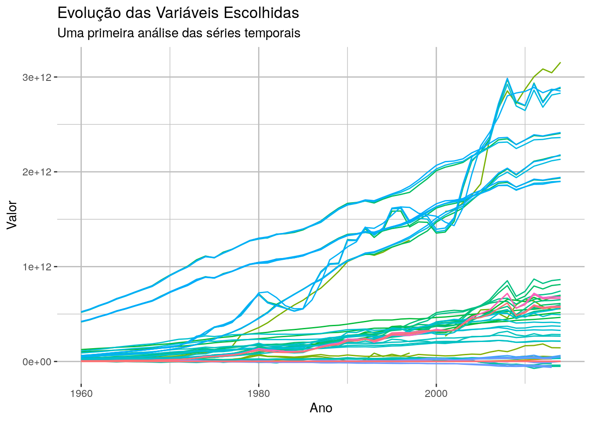

Podemos observar que existem dados perdidos devidos aos "Warnings" recebidos. Na próxima seção iremos corrigir esse problema.

## 2. Segundo Passo - Preenchimento de Missing Data

A função "approx" da biblioteca zoo permite que realizemos interpolação linear para preencher os dados faltantes de cada uma das séries. Esse procedimento é mais coerente que simplesmente copiar os dados do passado ou do futuro para completar as células iguais a NA.

Esse procedimento não considera os pontos extremos com valores iguais a NA, razão pela qual, após a interpolação, escrevemos uma rotina para preencher os valores extremos com o próximo valor nao nulo ou o valor não nulo imediatamente anterior.


```r
indicators_list <- colnames(df_in_t %>% select(-Year))
for (curr_indicator in indicators_list) {
  
  curr_list <- df_in_t[curr_indicator]
  curr_list <- na.approx(curr_list, na.rm = FALSE)
  
  non_NA_index <- which(!is.na(curr_list))
  first_non_NA <- min(non_NA_index)
  last_non_NA <- max(non_NA_index)
  
  if (first_non_NA > 1){
    curr_list[1:(first_non_NA - 1)] = curr_list[first_non_NA]
  }
  if (last_non_NA < length(curr_list)) {
    curr_list[(last_non_NA + 1):length(curr_list)] = curr_list[last_non_NA]
  }
  
  df_in_t[curr_indicator] = curr_list
}
```

Finalmente, podemos plotar novamente os gráficos:


```r
df_in_p <- df_in_t %>% gather('Indicator', 'Value', -Year)
```

```
## Warning: attributes are not identical across measure variables;
## they will be dropped
```

```r
df_in_p[is.na(df_in_p)] <- 0

df_in_p <- df_in_p %>% transform(Year=as.numeric(Year)) %>% transform(Value=as.numeric(Value))
ggplotly(ggplot(df_in_p, aes(x=Year, y=Value, color=Indicator)) + geom_line() + 
  theme(legend.position='none', panel.background = element_blank(),
        panel.grid.major = element_line(colour = 'gray'), 
        panel.grid.minor = element_line(colour = 'gray')) +
  labs(x='Ano (Variáveis reativas: encostar mouse para verificar)',
       y='Valor',
       title='Variáveis Corrigidas'))
```

preserveeb742c9ef9325898

Não há alterações visíveis pois os dados perdidos se concentraram majoritariamente em posições extremas das seŕies. Em todo caso, os warnings de dados faltantes não se encontram mais presentes e podemos prosseguir para a próxima etapa: analisar a correlação e o relacionamento entre as variáveis.

## 3. Terceiro Passo - Análise de Correlação

* Em um primeiro momento, estudaremos os relacionamentos mútuos entre cada par de variáveis que podemos tomar.
* Em seguida, iremos verificar as correlações de cada uma das variáveis com a variável que iremos estudar (a emissão de CO²).
* Finalmente, com essas informaçoes, iremos organizar e categorizar grupos de variáveis que estão fortemente correlacionadas utilizando técnicas de clusterização.

### Etapas da Análise de Correlação:

#### 3.1. Correlações Mútuas entre Variáveis

Podemos plotar a correlação entre as variáveis em um mapa de calor. É inviável escrever o nome de cada uma das variáveis na matriz, entretanto, podemos, ao menos, observar o aspecto de tal mapa.


```r
cor_mat <- df_in_t %>% select(-Year) %>% cor
ggcorrplot(cor_mat, tl.cex=0) +
  labs(title='Matriz de correlação como Mapa de Calor',
       subtitle='Identificando se há multicolinearidade')
```

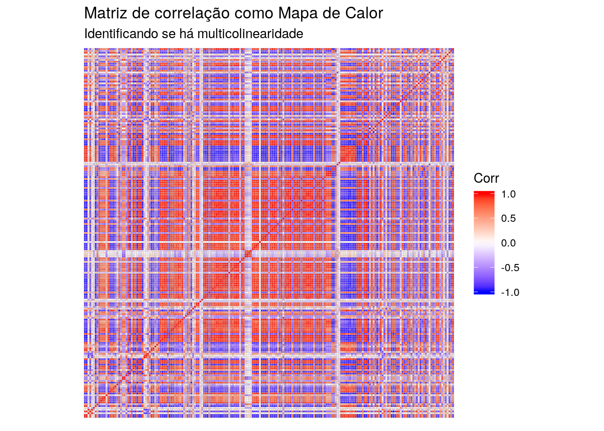

Aparentemente, os grupos de variáveis são fortemente relacionados entre si. Isso indica que podemos agrupar as variáveis em um número muito mais compacto de categorias sem que isso signifique prejuízo em nossa análise.

Vejamos a correlação entre cada uma das variáveis com o dado em estudo na próxima subseção.

#### 3.2. Correlações com Emissão de CO²

Antes de agruparmos as variáveis em categorias correlacionadas, vamos dar um "Zoom" na análise da seção anterior e nos ater à variável em estudo. Trata-se da emissão de CO² em KT, representada pela variável EN.ATM.CO2E.KT.

Podemos visualizar as correlações de cada uma das demais variáveis por meio de um gráfico de barra.


```r
x_plot <- rownames(cor_mat)
y_plot <- cor_mat[, 'EN.ATM.CO2E.KT']
df_plot <- data.frame(X=x_plot, Y=y_plot)

ggplotly(ggplot(data=df_plot, aes(x=reorder(x_plot, -abs(y_plot)), y=abs(y_plot))) +
  geom_bar(stat='identity', color='darkgreen', fill='white') + 
  theme_minimal() + theme(axis.text.x=element_blank()) +
  labs(x='Nome da Variável (Gráfico reativo: encostar o mouse para verificar)', 
       y='Correlação com Emissão de CO2 (KT)',
       title='Correlações com Variável Alvo'))
```

preserve97a3e690851b2390

Plotando o valor absoluto da correlação:


```r
ggplotly(ggplot(data=df_plot, aes(x=reorder(x_plot, -abs(y_plot)), y=abs(y_plot))) +
  geom_bar(stat='identity', color='darkgreen', fill='white') + 
  theme_minimal() + theme(axis.text.x=element_blank()) +
  labs(x='Nome da Variável (Gráfico reativo: encostar o mouse para verificar)', 
       y='Correlação com Emissão de CO2 (KT)',
       title='Correlações com Variável Alvo'))
```

preservefb3d2629d63d56b7

Não é, a princípio, necessário saber o nome de cada uma das variáveis representadas por cada uma das barras. O que sabemos, por hora, é que a correlação varia praticamente de forma contínua e todo tipo de correlação ocorre no grande conjunto de dados que temos disponíveis.

Assim, na próxima seção, iremos tentar agrupar as variáveis em grupos correlacionados no intuito de:

* Explicar quais variáveis possuem relacionamentos mútuos
* Utilizar tais relacionamentos para criar um modelo explicado por um menor número de variáveis explicativas.

Antes de efetuarmos o agrupamento, vamos retirar de nossa tabela a variável que queremos explicar>


```r
df_out <- df_in_t[, 'EN.ATM.CO2E.KT']
df_in_t <- df_in_t %>% select(-EN.ATM.CO2E.KT)
```

#### 3.3. Agrupamento de Variáveis Correlacionadas

As técnicas de aprendizado não supervisionado consistem na categorização de variáveis por meio de algoritmos de Cluster. Esse tipo de procedimento pode ser aplicado no agrupamento de variáveis fortemente correlacionadas.

Para isso, podemos imaginar que quanto mais correlacionadas duas variáveis forem, mais próximas elas estarão no hiperespaço de variáveis explicativas. Ou seja: podemos adotar uma métrica $\mathcal{F}(Cor(X, Y)) = \mathcal{D}(X, Y)$ que corresponde à distância entre os vetores $X$ e $Y$.

Essa métrica é tal que, quanto mais correlacionadas forem as variáveis, menor será a distância entre elas, de tal forma que variáveis $100\%$ correlacionadas serão separadas por uma distância igual a zero.

Além disso, a correlação será avaliada em valor absoluto neste ponto. Isso ocorre porque variáveis com correlações próximas a $-1$ também podem ser consideradas extremamente próximas, ainda que as variações de cada uma delas ocorram com sinais trocados.

Definiremos a função em questão como:
$\mathcal{F}(Cor(X, Y)) = \mathcal{D}(X, Y) = 1 - |Cor(X, Y)|$.

A correlação entre cada par de variáveis formará uma matriz de ordem $N \times N$, onde $N$ é a quantidade de variáveis presentes na base de dados (em torno de 200 variáveis).

Assim, essa matriz terá a forma: 
$\mathcal{D}_K(X_i, X_j) = 1 - |Cor(X_i, X_j)| = (d)_{ij} = D_{N \times N}$

Os pontos serão agrupados por meio da técnica de clusterização hierárquica, considerando-se a matriz de distância definida acima: $\mathcal{F_K}(Cor(X, Y)) = \mathcal{D}(X, Y) = 1 - |Cor(X, Y)|$.

A clusterização hierárquica não pede que o usuário determine o número de clusters desejado. Ao contrário, o usuário pode visualizar um dendograma com diferentes níveis de agrupamento e escolher aquele que melhor se aplica à necessidade do problema:


```r
hclust_obj <- (1 - abs(cor_mat)) %>% as.dist %>% hclust
dend <- hclust_obj %>% as.dendrogram
dend %>% dendextend::set('labels_color', 'white') %>% plot(xaxt='n')
```

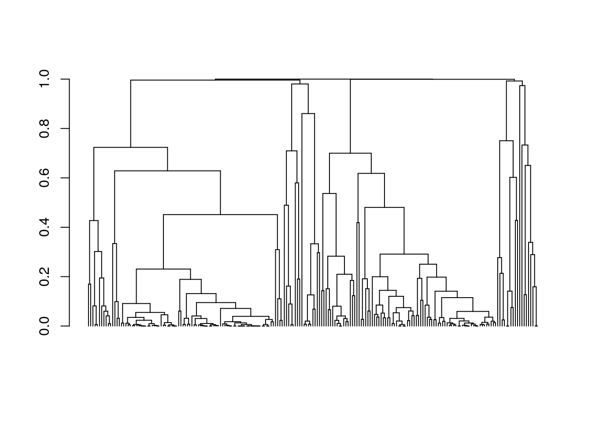

Precisamos escolher uma altura na qual a árvore será cortada. Para facilitar essa análise, plotemos o número de clusters em função da altura de corte:


```r
height <- seq(from=0, to=1, by=0.001)
n_clusters <- sapply(height, function(X)(cutree(dend, h=X) %>% unique %>% length))
df_hclust <- data.frame(Height=height, N.Clusters=n_clusters)
ggplotly(ggplot(df_hclust, aes(x=Height, y=N.Clusters)) + theme_minimal() +
           geom_line(stat='identity', color='darkgreen'))
```

preserve2f589e1b9ed6b171

O gráfico plotado é reativo, podemos encostar o mouse sobre ele e verificar, manualmente, os valores de $X$ (altura) e $Y$ (número de clusters) para cada uma das barras. Podemos observar a existência de um platô quando a altura do algoritmo é igual a $0.2$. Nesse caso, deixamos de trabalhar com $200$ variáveis e passamos a operar com $40$ grupos diferentes.

Iremos então acessar o nosso dicionário de metadados e atribuir a cada uma das variáveis o respectivo identificador do cluster.


```r
opt_cut <- cutree(dend, h=0.2)
df_in_clusters <- data.frame('Indicator.Code'=names(opt_cut), 
                             'Cluster.Index'=as.vector(opt_cut))

df_in_clusters <- df_in_clusters %>% 
  inner_join(df_in_meta, by=(c('Indicator.Code'='Indicator Code')))
```

```
## Warning: Column `Indicator.Code`/`Indicator Code` joining factor and
## character vector, coercing into character vector
```

```r
df_in_clusters %>% head
```

<div data-pagedtable="false">
  <script data-pagedtable-source type="application/json">
{"columns":[{"label":[""],"name":["_rn_"],"type":[""],"align":["left"]},{"label":["Indicator.Code"],"name":[1],"type":["chr"],"align":["left"]},{"label":["Cluster.Index"],"name":[2],"type":["int"],"align":["right"]},{"label":["Indicator Name"],"name":[3],"type":["chr"],"align":["left"]}],"data":[{"1":"AG.LND.AGRI.K2","2":"1","3":"Agricultural land (sq. km)","_rn_":"1"},{"1":"AG.LND.AGRI.ZS","2":"1","3":"Agricultural land (% of land area)","_rn_":"2"},{"1":"AG.LND.ARBL.HA","2":"2","3":"Arable land (hectares)","_rn_":"3"},{"1":"AG.LND.ARBL.HA.PC","2":"3","3":"Arable land (hectares per person)","_rn_":"4"},{"1":"AG.LND.ARBL.ZS","2":"2","3":"Arable land (% of land area)","_rn_":"5"},{"1":"AG.LND.CREL.HA","2":"4","3":"Land under cereal production (hectares)","_rn_":"6"}],"options":{"columns":{"min":{},"max":[10]},"rows":{"min":[10],"max":[10]},"pages":{}}}
  </script>
</div>

```r
write.csv(df_in_clusters, './Agrupamento_Variaveis.csv')
```

Finalmente, podemos observar o arquivo de saída e:
* Descrever cada um dos grupos
* Interpretar e caracterizar cada cluster
* Identificar potenciais correlações espúrias

Isso será feito na próxima seção.

#### 3.4. Interpretação dos Clusters e Identificação de Correlações Espúrias

Uma tabela caracterizando cada um dos clusteres foi criada. Ela será impressa nesta seção para consulta e comparação com as análises que serão feitas daqui em diante. As descrições foram feitas relacionando-se cada grupo de variáveis dentro de um mesmo cluster e interpretando o que cada agrupamento representa.


```r
df_grupos <- read_excel('./GRUPOS.xlsx')
df_grupos
```

<div data-pagedtable="false">
  <script data-pagedtable-source type="application/json">
{"columns":[{"label":["Cluster.Index"],"name":[1],"type":["dbl"],"align":["right"]},{"label":["Cluster.Cod"],"name":[2],"type":["chr"],"align":["left"]},{"label":["Cluster.Description"],"name":[3],"type":["chr"],"align":["left"]}],"data":[{"1":"1","2":"IDTMMDD","3":"Agricultura, Mineração, IDH, Atividade Industrial, Densidade Demográfica,"},{"1":"2","2":"TRMCOAA","3":"Terras arradas e emissões de CO2"},{"1":"3","2":"IMPUCIMA","3":"Impactos ambientais da mudança das populações urbana e do campo na importação de alimentos."},{"1":"4","2":"PROCERTE","3":"Produção de cereais terrestres (hectares)"},{"1":"5","2":"CONEFNAE","3":"Consumo de energia fóssil, nuclear, alternativa, produção de eletricidade e emissões de CO2."},{"1":"6","2":"NETINOREA","3":"Lucro líquido e ativos no exterior"},{"1":"7","2":"FOOMIDHS","3":"Relação entre alimentos, combustíveis renováveis ou não e índices de desenvolvimento."},{"1":"8","2":"AREASUPRF","3":"Área da superfície (km2)"},{"1":"9","2":"MEOPAFM","3":"Mercadorias exportadas de outros países como África, Oriente Médio e Ásia, especialmente eletrônicos"},{"1":"10","2":"PRDGIDPO","3":"Produção de gás e idade da população"},{"1":"11","2":"EIEIMPCO2","3":"Eletricidade, importação de energia e emissões de CO2"},{"1":"12","2":"PRODRNM","3":"Produção de energias renováveis e merchandise para exportações para desenvolvimento do Oriente Médio."},{"1":"13","2":"PRCO2CVB","3":"Produção rural, emissão CO2 de biodisel e combustíves renováveis"},{"1":"14","2":"CO2RBCPS","3":"Emissão de CO2 em residências, prédios comerciais e governamentais"},{"1":"15","2":"CO2ELAQP","3":"Emissão de CO2 por meio de eletricidade e de aquecimento da produção"},{"1":"16","2":"EXIMBEMS","3":"Exportações e Importações de bens e serviços"},{"1":"17","2":"INFLACAO","3":"Inflação"},{"1":"18","2":"CLCGIDHS","3":"Desenvolvimento humano"},{"1":"19","2":"CREDDOM","3":"Crédito doméstico"},{"1":"20","2":"CPRAPLPA","3":"Crescimento da população rural e aplicação de patentes."},{"1":"21","2":"TRADEMA","3":"Pedidos de marcas registradas"},{"1":"22","2":"IMPARMS","3":"Importação de armas"},{"1":"23","2":"EXPARMS","3":"Exportação de armas"},{"1":"24","2":"DESPADP","3":"Despesas da administração pública"},{"1":"25","2":"EXPBEMS","3":"Exportar bens e serviços"},{"1":"26","2":"IMPBEMS","3":"Importar bens e serviços"},{"1":"27","2":"BALEXBS","3":"Balanço externo de bens e serviços"},{"1":"28","2":"AGRICUL","3":"Agricultura"},{"1":"29","2":"INDPROC","3":"Indústria, produção industrial e crescimento econômico"},{"1":"30","2":"TOTEBIO","3":"TOT (terms of trade) e exportação de biodísel"},{"1":"31","2":"FCDECAL","3":"Fator de conversão DEC alternativa. (conversão da moeda local para dólar)"},{"1":"32","2":"CRESPRF","3":"Crescimento populacional e razão de fertilidade"},{"1":"33","2":"CPFEMIN","3":"Consumo da população feminina"},{"1":"34","2":"IMBIODI","3":"Importação de Biodísel"},{"1":"35","2":"EMIMAN","3":"Exportação de minérios e importação de manufaturados."},{"1":"36","2":"MIMPOR","3":"Mercadorias importadas para desenvolvimento da América Latina e"},{"1":"37","2":"MPODCEX","3":"Mercadorias importadas declaradas e comidas exportadas"},{"1":"38","2":"MEXMCAR","3":"Mercadorias exportadas para desenvolvidmento de economias na América Latina e Caribe."},{"1":"39","2":"MEXPDSAS","3":"Mercadorias exportadas para desenvolvidmento de economias do Sul da Ásia."}],"options":{"columns":{"min":{},"max":[10]},"rows":{"min":[10],"max":[10]},"pages":{}}}
  </script>
</div>

#### 3.5. Avaliação da Qualidade dos Clusters

Podemos avaliar a qualidade dos clusters verificando a distribuição das correlações para agrupamento. Queremos grupos com distribuições de correlações o mais próximas de $100\%$ que for possível.


```r
get_corr_distrib <- function(cluster_index) {
  
  cluster_table <- df_in_clusters %>% filter(Cluster.Index == cluster_index)
  vars_list <- cluster_table[['Indicator.Code']]
  n_cluster_vars <- length(vars_list)
  
  if (n_cluster_vars == 1) {
    return(NA)
  }
  
  corr_vec <- c()
  for (i in 2:n_cluster_vars) {
    for (j in 1:(i - 1)) {
      corr_vec <- c(corr_vec, cor_mat[vars_list[[i]], vars_list[[j]]] %>% abs)
    }
  }
  return(corr_vec)
}

corr_vec <- c()
cluster_vec <- c()

for (k in (df_in_clusters[['Cluster.Index']] %>% unique)) {
  new_rows <- get_corr_distrib(k)
  corr_vec <- c(corr_vec, new_rows)
  cluster_vec <- c(cluster_vec, rep(k %>% as.character, times=new_rows %>% length))
}

df_corr_per_cluster <- data.frame(Correlation=corr_vec, Cluster.Index=cluster_vec) %>%
  mutate(Cluster.Index=as.numeric(Cluster.Index)) %>%
  inner_join(df_grupos, by=c('Cluster.Index'='Cluster.Index'))

ggplot(df_corr_per_cluster) + 
  geom_density(aes(x=Correlation, fill=Cluster.Cod), alpha=.1) +
  scale_x_continuous(limits=c(.7, 1)) + theme_minimal() +
  labs(x='Correlação', y='Densidade por Cluster',
       title='Distribuição da correlação',
       subtitle='Por pares de variáveis dentro de um mesmo grupo / por grupo')
```

```
## Warning: Removed 17 rows containing non-finite values (stat_density).
```

```
## Warning: Groups with fewer than two data points have been dropped.

## Warning: Groups with fewer than two data points have been dropped.

## Warning: Groups with fewer than two data points have been dropped.

## Warning: Groups with fewer than two data points have been dropped.

## Warning: Groups with fewer than two data points have been dropped.
```

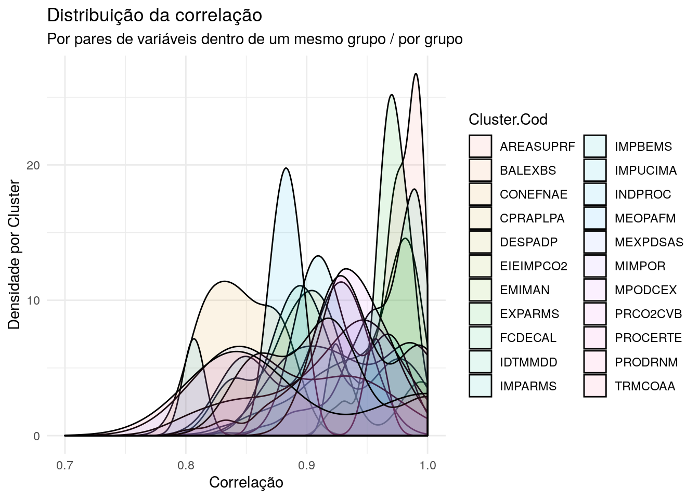

Podemos ainda plotar a distribuição global, sem segregação por cluster:


```r
ggplot(df_corr_per_cluster, aes(x=Correlation)) + geom_density() +
  scale_x_continuous(limits=c(.7, 1)) + theme_minimal() +
  labs(x='Correlação (Variáveis em um mesmo cluster)', y='Densidade',
       title='Distribuição da correlação',
       subtitle='Por pares de variáveis dentro de um mesmo grupo / geral')
```

```
## Warning: Removed 17 rows containing non-finite values (stat_density).
```

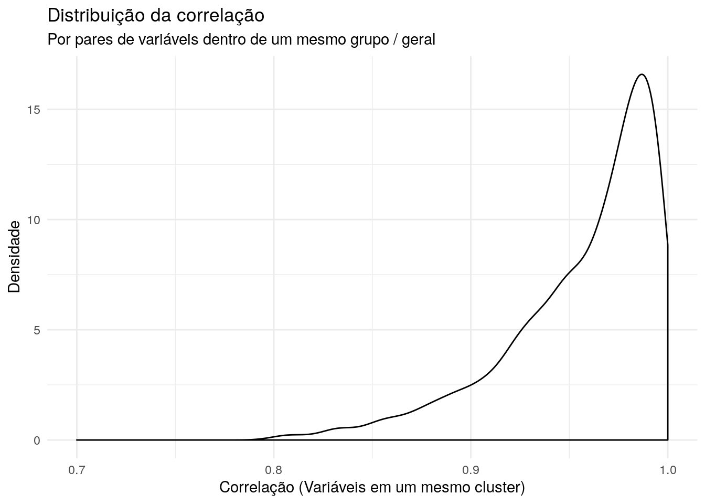

Podemos então observar que, além de reduzir o número de variáveis de $200$ para $32$, garantimos que dentro de um cluster teremos correlações iguais a, no mínimo, $70\%$.  Assim, podemos prosseguir nossa análise, focando apenas em variáveis agregadas por grupos. A agregação será realizada em duas etapas:

* Variáveis com correlação maior ou igual a $99\%$ podem ser consideradas como sendo a mesma variável. Assim, iremos em uma primeira etapa retirar a média de grupos de variáveis com tal correlação fortíssima.

* Em seguida, agruparemos o cluster realizando, também, uma média aritimética. Nesta etapa, os erros gerados por cada variável também serão submetidos a tal média e isso contribui na normalização do erro (pela lei do limite central), na redução da variância do erro (pois o desvio padrão se reduz em um fator igual a $\sqrt{N_{Cluster}}$) e na eliminação do problema da multicolinearidade sem eliminarmos qualquer variável da análise.

* O agrupamento por média deverá ser efetuado sobre as variáveis normalizadas, para que o efeito da média não seja comparado a uma média ponderada na qual variáveis com unidades de maiores ordens de grandeza prevalecem.


```r
df_in_p_sd <- df_in_p
df_in_p_sd <- df_in_p_sd %>%
  group_by(Indicator) %>%
  summarise_at(vars(Value), sd) %>%
  rename(Sd = Value) %>%
  as.data.frame

df_in_p_mean <- df_in_p
df_in_p_mean <- df_in_p_mean %>%
  group_by(Indicator) %>%
  summarise_at(vars(Value), mean) %>%
  rename(Mean = Value) %>%
  as.data.frame

df_in_p_grupos <- df_in_p %>%
  mutate(Indicator = as.character(Indicator)) %>%
  inner_join(df_in_p_sd, by=c('Indicator'='Indicator')) %>%
  inner_join(df_in_p_mean, by=c('Indicator' = 'Indicator')) %>%
  mutate(Value = (Value - Mean) / Sd) %>%
  inner_join(df_in_clusters, by=c('Indicator' = 'Indicator.Code')) %>%
  mutate(Cluster.Index = as.numeric(Cluster.Index)) %>%
  inner_join(df_grupos, by=c('Cluster.Index' = 'Cluster.Index')) %>%
  select('Cluster.Index', 'Cluster.Cod', 'Cluster.Description', 'Year', 'Value') %>%
  group_by(Cluster.Cod, Year) %>%
  summarise_at(vars(Value), mean) %>%
  as.data.frame

df_in_p_grupos %>% head
```

<div data-pagedtable="false">
  <script data-pagedtable-source type="application/json">
{"columns":[{"label":[""],"name":["_rn_"],"type":[""],"align":["left"]},{"label":["Cluster.Cod"],"name":[1],"type":["chr"],"align":["left"]},{"label":["Year"],"name":[2],"type":["dbl"],"align":["right"]},{"label":["Value"],"name":[3],"type":["dbl"],"align":["right"]}],"data":[{"1":"AGRICUL","2":"1960","3":"-1.0525270","_rn_":"1"},{"1":"AGRICUL","2":"1961","3":"-1.0525270","_rn_":"2"},{"1":"AGRICUL","2":"1962","3":"1.0418810","_rn_":"3"},{"1":"AGRICUL","2":"1963","3":"-1.0403757","_rn_":"4"},{"1":"AGRICUL","2":"1964","3":"-0.1232207","_rn_":"5"},{"1":"AGRICUL","2":"1965","3":"0.2395633","_rn_":"6"}],"options":{"columns":{"min":{},"max":[10]},"rows":{"min":[10],"max":[10]},"pages":{}}}
  </script>
</div>

Há correlação entre grupos de um mesmo cluster? É necessário fazer essa verificação final para conferir se o problema da multicolinearidade pode ocorrer ainda. Iniciemos plotando a evolução do valor médio encontrado em cada um dos clusters:


```r
clusters_list <- df_in_p_grupos[['Cluster.Cod']] %>% unique
```

##### Gráficos das Variáveis {.tabset .tabset-pills}

###### Variáveis 1 a 6

```r
ggplot(df_in_p_grupos %>% filter(Cluster.Cod %in% clusters_list[1:6]), aes(x=Year, y=Value, color=Cluster.Cod)) + geom_line() + theme_minimal() +
  labs(x='Ano', y ='Valor', title='Evolução temporal das variáveis',
       subtitle='Variáveis 1 a 6')
```

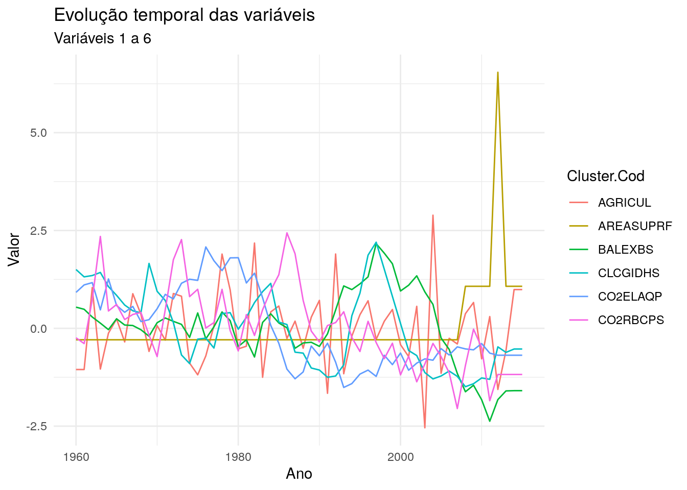

###### Variáveis 7 a 12

```r
ggplot(df_in_p_grupos %>% filter(Cluster.Cod %in% clusters_list[7:12]), aes(x=Year, y=Value, color=Cluster.Cod)) + geom_line() + theme_minimal() +
  labs(x='Ano', y ='Valor', title='Evolução temporal das variáveis',
       subtitle='Variáveis 7 a 12')
```

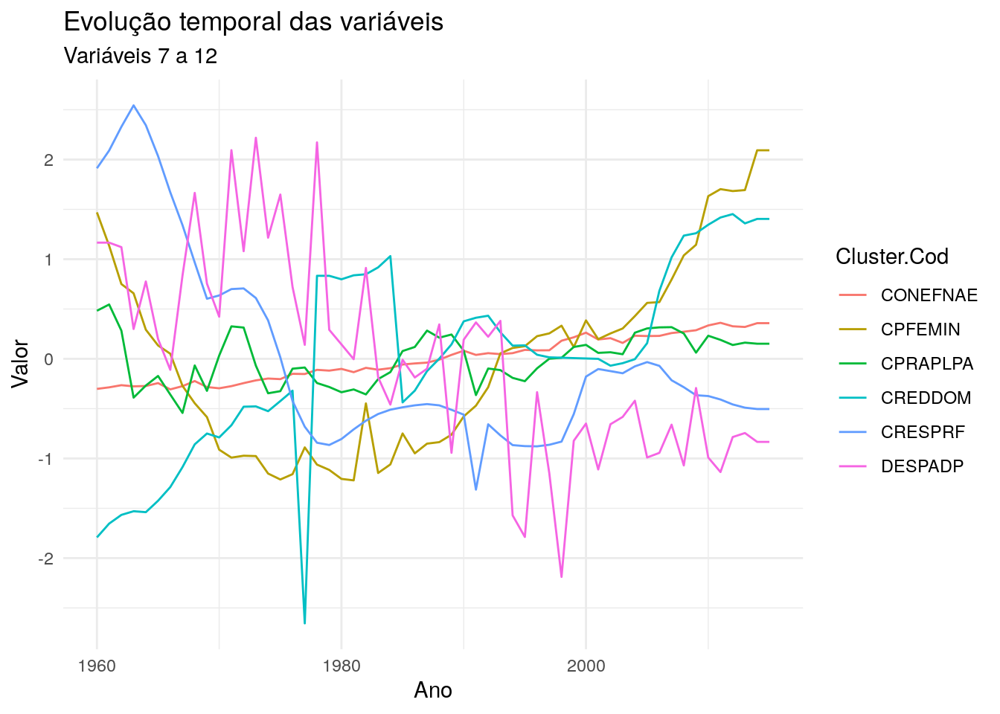

###### Variáveis 13 a 18

```r
ggplot(df_in_p_grupos %>% filter(Cluster.Cod %in% clusters_list[13:18]), aes(x=Year, y=Value, color=Cluster.Cod)) + geom_line() + theme_minimal() +
  labs(x='Ano', y ='Valor', title='Evolução temporal das variáveis',
       subtitle='Variáveis 13 a 18')
```

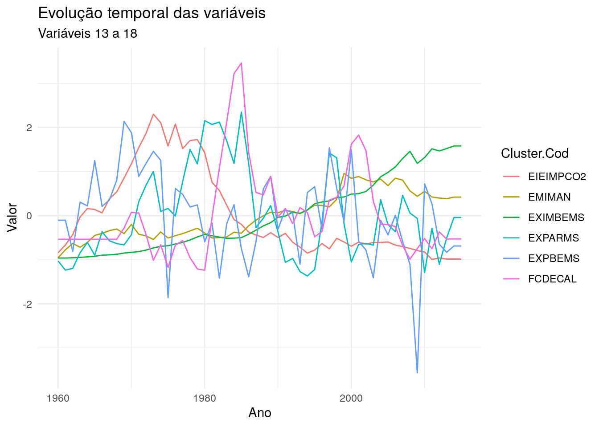


###### Variáveis 19 a 24

```r
ggplot(df_in_p_grupos %>% filter(Cluster.Cod %in% clusters_list[19:24]), aes(x=Year, y=Value, color=Cluster.Cod)) + geom_line() + theme_minimal() +
  labs(x='Ano', y ='Valor', title='Evolução temporal das variáveis',
       subtitle='Variáveis 19 a 24')
```

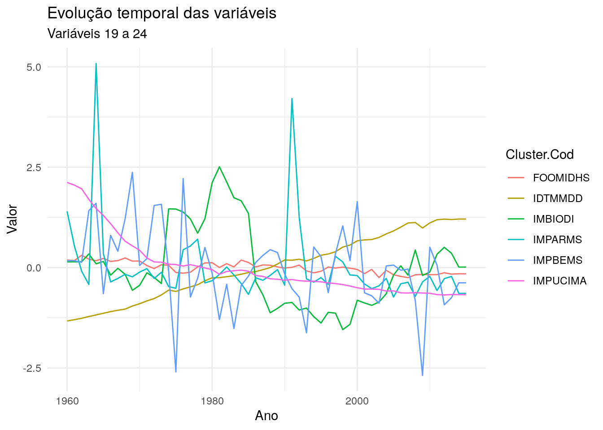

###### Variáveis 25 a 30

```r
ggplot(df_in_p_grupos %>% filter(Cluster.Cod %in% clusters_list[25:30]), aes(x=Year, y=Value, color=Cluster.Cod)) + geom_line() + theme_minimal() +
  labs(x='Ano', y ='Valor', title='Evolução temporal das variáveis',
       subtitle='Variáveis 25 a 30')
```


###### Variáveis 31 a 36

```r
ggplot(df_in_p_grupos %>% filter(Cluster.Cod %in% clusters_list[31:36]), aes(x=Year, y=Value, color=Cluster.Cod)) + geom_line() + theme_minimal() +
  labs(x='Ano', y ='Valor', title='Evolução temporal das variáveis',
       subtitle='Variáveis 31 a 36')
```

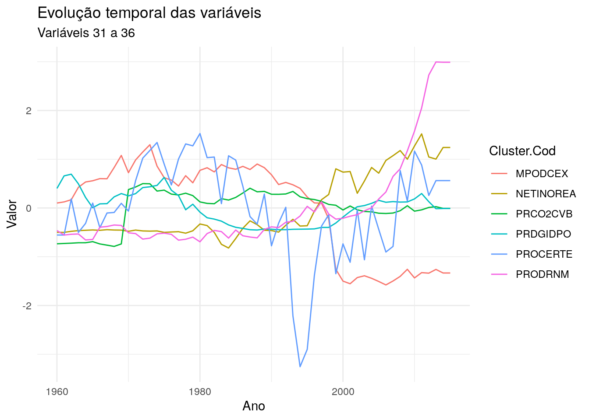

###### Variáveis 37 a 39

```r
ggplot(df_in_p_grupos %>% filter(Cluster.Cod %in% clusters_list[37:39]), aes(x=Year, y=Value, color=Cluster.Cod)) + geom_line() + theme_minimal() +
  labs(x='Ano', y ='Valor', title='Evolução temporal das variáveis',
       subtitle='Variáveis 37 a 39')
```

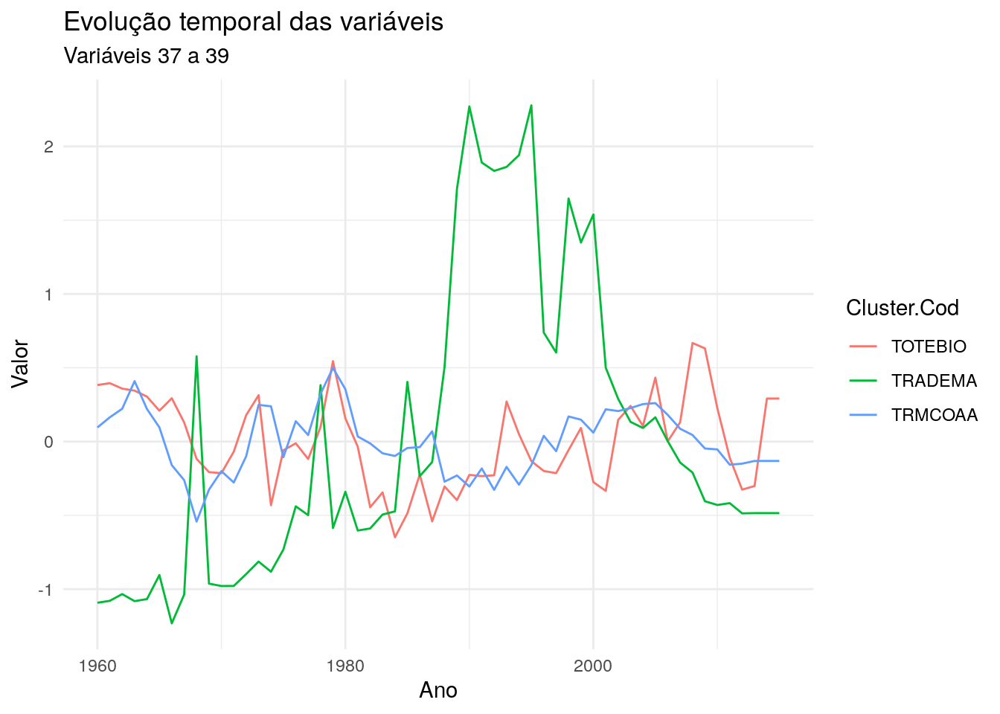

##### Verificação de Correlograma

Para nos certificarmos de maneira exata, verifiquemos o correlograma. Para isso, precisaremos retirar a tabela utilizada nos gráficos anteriores da forma de pivô.


```r
list_years <- df_in_p_grupos[['Year']] %>% unique
list_clusters <- df_in_p_grupos[['Cluster.Cod']] %>% unique

nrows_mat <- length(list_years)
ncols_mat <- length(list_clusters)

df_in_t_grupos <- zeros(nrows_mat, ncols_mat)

rownames(df_in_t_grupos) <- list_years
colnames(df_in_t_grupos) <- list_clusters

for (curr_year in list_years) {
  for (curr_cluster in list_clusters) {
    df_in_t_grupos[[curr_year %>% as.character, curr_cluster]] <-
      (df_in_p_grupos %>% 
       filter(Year == curr_year &
              Cluster.Cod == curr_cluster))$Value[[1]]
  }
}

df_in_t_grupos <- df_in_t_grupos %>% as.data.frame
mat_cor_grupos <- cor(df_in_t_grupos) %>% abs

mask <- zeros(ncols_mat) > 0
for (i in 1:ncols_mat) {
  mat_cor_grupos[[i, i]] <- 0
  mask[[i]] <- (any(abs(mat_cor_grupos[i,]) > 0.78))
  mat_cor_grupos[[i, i]] <- 1
}

mat_cor_grupos[mask, mask] %>% corrplot
```

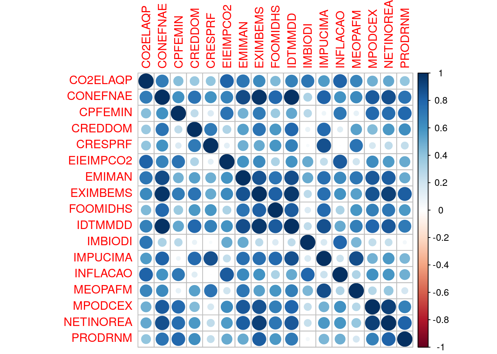

Ainda temos um grande problema de multicolinearidade entre os clusters. Para resolvermos isso, podemos recorrer à técnica da análise de componentes principais.

#### 3.6. Solução da Multicolinearidade entre Clusters: Análise de Componentes Principais (PCA)

Poderíamos, desde o início, ter realizado essa técnica, sem o intermédio de qualquer algoritmo de clusterização. No entanto, analisar a influência de um número reduzido de clusters em cada um dos componentes principais é mais fácil e garante uma maior interpretabilidade ao modelo.


```r
pr_comp <- prcomp(df_in_t_grupos)
list_var <- (pr_comp$sdev ** 2) / (sum(pr_comp$sdev ** 2))
list_cum <- cumsum(list_var)
df_pr <- data.frame(Perc.Var=list_var,
                    Cum.Perc=list_cum,
                    PC.Index=1:length(list_var))

ggplot(df_pr, aes(x=PC.Index)) + 
  geom_bar(aes(y=Perc.Var), stat='identity', color='darkgreen', fill='white') + 
  geom_line(aes(y=Cum.Perc)) + 
  scale_x_continuous(breaks = seq(0, 40, len=10)) +
  theme_minimal() +
  labs(x='Índice da Componente Principal',
       y='Percentual de Importância da Componente',
       title='Gráfico de Pareto: Componentes Principais',
       subtitle='Importância relativa (barras) e importância cumulativa (linha)')
```

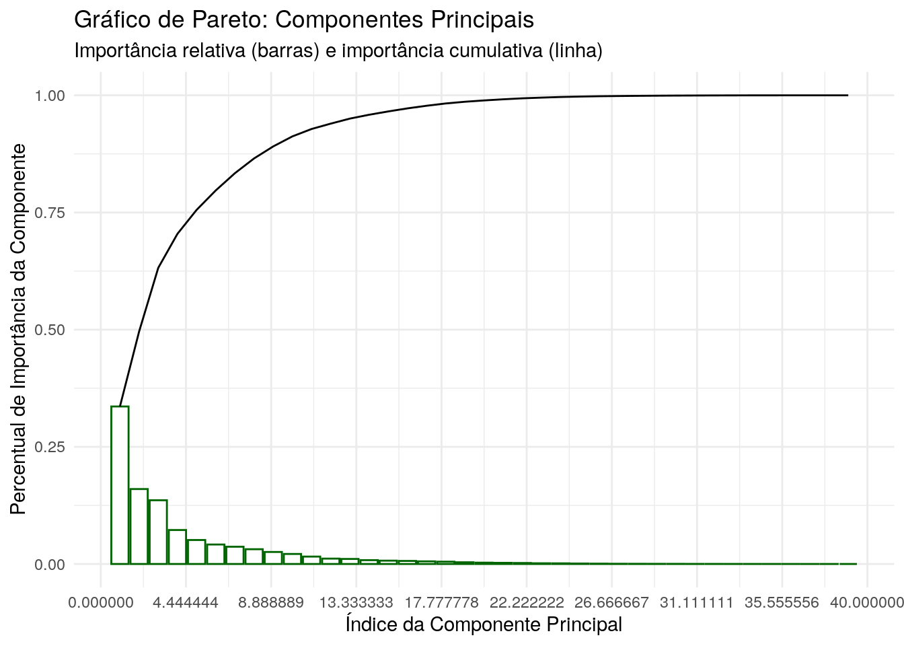

```r
pr_comp %>% summary
```

```
## Importance of components:
##                           PC1    PC2   PC3     PC4     PC5     PC6    PC7
## Standard deviation     3.1518 2.1739 2.005 1.46340 1.22961 1.10821 1.0430
## Proportion of Variance 0.3361 0.1599 0.136 0.07245 0.05115 0.04155 0.0368
## Cumulative Proportion  0.3361 0.4960 0.632 0.70441 0.75556 0.79711 0.8339
##                           PC8     PC9    PC10    PC11    PC12    PC13
## Standard deviation     0.9650 0.87051 0.79517 0.68265 0.58170 0.56293
## Proportion of Variance 0.0315 0.02564 0.02139 0.01577 0.01145 0.01072
## Cumulative Proportion  0.8654 0.89105 0.91244 0.92821 0.93965 0.95037
##                           PC14   PC15   PC16    PC17    PC18    PC19
## Standard deviation     0.49146 0.4582 0.4384 0.40714 0.38020 0.32840
## Proportion of Variance 0.00817 0.0071 0.0065 0.00561 0.00489 0.00365
## Cumulative Proportion  0.95855 0.9657 0.9721 0.97776 0.98265 0.98630
##                           PC20    PC21    PC22    PC23    PC24    PC25
## Standard deviation     0.28852 0.26693 0.24880 0.20955 0.19867 0.16624
## Proportion of Variance 0.00282 0.00241 0.00209 0.00149 0.00134 0.00093
## Cumulative Proportion  0.98911 0.99152 0.99362 0.99510 0.99644 0.99737
##                           PC26    PC27    PC28    PC29    PC30    PC31
## Standard deviation     0.14316 0.11484 0.10626 0.09295 0.08766 0.06892
## Proportion of Variance 0.00069 0.00045 0.00038 0.00029 0.00026 0.00016
## Cumulative Proportion  0.99807 0.99851 0.99890 0.99919 0.99945 0.99961
##                           PC32    PC33    PC34    PC35    PC36    PC37
## Standard deviation     0.06533 0.05669 0.04332 0.03426 0.02667 0.01283
## Proportion of Variance 0.00014 0.00011 0.00006 0.00004 0.00002 0.00001
## Cumulative Proportion  0.99975 0.99986 0.99992 0.99996 0.99999 0.99999
##                           PC38     PC39
## Standard deviation     0.01123 0.007274
## Proportion of Variance 0.00000 0.000000
## Cumulative Proportion  1.00000 1.000000
```

Podemos observar que grande parte das variações nas séries pode ser explicada por um pequeno número de componentes principais (conseguimos explicar 95% das variações a partir de 12 componentes). Assim, esperamos que, na etapa de modelagem, consigamos criar um modelo com poucas variáveis explicativas e buscaremos eliminá-las a partir de duas etapas:

* Por meio da função STEP, que buscará eliminar coeficientes de forma a reduzir o parâmetro AIC (Akaike Information Criterion)
* Em seguida, verificaremos quais coeficientes na saída são pouco significantes e possuem altos valores-P nos testes de Student.

Em cada instante de tempo, o vetor $\mathcal{C} = (C_1, C_2,..., C_{39})$ formado pelos clusteres será multiplicado pela matriz de rotação encontrada na análise de componentes principais e, assim, encontraremos novas séries temporais sobre as quais serão efetuadas as análises de regressão.

Aplicando a transformação em nossa matriz de clusters, obtemos o termo "x" da saída da função prcomp.


```r
df_pca <- pr_comp$x %>% as.data.frame
df_pca$Y <- df_out
```


Finalmente, podemos iniciar a modelagem do regressor linear.

## 4. Aplicação e Análise do Modelo de Regressão

### 4.1. Encontrando Modelo Adequado

Ajustando o modelo, nas componentes principais:


```r
mod = lm(Y~., data=df_pca)
summary(mod)
```

```
## 
## Call:
## lm(formula = Y ~ ., data = df_pca)
## 
## Residuals:
##     Min      1Q  Median      3Q     Max 
## -6328.6 -1902.9  -338.7  1546.3  6104.5 
## 
## Coefficients:
##              Estimate Std. Error t value Pr(>|t|)    
## (Intercept)  391149.2      674.6 579.861  < 2e-16 ***
## PC1            7948.6      216.0  36.807  < 2e-16 ***
## PC2            1689.9      313.1   5.397 5.93e-05 ***
## PC3          -20651.3      339.5 -60.832  < 2e-16 ***
## PC4          -19536.4      465.1 -42.003  < 2e-16 ***
## PC5           -5201.2      553.6  -9.396 6.49e-08 ***
## PC6            8640.3      614.2  14.068 1.99e-10 ***
## PC7             419.2      652.6   0.642 0.529784    
## PC8             733.6      705.3   1.040 0.313762    
## PC9           -2792.0      781.9  -3.571 0.002552 ** 
## PC10           -889.0      856.0  -1.039 0.314453    
## PC11          -7610.6      997.1  -7.633 1.01e-06 ***
## PC12          -4530.4     1170.1  -3.872 0.001352 ** 
## PC13           8178.5     1209.2   6.764 4.55e-06 ***
## PC14          -6912.5     1385.0  -4.991 0.000133 ***
## PC15           6402.1     1485.6   4.310 0.000540 ***
## PC16           2178.5     1552.6   1.403 0.179703    
## PC17          -3261.5     1671.8  -1.951 0.068809 .  
## PC18          -3827.9     1790.3  -2.138 0.048277 *  
## PC19           1670.9     2072.6   0.806 0.431963    
## PC20          -3589.7     2359.1  -1.522 0.147613    
## PC21          15742.9     2550.0   6.174 1.34e-05 ***
## PC22           9454.3     2735.8   3.456 0.003254 ** 
## PC23          15197.6     3248.2   4.679 0.000252 ***
## PC24          16195.3     3426.1   4.727 0.000228 ***
## PC25           6123.6     4094.4   1.496 0.154217    
## PC26          13572.9     4754.5   2.855 0.011468 *  
## PC27           1439.1     5927.0   0.243 0.811247    
## PC28          -6166.5     6405.3  -0.963 0.350020    
## PC29          41051.8     7323.0   5.606 3.94e-05 ***
## PC30          12587.3     7764.7   1.621 0.124535    
## PC31          37646.4     9876.8   3.812 0.001535 ** 
## PC32          -9955.8    10418.3  -0.956 0.353486    
## PC33         -32279.3    12006.6  -2.688 0.016149 *  
## PC34          15625.8    15713.2   0.994 0.334811    
## PC35          20042.1    19866.4   1.009 0.328062    
## PC36          14107.2    25520.1   0.553 0.588049    
## PC37         102290.8    53069.9   1.927 0.071866 .  
## PC38        -108663.4    60589.4  -1.793 0.091824 .  
## PC39         -78836.9    93575.7  -0.842 0.411929    
## ---
## Signif. codes:  0 '***' 0.001 '**' 0.01 '*' 0.05 '.' 0.1 ' ' 1
## 
## Residual standard error: 5048 on 16 degrees of freedom
## Multiple R-squared:  0.9979,	Adjusted R-squared:  0.9927 
## F-statistic: 192.3 on 39 and 16 DF,  p-value: 7.613e-16
```

Observamos que para diversas variáveis não podemos rejeitar a hipótese $\mathcal{H}_0$ de nulidade do coeficiente. Assim, iremos tentar resolver o problema eliminando as variáveis em sequência adequada a aumentar a verossimilhança do modelo por meio da função "step", utilizando-se o parâmetro "direction = backward":


```r
mod_ajustado <- step(mod, direction = 'backward')
```

```
## Start:  AIC=964.84
## Y ~ PC1 + PC2 + PC3 + PC4 + PC5 + PC6 + PC7 + PC8 + PC9 + PC10 + 
##     PC11 + PC12 + PC13 + PC14 + PC15 + PC16 + PC17 + PC18 + PC19 + 
##     PC20 + PC21 + PC22 + PC23 + PC24 + PC25 + PC26 + PC27 + PC28 + 
##     PC29 + PC30 + PC31 + PC32 + PC33 + PC34 + PC35 + PC36 + PC37 + 
##     PC38 + PC39
## 
##        Df  Sum of Sq        RSS     AIC
## - PC27  1 1.5022e+06 4.0921e+08  963.05
## - PC36  1 7.7865e+06 4.1549e+08  963.90
## - PC7   1 1.0512e+07 4.1822e+08  964.26
## <none>               4.0770e+08  964.84
## - PC19  1 1.6561e+07 4.2427e+08  965.07
## - PC39  1 1.8087e+07 4.2579e+08  965.27
## - PC32  1 2.3269e+07 4.3097e+08  965.95
## - PC28  1 2.3616e+07 4.3132e+08  965.99
## - PC34  1 2.5199e+07 4.3290e+08  966.20
## - PC35  1 2.5934e+07 4.3364e+08  966.29
## - PC10  1 2.7484e+07 4.3519e+08  966.49
## - PC8   1 2.7565e+07 4.3527e+08  966.50
## - PC16  1 5.0163e+07 4.5787e+08  969.34
## - PC25  1 5.6999e+07 4.6470e+08  970.17
## - PC20  1 5.9001e+07 4.6671e+08  970.41
## - PC30  1 6.6964e+07 4.7467e+08  971.36
## - PC38  1 8.1959e+07 4.8966e+08  973.10
## - PC37  1 9.4668e+07 5.0237e+08  974.53
## - PC17  1 9.6981e+07 5.0469e+08  974.79
## - PC18  1 1.1650e+08 5.2420e+08  976.91
## - PC33  1 1.8418e+08 5.9188e+08  983.71
## - PC26  1 2.0766e+08 6.1536e+08  985.89
## - PC22  1 3.0431e+08 7.1201e+08  994.06
## - PC9   1 3.2490e+08 7.3261e+08  995.66
## - PC31  1 3.7020e+08 7.7790e+08  999.02
## - PC12  1 3.8197e+08 7.8968e+08  999.86
## - PC15  1 4.7324e+08 8.8094e+08 1005.98
## - PC23  1 5.5779e+08 9.6550e+08 1011.12
## - PC24  1 5.6938e+08 9.7708e+08 1011.78
## - PC14  1 6.3476e+08 1.0425e+09 1015.41
## - PC2   1 7.4226e+08 1.1500e+09 1020.91
## - PC29  1 8.0078e+08 1.2085e+09 1023.69
## - PC21  1 9.7120e+08 1.3789e+09 1031.08
## - PC13  1 1.1658e+09 1.5735e+09 1038.47
## - PC11  1 1.4845e+09 1.8922e+09 1048.80
## - PC5   1 2.2496e+09 2.6573e+09 1067.81
## - PC6   1 5.0428e+09 5.4505e+09 1108.04
## - PC1   1 3.4521e+10 3.4928e+10 1212.07
## - PC4   1 4.4955e+10 4.5363e+10 1226.71
## - PC3   1 9.4295e+10 9.4702e+10 1267.92
## 
## Step:  AIC=963.05
## Y ~ PC1 + PC2 + PC3 + PC4 + PC5 + PC6 + PC7 + PC8 + PC9 + PC10 + 
##     PC11 + PC12 + PC13 + PC14 + PC15 + PC16 + PC17 + PC18 + PC19 + 
##     PC20 + PC21 + PC22 + PC23 + PC24 + PC25 + PC26 + PC28 + PC29 + 
##     PC30 + PC31 + PC32 + PC33 + PC34 + PC35 + PC36 + PC37 + PC38 + 
##     PC39
## 
##        Df  Sum of Sq        RSS     AIC
## - PC36  1 7.7865e+06 4.1699e+08  962.10
## - PC7   1 1.0512e+07 4.1972e+08  962.47
## <none>               4.0921e+08  963.05
## - PC19  1 1.6561e+07 4.2577e+08  963.27
## - PC39  1 1.8087e+07 4.2729e+08  963.47
## - PC32  1 2.3269e+07 4.3248e+08  964.14
## - PC28  1 2.3616e+07 4.3282e+08  964.19
## - PC34  1 2.5199e+07 4.3441e+08  964.39
## - PC35  1 2.5934e+07 4.3514e+08  964.49
## - PC10  1 2.7484e+07 4.3669e+08  964.69
## - PC8   1 2.7565e+07 4.3677e+08  964.70
## - PC16  1 5.0163e+07 4.5937e+08  967.52
## - PC25  1 5.6999e+07 4.6621e+08  968.35
## - PC20  1 5.9001e+07 4.6821e+08  968.59
## - PC30  1 6.6964e+07 4.7617e+08  969.53
## - PC38  1 8.1959e+07 4.9117e+08  971.27
## - PC37  1 9.4668e+07 5.0387e+08  972.70
## - PC17  1 9.6981e+07 5.0619e+08  972.96
## - PC18  1 1.1650e+08 5.2570e+08  975.07
## - PC33  1 1.8418e+08 5.9338e+08  981.86
## - PC26  1 2.0766e+08 6.1687e+08  984.03
## - PC22  1 3.0431e+08 7.1351e+08  992.18
## - PC9   1 3.2490e+08 7.3411e+08  993.77
## - PC31  1 3.7020e+08 7.7941e+08  997.13
## - PC12  1 3.8197e+08 7.9118e+08  997.97
## - PC15  1 4.7324e+08 8.8245e+08 1004.08
## - PC23  1 5.5779e+08 9.6700e+08 1009.20
## - PC24  1 5.6938e+08 9.7858e+08 1009.87
## - PC14  1 6.3476e+08 1.0440e+09 1013.49
## - PC2   1 7.4226e+08 1.1515e+09 1018.98
## - PC29  1 8.0078e+08 1.2100e+09 1021.76
## - PC21  1 9.7120e+08 1.3804e+09 1029.14
## - PC13  1 1.1658e+09 1.5750e+09 1036.52
## - PC11  1 1.4845e+09 1.8937e+09 1046.84
## - PC5   1 2.2496e+09 2.6588e+09 1065.84
## - PC6   1 5.0428e+09 5.4520e+09 1106.06
## - PC1   1 3.4521e+10 3.4930e+10 1210.07
## - PC4   1 4.4955e+10 4.5364e+10 1224.71
## - PC3   1 9.4295e+10 9.4704e+10 1265.93
## 
## Step:  AIC=962.1
## Y ~ PC1 + PC2 + PC3 + PC4 + PC5 + PC6 + PC7 + PC8 + PC9 + PC10 + 
##     PC11 + PC12 + PC13 + PC14 + PC15 + PC16 + PC17 + PC18 + PC19 + 
##     PC20 + PC21 + PC22 + PC23 + PC24 + PC25 + PC26 + PC28 + PC29 + 
##     PC30 + PC31 + PC32 + PC33 + PC34 + PC35 + PC37 + PC38 + PC39
## 
##        Df  Sum of Sq        RSS     AIC
## - PC7   1 1.0512e+07 4.2751e+08  961.50
## <none>               4.1699e+08  962.10
## - PC19  1 1.6561e+07 4.3355e+08  962.28
## - PC39  1 1.8087e+07 4.3508e+08  962.48
## - PC32  1 2.3269e+07 4.4026e+08  963.14
## - PC28  1 2.3616e+07 4.4061e+08  963.19
## - PC34  1 2.5199e+07 4.4219e+08  963.39
## - PC35  1 2.5934e+07 4.4293e+08  963.48
## - PC10  1 2.7484e+07 4.4448e+08  963.68
## - PC8   1 2.7565e+07 4.4456e+08  963.69
## - PC16  1 5.0163e+07 4.6716e+08  966.46
## - PC25  1 5.6999e+07 4.7399e+08  967.28
## - PC20  1 5.9001e+07 4.7599e+08  967.51
## - PC30  1 6.6964e+07 4.8396e+08  968.44
## - PC38  1 8.1959e+07 4.9895e+08  970.15
## - PC37  1 9.4668e+07 5.1166e+08  971.56
## - PC17  1 9.6981e+07 5.1397e+08  971.81
## - PC18  1 1.1650e+08 5.3349e+08  973.90
## - PC33  1 1.8418e+08 6.0117e+08  980.59
## - PC26  1 2.0766e+08 6.2465e+08  982.73
## - PC22  1 3.0431e+08 7.2130e+08  990.79
## - PC9   1 3.2490e+08 7.4190e+08  992.36
## - PC31  1 3.7020e+08 7.8719e+08  995.68
## - PC12  1 3.8197e+08 7.9896e+08  996.51
## - PC15  1 4.7324e+08 8.9023e+08 1002.57
## - PC23  1 5.5779e+08 9.7479e+08 1007.65
## - PC24  1 5.6938e+08 9.8637e+08 1008.31
## - PC14  1 6.3476e+08 1.0517e+09 1011.91
## - PC2   1 7.4226e+08 1.1593e+09 1017.36
## - PC29  1 8.0078e+08 1.2178e+09 1020.12
## - PC21  1 9.7120e+08 1.3882e+09 1027.45
## - PC13  1 1.1658e+09 1.5828e+09 1034.80
## - PC11  1 1.4845e+09 1.9015e+09 1045.07
## - PC5   1 2.2496e+09 2.6666e+09 1064.01
## - PC6   1 5.0428e+09 5.4597e+09 1104.14
## - PC1   1 3.4521e+10 3.4938e+10 1208.08
## - PC4   1 4.4955e+10 4.5372e+10 1222.72
## - PC3   1 9.4295e+10 9.4712e+10 1263.93
## 
## Step:  AIC=961.5
## Y ~ PC1 + PC2 + PC3 + PC4 + PC5 + PC6 + PC8 + PC9 + PC10 + PC11 + 
##     PC12 + PC13 + PC14 + PC15 + PC16 + PC17 + PC18 + PC19 + PC20 + 
##     PC21 + PC22 + PC23 + PC24 + PC25 + PC26 + PC28 + PC29 + PC30 + 
##     PC31 + PC32 + PC33 + PC34 + PC35 + PC37 + PC38 + PC39
## 
##        Df  Sum of Sq        RSS     AIC
## <none>               4.2751e+08  961.50
## - PC19  1 1.6561e+07 4.4407e+08  961.62
## - PC39  1 1.8087e+07 4.4559e+08  961.82
## - PC32  1 2.3269e+07 4.5077e+08  962.46
## - PC28  1 2.3616e+07 4.5112e+08  962.51
## - PC34  1 2.5199e+07 4.5270e+08  962.70
## - PC35  1 2.5934e+07 4.5344e+08  962.79
## - PC10  1 2.7484e+07 4.5499e+08  962.98
## - PC8   1 2.7565e+07 4.5507e+08  962.99
## - PC16  1 5.0163e+07 4.7767e+08  965.71
## - PC25  1 5.6999e+07 4.8450e+08  966.50
## - PC20  1 5.9001e+07 4.8651e+08  966.73
## - PC30  1 6.6964e+07 4.9447e+08  967.64
## - PC38  1 8.1959e+07 5.0946e+08  969.32
## - PC37  1 9.4668e+07 5.2217e+08  970.70
## - PC17  1 9.6981e+07 5.2449e+08  970.94
## - PC18  1 1.1650e+08 5.4400e+08  972.99
## - PC33  1 1.8418e+08 6.1168e+08  979.56
## - PC26  1 2.0766e+08 6.3516e+08  981.67
## - PC22  1 3.0431e+08 7.3181e+08  989.60
## - PC9   1 3.2490e+08 7.5241e+08  991.15
## - PC31  1 3.7020e+08 7.9771e+08  994.43
## - PC12  1 3.8197e+08 8.0948e+08  995.25
## - PC15  1 4.7324e+08 9.0074e+08 1001.23
## - PC23  1 5.5779e+08 9.8530e+08 1006.25
## - PC24  1 5.6938e+08 9.9688e+08 1006.91
## - PC14  1 6.3476e+08 1.0623e+09 1010.47
## - PC2   1 7.4226e+08 1.1698e+09 1015.86
## - PC29  1 8.0078e+08 1.2283e+09 1018.60
## - PC21  1 9.7120e+08 1.3987e+09 1025.87
## - PC13  1 1.1658e+09 1.5933e+09 1033.17
## - PC11  1 1.4845e+09 1.9120e+09 1043.38
## - PC5   1 2.2496e+09 2.6771e+09 1062.23
## - PC6   1 5.0428e+09 5.4703e+09 1102.25
## - PC1   1 3.4521e+10 3.4948e+10 1206.10
## - PC4   1 4.4955e+10 4.5383e+10 1220.73
## - PC3   1 9.4295e+10 9.4722e+10 1261.94
```

```r
summary(mod_ajustado)
```

```
## 
## Call:
## lm(formula = Y ~ PC1 + PC2 + PC3 + PC4 + PC5 + PC6 + PC8 + PC9 + 
##     PC10 + PC11 + PC12 + PC13 + PC14 + PC15 + PC16 + PC17 + PC18 + 
##     PC19 + PC20 + PC21 + PC22 + PC23 + PC24 + PC25 + PC26 + PC28 + 
##     PC29 + PC30 + PC31 + PC32 + PC33 + PC34 + PC35 + PC37 + PC38 + 
##     PC39, data = df_pca)
## 
## Residuals:
##     Min      1Q  Median      3Q     Max 
## -6119.0 -1972.8  -442.5  1677.2  6079.0 
## 
## Coefficients:
##              Estimate Std. Error t value Pr(>|t|)    
## (Intercept)  391149.2      633.9 617.082  < 2e-16 ***
## PC1            7948.6      202.9  39.169  < 2e-16 ***
## PC2            1689.9      294.2   5.744 1.55e-05 ***
## PC3          -20651.3      319.0 -64.737  < 2e-16 ***
## PC4          -19536.4      437.1 -44.699  < 2e-16 ***
## PC5           -5201.2      520.2  -9.999 5.27e-09 ***
## PC6            8640.3      577.2  14.971 5.70e-12 ***
## PC8             733.6      662.8   1.107 0.282176    
## PC9           -2792.0      734.7  -3.800 0.001210 ** 
## PC10           -889.0      804.4  -1.105 0.282864    
## PC11          -7610.6      936.9  -8.123 1.34e-07 ***
## PC12          -4530.4     1099.5  -4.120 0.000582 ***
## PC13           8178.5     1136.2   7.198 7.75e-07 ***
## PC14          -6912.5     1301.4  -5.311 3.98e-05 ***
## PC15           6402.1     1396.0   4.586 0.000202 ***
## PC16           2178.5     1459.0   1.493 0.151822    
## PC17          -3261.5     1571.0  -2.076 0.051699 .  
## PC18          -3827.9     1682.3  -2.275 0.034651 *  
## PC19           1670.9     1947.6   0.858 0.401630    
## PC20          -3589.7     2216.8  -1.619 0.121857    
## PC21          15742.9     2396.2   6.570 2.73e-06 ***
## PC22           9454.3     2570.8   3.678 0.001599 ** 
## PC23          15197.6     3052.3   4.979 8.33e-05 ***
## PC24          16195.3     3219.5   5.030 7.43e-05 ***
## PC25           6123.6     3847.4   1.592 0.127971    
## PC26          13572.9     4467.8   3.038 0.006768 ** 
## PC28          -6166.5     6019.0  -1.025 0.318466    
## PC29          41051.8     6881.3   5.966 9.66e-06 ***
## PC30          12587.3     7296.4   1.725 0.100730    
## PC31          37646.4     9281.1   4.056 0.000674 ***
## PC32          -9955.8     9789.9  -1.017 0.321953    
## PC33         -32279.3    11282.4  -2.861 0.009998 ** 
## PC34          15625.8    14765.4   1.058 0.303201    
## PC35          20042.1    18668.1   1.074 0.296447    
## PC37         102290.8    49868.9   2.051 0.054295 .  
## PC38        -108663.4    56934.8  -1.909 0.071543 .  
## PC39         -78836.9    87931.4  -0.897 0.381166    
## ---
## Signif. codes:  0 '***' 0.001 '**' 0.01 '*' 0.05 '.' 0.1 ' ' 1
## 
## Residual standard error: 4743 on 19 degrees of freedom
## Multiple R-squared:  0.9978,	Adjusted R-squared:  0.9935 
## F-statistic: 235.9 on 36 and 19 DF,  p-value: < 2.2e-16
```

Encontramos um modelo com apenas $36$ variáveis, grande parte delas é significante e apenas uma eliminação foi realizada. O coeficiente $R^2$ é altíssimo, na ordem de $99%$, indicando, a princípio, que uma grande parcela da variação quadrática total pode, de fato, ser explicada pelo modelo.

Porém, para termos uma noção geral dos resultados, precisamos olhar mais detalhadamente os resíduos.

### 4.2. Pré-Análise de Resíduos

Observemos os resíduos do modelo ajustado:


```r
par(mfrow=c(2, 2))
mod_ajustado %>% aov %>% plot
```

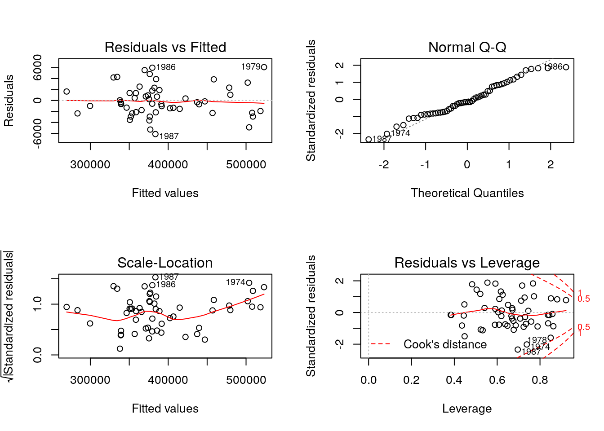

* A curva de resíduos e desvios-padrões por valores ajustados não demonstra nenhum padrão, o que indica normalidade e ausência de autocorrelação.
* A curva quantil-quantil gaussiana forma um padrão de reta de $45$ graus, o que se encontra de acordo com a literatura em amostras de erros que seguem distribuições normais
* A última curva, demonstra a inexistência de outliers significativos (que possuam elevadas distâncias de Cook). Assim, a retirada individual de cada ponto da amostra não pode interferir significativamente no modelo já encontrado.

#### Testes efetuados 


```r
anares <- resid(mod_ajustado)
ad.test(anares)
```

```
## 
## 	Anderson-Darling normality test
## 
## data:  anares
## A = 0.38975, p-value = 0.3719
```

```r
shapiro.test(anares)
```

```
## 
## 	Shapiro-Wilk normality test
## 
## data:  anares
## W = 0.98017, p-value = 0.4828
```

Os p-valores são muito maiores que $0.05$ (tanto para o teste de Anderson-Darling quanto para o teste de Shapiro-Wilk) e, assim, podemos adotar a hipótese de normalidade. Testando a homocedasticidade por meio do teste de Breusch-Pagan


```r
bptest(mod_ajustado)
```

```
## 
## 	studentized Breusch-Pagan test
## 
## data:  mod_ajustado
## BP = 34.627, df = 36, p-value = 0.5339
```

O elevado P-Valor não nos permite rejeitar a hipótese de homocedasticidade. Finalmente, testemos a autocorrelação por meio de um teste de Durblin-Watson:


```r
dwtest(mod_ajustado)
```

```
## 
## 	Durbin-Watson test
## 
## data:  mod_ajustado
## DW = 2.2876, p-value = 0.1314
## alternative hypothesis: true autocorrelation is greater than 0
```

Como o p-valor é maior que $5 \%$. Assim, temos todas as hipóteses necessárias para uma boa regressão linear (já sabemos que não há multicolinearidade pois realizamos decomposição por componentes principais na transformação dos dados).

Nosso modelo cumpre os requisitos de uma boa regressão linear e podemos, agora, interpretar os resultados. Porém, para isso, precisamos verificar a influência de cada um dos clusters sobre cada um dos componentes principais. Isso será realizado na próxima seção.

## 5. Interpretando o Modelo

Para interpretarmos o modelo, iremos, primeiramente, relembrar a sequência de passos adotada até aqui:

1. Inspeção das variáveis
2. Agrupamento das variáveis em clusteres
3. Criação de novas variáveis: cada cluster é transformado em uma única variável, representada pela média dos membros do agrupamento, cada um deles é normalizado (dividido pelo desvio-padrão) antes da operação.
4. Transformação das variáveis utilizando análise de componentes principais (PCA) para eliminar o problema de multicolinearidade entre os clusters.
5. Aplicação do modelo linear

Assim, cada componente principal será explicado, em diferentes graus e percentuais, por diferentes clusters:


```r
pr_comp_contrib <- pr_comp$rotation ** 2 %>% 
  apply(MARGIN=1, FUN=function(X) (X / sum(X))) %>% t %>% as.data.frame

pr_comp_contrib <- rownames_to_column(pr_comp_contrib, var='Cluster.Name')
```

Iremos demonstrar as contribuições para os valores principais mais significativos do modelo final:


```r
summary(mod_ajustado)
```

```
## 
## Call:
## lm(formula = Y ~ PC1 + PC2 + PC3 + PC4 + PC5 + PC6 + PC8 + PC9 + 
##     PC10 + PC11 + PC12 + PC13 + PC14 + PC15 + PC16 + PC17 + PC18 + 
##     PC19 + PC20 + PC21 + PC22 + PC23 + PC24 + PC25 + PC26 + PC28 + 
##     PC29 + PC30 + PC31 + PC32 + PC33 + PC34 + PC35 + PC37 + PC38 + 
##     PC39, data = df_pca)
## 
## Residuals:
##     Min      1Q  Median      3Q     Max 
## -6119.0 -1972.8  -442.5  1677.2  6079.0 
## 
## Coefficients:
##              Estimate Std. Error t value Pr(>|t|)    
## (Intercept)  391149.2      633.9 617.082  < 2e-16 ***
## PC1            7948.6      202.9  39.169  < 2e-16 ***
## PC2            1689.9      294.2   5.744 1.55e-05 ***
## PC3          -20651.3      319.0 -64.737  < 2e-16 ***
## PC4          -19536.4      437.1 -44.699  < 2e-16 ***
## PC5           -5201.2      520.2  -9.999 5.27e-09 ***
## PC6            8640.3      577.2  14.971 5.70e-12 ***
## PC8             733.6      662.8   1.107 0.282176    
## PC9           -2792.0      734.7  -3.800 0.001210 ** 
## PC10           -889.0      804.4  -1.105 0.282864    
## PC11          -7610.6      936.9  -8.123 1.34e-07 ***
## PC12          -4530.4     1099.5  -4.120 0.000582 ***
## PC13           8178.5     1136.2   7.198 7.75e-07 ***
## PC14          -6912.5     1301.4  -5.311 3.98e-05 ***
## PC15           6402.1     1396.0   4.586 0.000202 ***
## PC16           2178.5     1459.0   1.493 0.151822    
## PC17          -3261.5     1571.0  -2.076 0.051699 .  
## PC18          -3827.9     1682.3  -2.275 0.034651 *  
## PC19           1670.9     1947.6   0.858 0.401630    
## PC20          -3589.7     2216.8  -1.619 0.121857    
## PC21          15742.9     2396.2   6.570 2.73e-06 ***
## PC22           9454.3     2570.8   3.678 0.001599 ** 
## PC23          15197.6     3052.3   4.979 8.33e-05 ***
## PC24          16195.3     3219.5   5.030 7.43e-05 ***
## PC25           6123.6     3847.4   1.592 0.127971    
## PC26          13572.9     4467.8   3.038 0.006768 ** 
## PC28          -6166.5     6019.0  -1.025 0.318466    
## PC29          41051.8     6881.3   5.966 9.66e-06 ***
## PC30          12587.3     7296.4   1.725 0.100730    
## PC31          37646.4     9281.1   4.056 0.000674 ***
## PC32          -9955.8     9789.9  -1.017 0.321953    
## PC33         -32279.3    11282.4  -2.861 0.009998 ** 
## PC34          15625.8    14765.4   1.058 0.303201    
## PC35          20042.1    18668.1   1.074 0.296447    
## PC37         102290.8    49868.9   2.051 0.054295 .  
## PC38        -108663.4    56934.8  -1.909 0.071543 .  
## PC39         -78836.9    87931.4  -0.897 0.381166    
## ---
## Signif. codes:  0 '***' 0.001 '**' 0.01 '*' 0.05 '.' 0.1 ' ' 1
## 
## Residual standard error: 4743 on 19 degrees of freedom
## Multiple R-squared:  0.9978,	Adjusted R-squared:  0.9935 
## F-statistic: 235.9 on 36 and 19 DF,  p-value: < 2.2e-16
```

São as componentes: PC1, PC3 e PC4, que possuem significância abaixo de $0.1\%$ no teste de Student. Plotando as contribuições:


```r
pr_comp_contrib_p <- pr_comp_contrib %>% 
  gather(key='Component', value='Contrib', -Cluster.Name) %>%
  arrange(desc(Contrib))

plot.Radar <- function(component_name) {
  
  options(warn=-1)
  df_to_plot <- pr_comp_contrib_p %>% filter(Component %in% c(component_name))
  
  max_prob <- max(df_to_plot$Contrib)
  size_x <- length(df_to_plot$Cluster.Name %>% unique)
  seq_angle <- 360/(2*pi) * rev(pi/2 + seq(pi/size_x, 
                                           2*pi - pi/14, 
                                           len = size_x))
  
  (ggplot(data=df_to_plot, aes(x=reorder(Cluster.Name, -Contrib), 
                               y=Contrib, group=Component,
                              fill=Contrib)) + 
  geom_point(size=1) + 
  geom_bar(stat='identity') + 
  ggtitle('Análise de Componentes Principais' %>% paste(component_name, sep=': '))  + 
  geom_hline(aes(yintercept=0), lwd=1, lty=2) + 
  scale_y_continuous(limits=c(0, 1.35*max_prob)) + 
  coord_polar() +
  theme_minimal() +
  theme(axis.ticks =element_blank(), 
        axis.text.y =element_blank(), 
        axis.title=element_blank(), 
        axis.text.x=element_text(size = 6, angle=seq_angle))) %>%
    return
}
```

#### Composição das Componentes Principais  Mais Significativas {.tabset .tabset-pills}


##### Componente 1

```r
plot.Radar('PC1')
```

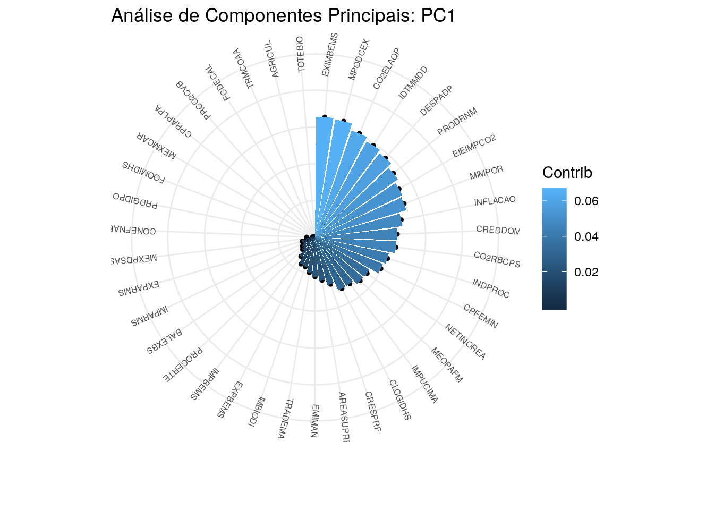

##### Componente 3

```r
plot.Radar('PC3')
```

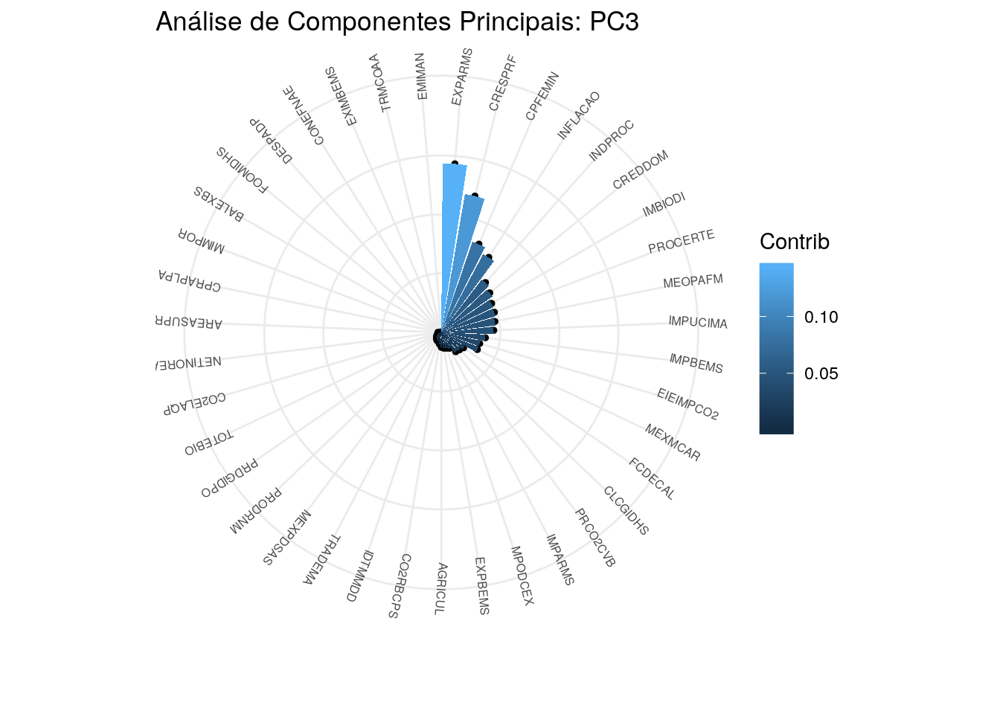

##### Componente 4

```r
plot.Radar('PC4')
```

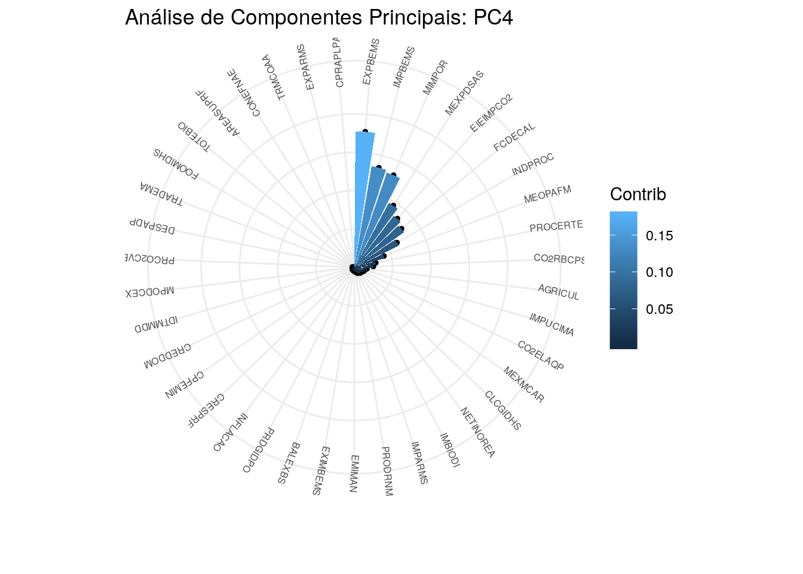

#### Interpretação

Interpretando-se as componentes principais, obtemos:

* A componente principal mais importante é PC1 (maior percentual de variância) possui participações de todas as variáveis mas possui como variáveis mais influentes os clusters: (1) EXIMBEMS (Exportação de Mercadorias, Bens e Serviços), (2) IMPODCEX (Mercadorias Importadas e Alimentos Exportados) e (3) CO2ELAQP (Emissão de CO2 para produção de eletricidade e produção).
* A segunda componente principal analisada, PC3, possui duas variáveis relevantes em sua composição: EXPARMS e CRESPRF, que são, respectivamente, exportação de armas e crescimento populacional em razão da fertilidade.
* A terceira componente principal analisada, PC4, possui como $3$ variáveis mais relevantes, a Exportação de Bens, Mercadorias e Serviços (EXPBEMS - sem contar com a importação, como no caso da primeira componente), IMPBEMS - a importação de bens, mercadorias e serviços e MIMPOR - Mercadorias Importadas para o Desenvolvimento da América Latina.

Podemos então notar que o comércio internacional possui grande peso na determinação da emissão de CO2 pela França e, em expecial, o comércio de bens importados da América Latina.

Além disso, observamos uma participação relevante da produção de energia e da indústria bélica em tal variável. Logicamente, todos esses fatores estão correlacionados e representam faces diferentes de tal problema ambiental.

## 6. Interpretando com Wordclouds

A análise das componentes principais na seção anterior nos forneceu alguns insights mas ainda não pareceu ser o suficiente para interpretarmos todas as variáveis explicativas (que são muitas) simultaneamente.

Por isso, propomos um método alternativo para mapear as variáveis relevantes do modelo: iremos gerar um wordcloud com as palavras com maior peso na determinação da saída (emissão de CO2 em KT).

Iremos criar um dataframe relacionando cada palavra contida na descrição das variáveis ao peso de tal variável na determinação da variável explicada. E como determinaremos tal peso?

Iremos utilizar a regra da cadeia para calcular a sensibilidade de cada variável na saída.

* Se $Y$ é a saída do modelo
* $X_k$ é alguma variável de entrada do modelo (componente principal), representado pelo coeficiente $A_k$ então:

$X_k = \sum_{i=0}^{i=N_{Clusters}} P_i.C_i$ e

$C_k = \frac{\sum_{i=0}^{i=N_{NV_k}} V_{k,i}}{NV_k}$

Onde:

* $N_{Clusters}$ é o número de clusters utilizado
* $P_i$ é o peso em $\%$ da variância do clusters $i$ na variável $X_k$
* $C_k$ é o valor do agrupamento por média do cluster $k$, que possui $NV_k$ variáveis e 
* $V_{k,i}$ é o valor da $i$-ésima variável do cluster $k$

Nesse caso temos:

$\frac{\partial Y}{\partial V_{k, i}} = \frac{A_k \times P_i}{NV_k}$

E esse será o peso de cada uma das variáveis, que será somado ao peso de cada uma das palavras contidas dentro da descrição da variável.

Com esses dados, iremos dispor os gráficos em uma nuvem de palavras (iremos utilizar apenas variáveis com p-valor abaixo de $5 \%$ nessa análise).


```r
concat_descript <- paste(df_in_meta$`Indicator Name`, collapse=' ') %>% toupper()
concat_descript <- gsub('[^[:alnum:] ]', '', concat_descript)

words_vec <- strsplit(concat_descript, split=' ') %>% unlist() %>% unique()
words_weight_vec <- zeros(length(words_vec)) %>% as.vector()
df_wordcloud <- data.frame(Word=words_vec,
                           Weight=words_weight_vec,
                           stringsAsFactors=F)

pc_names <- summary(mod_ajustado)$coefficients %>% rownames()
df_coef_sig <- summary(mod_ajustado)$coefficients %>% as.data.frame()
df_coef_sig$PC <- pc_names
df_coef_sig <- df_coef_sig %>% filter(`Pr(>|t|)` <= 0.05)

df_in_meta_grupos <- df_in_clusters %>% 
  inner_join(df_grupos, by=c('Cluster.Index'='Cluster.Index')) %>%
  inner_join(df_in_meta, by=c('Indicator.Code'='Indicator Code'))

for (var_X in df_coef_sig$PC[-1]) {
  var_A <- mod_ajustado$coefficients[[var_X]]
  for (var_V in pr_comp$rotation[, var_X] %>% names()) {
    
    weight_V <- pr_comp$rotation[[var_V, var_X]] * var_A
    
    V_description <- (df_in_meta_grupos %>% 
                        filter(Cluster.Cod==var_V) %>% 
                        as.data.frame())$`Indicator Name.x`[[1]]
    
    V_description <- gsub('[^[:alnum:] ]', '', V_description)
    
    V_description_words <- V_description %>% toupper() %>% strsplit(split = ' ')
    
    for (word_from_V in V_description_words %>% unlist) {
      curr_val <- (df_wordcloud %>% filter(Word == word_from_V))$Weight[[1]]
      setDT(df_wordcloud)[Word == word_from_V, Weight := curr_val + weight_V]
    }
  }
}
```


```r
ignore_list <- c('', 'OF', 'PER', 'ANNUAL', 'NET', 
                 'AND', 'OF', 'LCU', 'FROM', 'CONSTANT',
                 'TERMS', 'ADJUSTMENT', 'ON', 'TO', 'KM', 'KWH',
                 'SQ', 'DEC', 'IN', 'TOTAL', 'FINAL', 'BY')

df_wordcloud <- df_wordcloud %>% 
  filter(Weight != 0 & ! Word %in% ignore_list) %>% 
  mutate(Weight = abs(Weight)) %>%
  mutate(Weight=scales::rescale(Weight, to=c(0, 20))) %>%
  arrange(desc(Weight))


df_wordcloud
```

<div data-pagedtable="false">
  <script data-pagedtable-source type="application/json">
{"columns":[{"label":["Word"],"name":[1],"type":["chr"],"align":["left"]},{"label":["Weight"],"name":[2],"type":["dbl"],"align":["right"]}],"data":[{"1":"OIL","2":"20.00000000"},{"1":"PRODUCTION","2":"12.79952449"},{"1":"SOURCES","2":"12.40476997"},{"1":"ELECTRICITY","2":"11.76696274"},{"1":"PERSON","2":"7.61741722"},{"1":"TRADE","2":"6.47434206"},{"1":"GAS","2":"6.30815087"},{"1":"NATURAL","2":"6.30815087"},{"1":"ENERGY","2":"5.37225392"},{"1":"COMBUSTIBLE","2":"5.37225392"},{"1":"RENEWABLES","2":"5.37225392"},{"1":"WASTE","2":"5.37225392"},{"1":"EXPORTS","2":"4.80674985"},{"1":"DOMESTIC","2":"4.19104259"},{"1":"CREDIT","2":"4.19104259"},{"1":"POPULATION","2":"4.02167669"},{"1":"FEMALE","2":"4.02167669"},{"1":"AGRICULTURAL","2":"3.68757951"},{"1":"SERVICES","2":"3.43134327"},{"1":"GOODS","2":"3.31614377"},{"1":"APPLICATIONS","2":"3.16293652"},{"1":"RATE","2":"3.08504999"},{"1":"BIRTHS","2":"3.08504999"},{"1":"FERTILITY","2":"3.08504999"},{"1":"WOMAN","2":"3.08504999"},{"1":"PATENT","2":"2.86898631"},{"1":"RESIDENTS","2":"2.86898631"},{"1":"LAND","2":"2.72161567"},{"1":"IMPORTS","2":"2.72007470"},{"1":"ELECTRIC","2":"2.68647737"},{"1":"POWER","2":"2.68647737"},{"1":"TRANSMISSION","2":"2.68647737"},{"1":"DISTRIBUTION","2":"2.68647737"},{"1":"LOSSES","2":"2.68647737"},{"1":"OUTPUT","2":"2.68647737"},{"1":"FUEL","2":"2.54213194"},{"1":"HIGHINCOME","2":"2.53419403"},{"1":"BALANCE","2":"2.50280991"},{"1":"EXTERNAL","2":"2.50280991"},{"1":"AREA","2":"2.29626343"},{"1":"CONSUMER","2":"2.10217243"},{"1":"INFLATION","2":"2.10217243"},{"1":"PRICES","2":"2.10217243"},{"1":"ECONOMIES","2":"1.81631595"},{"1":"MANUFACTURING","2":"1.73961212"},{"1":"HECTARES","2":"1.66801484"},{"1":"ASIA","2":"1.64136592"},{"1":"SOUTH","2":"1.64136592"},{"1":"VALUE","2":"1.56948333"},{"1":"ADDED","2":"1.56948333"},{"1":"US","2":"1.53624592"},{"1":"CURRENT","2":"1.43946949"},{"1":"GROWTH","2":"1.16244549"},{"1":"EXCLUDING","2":"1.05668016"},{"1":"HYDROELECTRIC","2":"1.05668016"},{"1":"RENEWABLE","2":"1.05668016"},{"1":"ARABLE","2":"0.94434666"},{"1":"LATIN","2":"0.92348784"},{"1":"AMERICA","2":"0.92348784"},{"1":"CARIBBEAN","2":"0.92348784"},{"1":"CEREAL","2":"0.91736225"},{"1":"ALTERNATIVE","2":"0.85136450"},{"1":"FACTOR","2":"0.85136450"},{"1":"CONVERSION","2":"0.85136450"},{"1":"CO2","2":"0.63780723"},{"1":"EMISSIONS","2":"0.63780723"},{"1":"COMBUSTION","2":"0.63780723"},{"1":"RESIDUAL","2":"0.62236127"},{"1":"ECONOMY","2":"0.62236127"},{"1":"REPORTING","2":"0.62236127"},{"1":"UNDER","2":"0.60846869"},{"1":"DEVELOPING","2":"0.60267859"},{"1":"HEAT","2":"0.52260773"},{"1":"GOVERNMENT","2":"0.47760929"},{"1":"PERMANENT","2":"0.47117889"},{"1":"CROPLAND","2":"0.47117889"},{"1":"MERCHANDISE","2":"0.36838514"},{"1":"CONSUMPTION","2":"0.29109652"},{"1":"EXPENDITURE","2":"0.29109652"},{"1":"GENERAL","2":"0.29109652"},{"1":"SURFACE","2":"0.22251575"},{"1":"GDP","2":"0.20487696"},{"1":"METRIC","2":"0.19369406"},{"1":"TONS","2":"0.19369406"},{"1":"THE","2":"0.18592707"},{"1":"DIRECT","2":"0.17875071"},{"1":"TRADEMARK","2":"0.17875071"},{"1":"NONRESIDENT","2":"0.17875071"},{"1":"ETC","2":"0.07131327"},{"1":"CENTRAL","2":"0.07131327"},{"1":"CLAIMS","2":"0.07131327"},{"1":"AGRICULTURE","2":"0.05492929"},{"1":"ARMS","2":"0.03219929"},{"1":"SIPRI","2":"0.03219929"},{"1":"TREND","2":"0.03219929"},{"1":"INDICATOR","2":"0.03219929"},{"1":"VALUES","2":"0.03219929"},{"1":"FINANCIAL","2":"0.01836419"},{"1":"SECTOR","2":"0.01836419"},{"1":"PROVIDED","2":"0.01836419"},{"1":"PUBLIC","2":"0.00000000"},{"1":"COMMERCIAL","2":"0.00000000"},{"1":"RESIDENTIAL","2":"0.00000000"},{"1":"BUILDINGS","2":"0.00000000"}],"options":{"columns":{"min":{},"max":[10]},"rows":{"min":[10],"max":[10]},"pages":{}}}
  </script>
</div>


```r
wordcloud(df_wordcloud$Word, 
          df_wordcloud$Weight,
          colors = brewer.pal(8, 'Dark2'))
```


* Óleo, produção, gás e combustíveis parecem exercer um primeiro plano nas palavras-chave que possuem mais peso na explicação das emissões de CO2.

* População, bens e trocas também exercem um papel intermediário. Com relação a trocas, temos que, na seção anterior, encontramos relações fortes com diversas variáveis ligadas ao comércio internacional (importações e exportações).

Assim, nosso modelo, ao buscar as variáveis mais relevantes, encontrou três pilares determinantes na explicação das emissões de CO2:

1. Em primeiro lugar: dados relativos à produção energética, principalmente no que diz respeito a Óleo.
2. Em segundo lugar: dados macroeconômicos - população, pessoas, PIB etc.
3. Em terceiro lugar: dados relativos ao comércio internacional (importações e exportações).

E podemos concluir que a emissão de CO2 é um problema desafiante pois se encontra altamente correlacionada com termos-chave relacionados a desenvolvimento e crescimento econômico.

É por isso que a produção precisa ser contida e equilibrada com uma boa diretriz ambiental no conceito de desenvolvimento sustentável.

## 7. Predição - CO2 em 2014

Para finalizar, iremos prever a emissão de CO2 para o ano de $2014$ (último ano da análise) conforme o proposto no roteiro deste projeto. Para isso, iremos simplesmente utilizar a função predict.

Iremos também estimar as emissões para os anos de $2012$ e $2013$ pois também temos dados perdidos para a emissão de CO2 nesses anos:


```r
df_predict <- predict.lm(object=mod_ajustado,
                       newdata=df_pca[c('2012', '2013', '2014'),],
                       interval='prediction') %>% as.data.frame()

df_predict
```

<div data-pagedtable="false">
  <script data-pagedtable-source type="application/json">
{"columns":[{"label":[""],"name":["_rn_"],"type":[""],"align":["left"]},{"label":["fit"],"name":[1],"type":["dbl"],"align":["right"]},{"label":["lwr"],"name":[2],"type":["dbl"],"align":["right"]},{"label":["upr"],"name":[3],"type":["dbl"],"align":["right"]}],"data":[{"1":"339094.2","2":"325638.2","3":"352550.2","_rn_":"2012"},{"1":"339467.2","2":"326832.2","3":"352102.3","_rn_":"2013"},{"1":"339389.8","2":"327701.9","3":"351077.6","_rn_":"2014"}],"options":{"columns":{"min":{},"max":[10]},"rows":{"min":[10],"max":[10]},"pages":{}}}
  </script>
</div>

Plotando tais resultados:


```r
df_pca$Year <-rownames(df_pca)
df_predict$Year <- c(2012, 2013, 2014)
df_pca_non_missing <- df_pca %>% mutate(Year = as.numeric(Year))
df_pca_non_missing <- df_pca_non_missing %>% filter(Year <= 2012 & Year > 2005)

ggplot() + 
  
  geom_line(data=df_pca_non_missing, 
            aes(x=Year, y=Y, group=1),
            color='blue', stat='identity', group=1) + 
  
  geom_line(data=df_predict, aes(x=Year, y=fit),
            colour='red',
            linetype='dashed') +
  
  geom_linerange(data=df_predict, aes(x=Year, y=fit, ymin=lwr, ymax=upr),
            color='red', group=1) +
  
  geom_point(data=df_pca_non_missing, aes(x=Year, y=Y), 
             shape=21, 
             colour='blue', 
             fill='white', 
             size=3, 
             stroke=1) +
  
  geom_point(data=df_predict, aes(x=Year, y=fit), 
             shape=21, 
             colour='red', 
             fill='white', 
             size=3, 
             stroke=1) +
  
  geom_point(data=df_predict, aes(x=Year, y=lwr), 
             shape=45, 
             colour='red',
             size=15) +
  
  geom_point(data=df_predict, aes(x=Year, y=upr), 
             shape=45, 
             colour='red', 
             size=15) +
  
  labs(
    title = 'Previsão para 2012, 2013 e 2014',
    subtitle = 'Dados históricos em azul, previsões em vermelho',
    x = 'Ano',
    y = 'CO2 (KT) com Erro a 5% (Para previsões)'
  ) + theme_minimal()
```

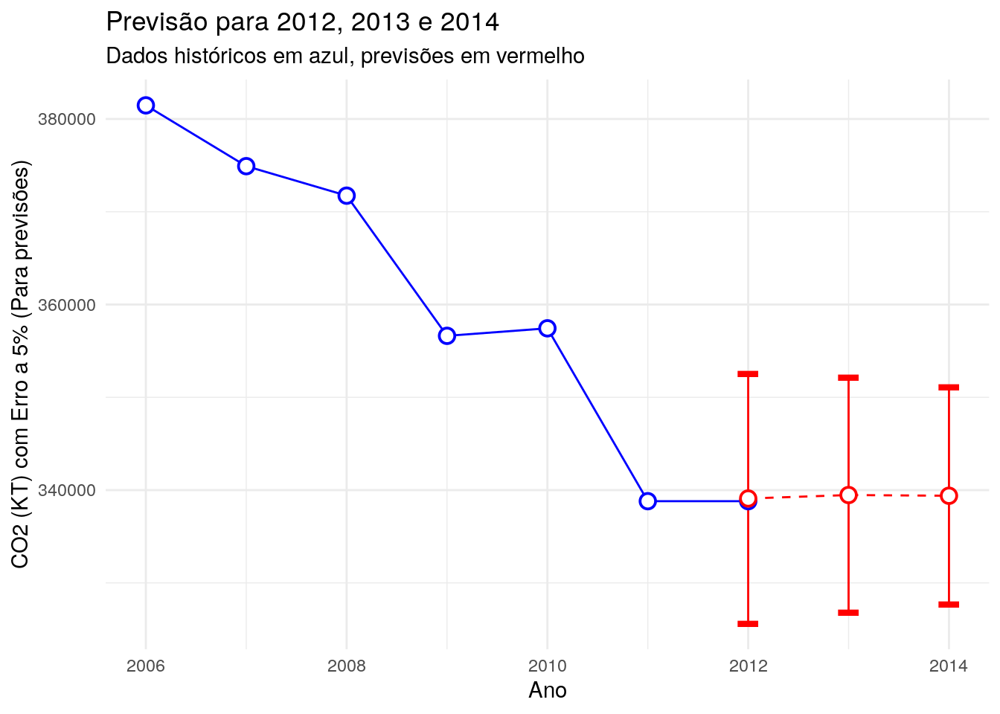

O valor esperado para a emissão em KT no ano de $2014$ é de $339389.8$ em um intervalo compreendido entre $327701.9$ e $351077.6$ e a uma significância de $5\%$.

Podemos ainda conferir tal resultado com o valor que, de fato ocorreu, para a emissão de CO2 na França nesse ano.  Para isso, conferimos esse site: [https://www.worldometers.info/co2-emissions/france-co2-emissions/](https://www.worldometers.info/co2-emissions/france-co2-emissions/), no qual encontramos uma emissão da ordem de $320.703.500,00$.

O valor da emissão em $2014$ se encontra muito acima daquilo que realmente ocorreu e a maior queda na emissão de gás carbônico na França ocorreu justamente nesse ano ($\approx -9.0\%$). 

É plenamente possível que isso tenha ocorrido devido à implementação de políticas de redução na emissão de gás carbônico que não se encontram diretamente relacionadas às variáveis explicativas do modelo (porém, tal análise foge do escopo do presente projeto).

Em todo caso, isso demonstra que o modelo não é absoluto: os governos podem buscar uma crescente redução em tais emissões no intuito de implementar menos danos ambientais e isso pode ocorrer inclusive em variáveis não incluídas na base de dados aqui utilizada.

Os resultados são positivos para o caso do governo francês, observa-se uma tendêcia de queda.

## 8. Conclusões

Com base em cada uma das etapas, podemos tirar diversas conclusões:

* No processo de modelagem matemática de determinado problema, a etapa de organização e exploração de dados tendem a tomar uma parcela significativa dos esforços. Essas duas etapas podem ser realizadas conjuntamente pois a organização ocorre ao longo da exploração dos dados brutos que devem ser, paulatinamente, refinados.
* A clusterizaçao tomou um papel importante na etapa de análise exploratória e organização de dados descrito no ponto anterior pois foi fundamental no estudo da redução do número de variáveis perdas significativas de informações.
* Todos os testes de hipóteses foram positivos e os requisitos do modelo foram cumpridos.
* O procedimento de decomposição por valores singulares permitiu, de forma direta, a eliminação do problema de multicolinearidade (que poderia comprometer os resultados de nossos testes de hipóteses). Porém, a aplicação de tal modelo tornou a interpretação do modelo um pouco mais trabalhosa. Entretanto, foi possível verificar a participação das variáveis iniciais nas componentes principais sem maiores prejuízos na interpretabilidade do modelo.
* Emissões de CO2 são altamente relacionadas à indústria de Óleo e Gás e a palavras-chave ligadas à produção energética. Outros aspectos relevantes foram identificados como variáveis ligadas ao comércio mundial, à indústria bélica ou a dados demográficos e macroeconômicos.
